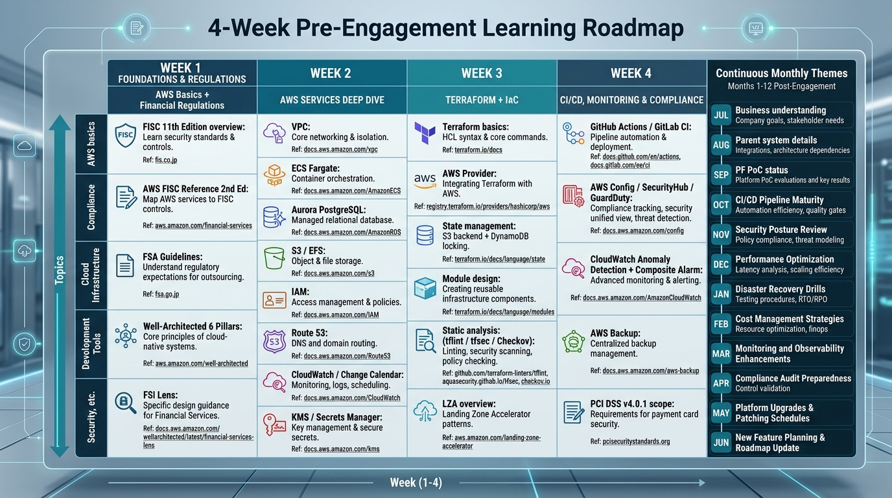

# PM-03. 技術事前学習ロードマップ (Yutaro 専用)

**目的**: 参画 (2026 年 6 月) 前の 1 ヶ月で習得すべき技術と、参画後の継続学習計画を整理する。

---

## 1. 参画前 1 ヶ月 (2026 年 5 月) で叩き込む




### Week 1: AWS 基礎 + 金融機関規制

#### 必須学習項目

| トピック | 学習目標 | リソース |
|---|---|---|
| FISC 第 11 版 概要 | 全項目数 / クラウドサービス固有事項 / 解説書構成 | https://www.fisc.or.jp/publication/book/005831.php (購入要) / https://aws.amazon.com/jp/blogs/news/financereferencearchitecture-fisc11-update/ |
| AWS FISC リファレンス第 2 版 | AWS サービスごとの対応マッピング | https://d1.awsstatic.com/whitepapers/jp/security/AWS_FISC%20Reference%20Part%201.pdf |
| 金融庁サイバーセキュリティガイドライン | 監督指針との対応関係 | https://www.fsa.go.jp/ |
| AWS Well-Architected Framework 6 柱 | 運用 / セキュリティ / 信頼性 / 性能効率 / コスト最適化 / 持続可能性 | https://aws.amazon.com/architecture/well-architected/ |
| AWS Well-Architected Financial Services Industry Lens | 金融機関固有の設計原則 | https://docs.aws.amazon.com/wellarchitected/latest/financial-services-industry-lens/ |

#### 達成チェック
- [ ] FISC 第 11 版の「クラウドサービス固有で対応すべき事項」を 5 個以上挙げられる
- [ ] AWS FISC リファレンス第 2 版で本案件想定サービス (ECS / Aurora / S3) の対応概要を説明できる
- [ ] Well-Architected 6 柱の質問を最低 30 個答えられる

### Week 2: 想定 AWS サービスの深掘り

#### 必須サービス

| サービス | 学習目標 | 公式ドキュメント |
|---|---|---|
| **VPC** | Subnet / Route Table / SG / NACL / NAT GW / VPC Endpoint / TGW 接続パターン | https://docs.aws.amazon.com/vpc/ |
| **ECS (Fargate 中心)** | Task / Service / Cluster / Capacity Provider / Auto Scaling / Service Connect | https://docs.aws.amazon.com/AmazonECS/latest/developerguide/ |
| **Aurora PostgreSQL** | Multi-AZ / Read Replica / Global Database / Backup (1-35 日) / Point-in-Time Recovery / KMS 暗号化 | https://docs.aws.amazon.com/AmazonRDS/latest/AuroraUserGuide/ |
| **S3** | Storage Class / Lifecycle / Versioning / Object Lock / Replication / KMS 暗号化 / アクセスログ | https://docs.aws.amazon.com/AmazonS3/ |
| **EFS** | パフォーマンスモード / スループットモード / Backup / アクセスポイント | https://docs.aws.amazon.com/efs/ |
| **IAM** | Policy 構文 / Permission Boundary / SCP / Identity Center 概要 | https://docs.aws.amazon.com/IAM/ |
| **Route 53** | Public / Private / Health Check / Failover / Geolocation / Latency | https://docs.aws.amazon.com/Route53/ |
| **CloudWatch** | Logs / Metrics / Alarm / Composite Alarm / Dashboards / Logs Insights / Subscription Filter | https://docs.aws.amazon.com/AmazonCloudWatch/ |
| **Change Calendar** | OPEN/CLOSED / Cron / GetCalendarState API / iCalendar import / Document type CalendarDocument | https://docs.aws.amazon.com/ja_jp/systems-manager/latest/userguide/systems-manager-change-calendar.html |
| **KMS** | CMK / Multi-Region Key / Key Policy / Grant / cross-account 共有 | https://docs.aws.amazon.com/kms/ |
| **Secrets Manager** | Rotation / Cross-region / Versioning / Resource Policy | https://docs.aws.amazon.com/secretsmanager/ |

#### 達成チェック
- [ ] 各サービスの主要パラメータを 10 個ずつ挙げられる
- [ ] ECS Fargate / Aurora PostgreSQL のコスト試算を 3 環境分作成できる
- [ ] Change Calendar の OPEN/CLOSED 切替フローを図解できる

### Week 3: Terraform + IaC

#### 必須学習項目

| トピック | 学習目標 | リソース |
|---|---|---|
| Terraform 基礎 | provider / resource / data / module / variable / output / state | https://developer.hashicorp.com/terraform/docs |
| AWS Provider | hashicorp/aws v5.100+ のリソース構造 | https://registry.terraform.io/providers/hashicorp/aws/latest/docs |
| State 管理 | Remote backend (S3 + DynamoDB ロック)、State 分割 | https://developer.hashicorp.com/terraform/language/backend |
| Module 設計 | 単一責務 / variable 共通化 / outputs / バージョン管理 | https://developer.hashicorp.com/terraform/language/modules/develop |
| 静的解析 | tflint / tfsec / Checkov | https://github.com/aquasecurity/tfsec / https://github.com/bridgecrewio/checkov |
| Landing Zone Accelerator | LZA で何ができるか (本案件は PF 側が管理する可能性) | https://aws.amazon.com/solutions/implementations/landing-zone-accelerator-on-aws/ |

#### 達成チェック
- [ ] VPC + Subnet + SG + ECS + Aurora の Terraform をゼロから書ける
- [ ] tflint / tfsec / Checkov を CI で動かせる
- [ ] State 分割の原則を 3 パターン挙げられる (環境別 / リソース種別 / アカウント別)

### Week 4: CI/CD + 監視 + 規制対応

#### 必須学習項目

| トピック | 学習目標 | リソース |
|---|---|---|
| GitHub Actions / GitLab CI | OIDC で AWS 認証 / 環境別 Job / Approval Gate | https://docs.github.com/en/actions / https://docs.gitlab.com/ee/ci/ |
| AWS CodePipeline / CodeBuild | Stage / Action / Manual Approval / Cross-account | https://docs.aws.amazon.com/codepipeline/ |
| AWS Config / SecurityHub / GuardDuty | 委任管理 / Aggregation / Conformance Pack | https://docs.aws.amazon.com/config/ |
| CloudWatch Anomaly Detection / Composite Alarm | 異常検知の構造 | https://docs.aws.amazon.com/AmazonCloudWatch/latest/monitoring/CloudWatch_Anomaly_Detection.html |
| AWS Backup | バックアッププラン / Vault / Cross-region / cross-account | https://docs.aws.amazon.com/aws-backup/ |
| PCI DSS v4.0.1 | ECS / Aurora での対応 (本案件では適用範囲確認要) | https://docs.aws.amazon.com/securityhub/latest/userguide/pci-standard.html / https://d1.awsstatic.com/whitepapers/ja_JP/compliance/architecting-on-amazon-ecs-for-pci-dss-compliance.pdf |

#### 達成チェック
- [ ] GitHub Actions OIDC で AWS にアクセスする最小構成を書ける
- [ ] CloudWatch Composite Alarm の OR/AND 構造を説明できる
- [ ] AWS Backup で Aurora を Cross-region backup する設定を書ける

---

## 2. 参画後の継続学習 (月 10 時間目安)

### 月次テーマ

| 月 | テーマ | 達成目標 |
|---|---|---|
| 2026-06 | 業務理解 (販促 / クーポン / グループ顧客) | 業務フロー L1 を書ける |
| 2026-07 | 親システム (名寄せ) 詳細 | 連携 I/F 仕様を読み解ける |
| 2026-08 | PF 側 PoC 状況 | PF 側設計者と会話できる |
| 2026-09 | 非機能要件 / 性能設計 | Aurora / ECS の性能予測ができる |
| 2026-10 | セキュリティ / FISC 詳細 | FISC 全項目の意味を説明できる |
| 2026-11 | 監視運用設計 | CloudWatch Composite Alarm 設計ができる |
| 2026-12 | コスト最適化 | RI / SP / Savings Plans 比較ができる |
| 2027-01 | Terraform マルチアカウント | LZA / AFT を理解する |
| 2027-02 | ECS Fargate 本番運用 | 障害パターン 10 種を答えられる |
| 2027-03 | Aurora 本番運用 | Failover / Restore シナリオを 5 種設計できる |
| 2027-04 | Change Calendar 詳細 | 凍結期間の自動切替を実装できる |
| 2027-05 以降 | プロジェクト固有課題に応じて | 都度 |

---

## 3. 学習リソースの推奨ランキング

### 3.1 一次資料 (最優先)

1. **AWS 公式ドキュメント** (docs.aws.amazon.com): 最新の仕様
2. **AWS 公式ブログ** (aws.amazon.com/blogs/news): 設計パターン
3. **AWS Knowledge MCP Server** (`https://knowledge-mcp.global.api.aws`): リアルタイム検索
4. **AWS Well-Architected Tool**: 設計レビュー
5. **HashiCorp Terraform Registry** (registry.terraform.io): Provider 仕様
6. **FISC 公式** (fisc.or.jp): 安全対策基準
7. **金融庁公式** (fsa.go.jp): ガイドライン

### 3.2 二次資料 (参考)

1. AWS Black Belt Online Seminar (YouTube AWS Japan): 日本語深掘り
2. DevelopersIO (クラスメソッド): 実装事例
3. Zenn / Qiita: 個人ブログ (情報の新しさ要確認)
4. AWS re:Invent / Summit セッション動画

### 3.3 認定取得 (Optional)

| 認定 | 優先度 | 取得時期 |
|---|---|---|
| AWS Solutions Architect Professional (SAP) | 高 | 既取得想定。再認定 (3 年) |
| AWS Security Specialty | 高 | 2026 内 |
| AWS DevOps Engineer Professional | 中 | 2027 内 (CI/CD 強化) |
| AWS Database Specialty | 中 | 任意 |

---

## 4. 学習進捗チェックリスト (Week 1-4 サマリ)

```
[ ] Week 1: AWS 基礎 + 金融機関規制
    [ ] FISC 第 11 版概要
    [ ] AWS FISC リファレンス第 2 版
    [ ] 金融庁ガイドライン
    [ ] Well-Architected 6 柱 + FSI Lens

[ ] Week 2: 想定 AWS サービス
    [ ] VPC / ECS / Aurora / S3 / EFS
    [ ] IAM / Route53 / CloudWatch
    [ ] Change Calendar / KMS / Secrets Manager

[ ] Week 3: Terraform + IaC
    [ ] Terraform 基礎
    [ ] AWS Provider
    [ ] State 管理 / Module 設計
    [ ] 静的解析 (tflint / tfsec / Checkov)
    [ ] LZA 概要

[ ] Week 4: CI/CD + 監視 + 規制対応
    [ ] GitHub Actions / GitLab CI / CodePipeline
    [ ] AWS Config / SecurityHub / GuardDuty
    [ ] CloudWatch Anomaly / Composite Alarm
    [ ] AWS Backup
    [ ] PCI DSS v4.0.1 (適用範囲確認)
```

---

## 5. 出典

- AWS 公式ドキュメント https://docs.aws.amazon.com/
- AWS Well-Architected Framework https://aws.amazon.com/architecture/well-architected/
- AWS Well-Architected FSI Lens https://docs.aws.amazon.com/wellarchitected/latest/financial-services-industry-lens/
- FISC 金融情報システムセンター https://www.fisc.or.jp/
- AWS FISC リファレンス https://aws.amazon.com/jp/blogs/news/financereferencearchitecture-fisc11-update/
- HashiCorp Terraform Registry https://registry.terraform.io/
- AWS PCI DSS https://d1.awsstatic.com/whitepapers/ja_JP/compliance/architecting-on-amazon-ecs-for-pci-dss-compliance.pdf
- 金融庁 https://www.fsa.go.jp/
