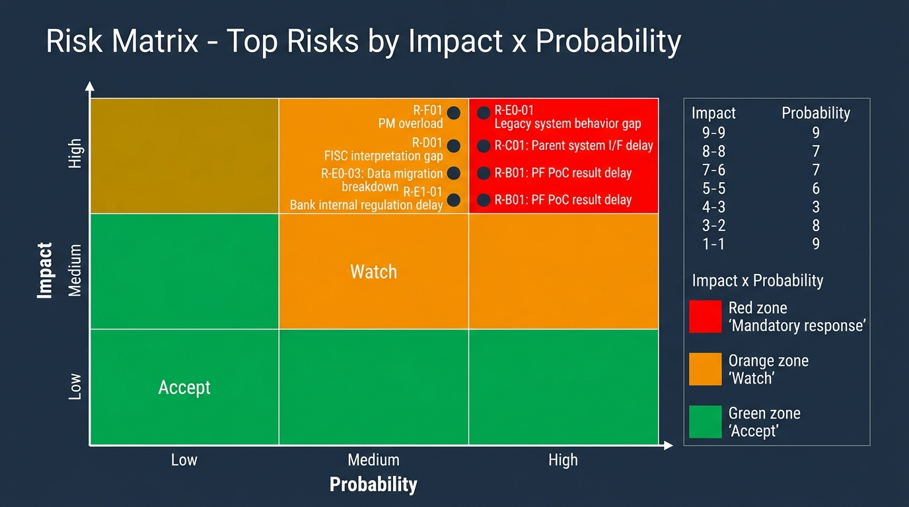

# PM-04. リスク管理レジスタ (Yutaro 専用)

**目的**: 案件固有のリスクを早期 (要件定義 Day-1〜30) に書き出し、トリガー / 緩和策 / オーナーを明確化する。  
**運用**: 週次レビュー (毎週月曜 30 分)、月次で顧客と内容共有。新規発生 / 状況変化 / クローズを必ず記録。

---

## 1. リスク評価マトリクス

| 影響度 \ 確率 | 低 (3 以下) | 中 (4-6) | 高 (7 以上) |
|---|---|---|---|
| 高 (7-9) | 注視 | **対応必須** | **最優先対応** |
| 中 (4-6) | 受容可 | 注視 | **対応必須** |
| 低 (1-3) | 受容 | 受容 | 注視 |

- 影響度: 1=軽微 → 9=プロジェクト中止級
- 確率: 1=ほぼ無い → 9=確実
- スコア: 影響度 × 確率 / 81 (0.0-1.0)

---

## 2. リスクレジスタ (案件固有 40+ 件)

### A. 顧客・組織リスク

| ID | リスク | 影響 | 確率 | トリガー | 緩和策 | オーナー |
|---|---|---|---|---|---|---|
| R-A01 | 顧客側責任者の交代で要件解釈ぶれ | 7 | 4 | 顧客側人事異動シーズン (4 月/10 月) | 文書化された Decision Log を維持。後任への引き継ぎ会を 1 週間以内に設定 | PM |
| R-A02 | 顧客側販促企画と IT 統括の方針対立 | 6 | 5 | 機能要件で意見対立 | Day-30 までに両部門の共同レビュー会議を月次開催。Decision Maker を顧客側で 1 名に集約依頼 | PM |
| R-A03 | 顧客監査部門からの突然の要求変更 | 8 | 5 | 監査年次計画 / 外部監査入り | 監査部門と月次同期会議。FISC 対応マッピングを早期 (要件定義中) 共有 | PM |
| R-A04 | 顧客側予算カット | 9 | 3 | 中期計画見直しタイミング (年度始め) | 月次コスト報告を顧客と共有。スコープ縮退案を常時準備 (要件 Must/Should/Could 分類) | PM + 元請 PL |
| R-A05 | 元請 SIer 都合での契約条件変更 | 8 | 3 | 元請の体制変更 / 案件統合 | 元請 PL と隔週 1on1。契約変更の事前通告ルール合意 | PM (BP として) |

### B. PF 側 (オープン勘定系) リスク

| ID | リスク | 影響 | 確率 | トリガー | 緩和策 | オーナー |
|---|---|---|---|---|---|---|
| R-B01 | PF 側 PoC 結果遅延 → 要件前提崩壊 | 9 | 7 | PoC 進捗ステータスが「未確定」のまま | **週次** で PF 側との同期会議。受領タイミングを 2026/9 までに合意。代替案 (PF 側機能を使わない設計) を Plan B として準備 | PM |
| R-B02 | PF 側ガイドライン変更で詳細設計手戻り | 8 | 6 | PF 側からの仕様変更通知 | 受領 → 影響分析 → 顧客合意 を 2 週間で回す体制構築。設計書のバージョン管理徹底 | PM + SA |
| R-B03 | PF 側 IAM Identity Center 設計と本システム想定が乖離 | 7 | 5 | Permission Set 命名規則の差異 | Day-60 までに PF 側 IAM 責任者と接続テスト計画合意 | SA |
| R-B04 | PF 側 TGW 接続の帯域不足 | 7 | 4 | 性能試験で TGW 経由通信遅延 | 要件定義時にトラフィック予測 (キャンペーン時ピーク含む) を PF 側に提示。性能試験準備時に再確認 | SA |
| R-B05 | PF 側コスト配分ルール変更 | 6 | 4 | PF 側課金体系発表 | 月次でコスト試算を更新。配分ルール変更時の通知を依頼 | PM |
| R-B06 | PF 側標準 AMI / コンテナイメージのライフサイクル変動 | 7 | 5 | PF 側 EOL 通知 | 標準イメージのバージョンを Terraform variables 化。EOL 監視を運用機能に組込み | SA + 構築 |
| R-B07 | PF 側 Change Calendar との競合 | 6 | 5 | PF 全体凍結期間と本システム独自凍結期間の衝突 | PF 側凍結期間を Terraform data source で参照する設計。本システムは AND 条件で適用 | SA |
| R-B08 | PF 側 CI/CD ガイドライン (GitLab vs Jenkins vs CodePipeline) 後出し | 8 | 6 | PF 側 CI/CD 方針確定が 2027/Q1 以降 | 暫定で local apply 運用。詳細設計 Exit (2027/5) までに切替計画 | 構築 |

### C. 親システム (顧客名寄せ) リスク

| ID | リスク | 影響 | 確率 | トリガー | 緩和策 | オーナー |
|---|---|---|---|---|---|---|
| R-C01 | 親システム I/F 仕様の確定遅延 | 9 | 7 | 親システム側スケジュール不透明 | Day-7 までに名寄せ側と接続テスト計画合意。I/F 仕様書テンプレを先行提示 | PM + SA |
| R-C02 | 親システム側の改修で I/F 仕様が変動 | 7 | 5 | 親システム側リリースタイミング | 親システム側リリース計画を月次取得。バージョン互換性確認 | SA |
| R-C03 | 親システム側のテスト環境スケジュール競合 | 7 | 6 | 結合試験開始時 (2027/10) | Day-60 までに親システム側のテスト窓口特定。試験予約を 3 ヶ月前から開始 | QA + PM |
| R-C04 | 親システム側からのデータ品質問題 | 7 | 4 | 結合試験での顧客 ID 不整合 | データ品質チェック (件数 / 必須項目 / 型) をバッチに必ず組込み | 構築 |
| R-C05 | 親システム側の障害で本システム停止 | 9 | 3 | 親システムからの取込バッチ失敗 | バッチリトライ + 前日データでの暫定運用パスを設計 | SA + 運用 |

### D. 規制対応リスク

| ID | リスク | 影響 | 確率 | トリガー | 緩和策 | オーナー |
|---|---|---|---|---|---|---|
| R-D01 | FISC 第 11 版の解釈差 (顧客 vs PM) | 8 | 6 | 監査部門レビュー | AWS FISC リファレンス第 2 版で全項目マッピング。顧客監査部門と月次共有 | PM + SA |
| R-D02 | 金融庁ガイドラインの追加要求 | 7 | 4 | 監督指針改訂 | 金融庁公式 (fsa.go.jp) を月次チェック。改訂アラート設定 | PM |
| R-D03 | PCI DSS v4.0.1 適用範囲の誤判定 | 8 | 4 | カード会員データを扱うかの判断 | 要件定義時にデータフローを明示。カード情報を扱わない設計に確定 | SA + 顧客 |
| R-D04 | 個人情報保護法 (改正) 対応漏れ | 7 | 3 | 個人情報の取扱い設計 | 顧客 ID のみ保持。氏名・住所等は親システムで保持し本システムは ID のみ参照 | SA |
| R-D05 | 監査ログ保管期間の不足 | 7 | 3 | 監査時にログがない | 監査ログを Object Lock (COMPLIANCE モード) で 7 年保管 | 構築 |
| R-D06 | 暗号鍵管理の運用不備 | 8 | 4 | KMS Key Rotation 失敗 / 鍵削除事故 | KMS CMK 自動ローテーション設定。鍵削除は 30 日待機期間 + 4-eyes 承認 | 構築 + 運用 |

### E0. リフトアンドシフト固有リスク

| ID | リスク | 影響 | 確率 | トリガー | 緩和策 | オーナー |
|---|---|---|---|---|---|---|
| R-E0-01 | 既存システム挙動の完全把握不足 → 移行後の同等性検証で再現失敗 | 9 | 7 | 既存システム保守ベンダーとの接続遅延、設計書欠落 | Day-7 までに既存保守担当と週次同期設定、現状調査スプリント (1 ヶ月) を要件定義に組込、ソースコード入手 | PM + SA |
| R-E0-02 | 既存アプリの環境依存性 (オンプレ固有設定 / 内部 IP 直書 / NW ファイルシステム前提) → クラウドで動かない | 8 | 7 | MUT 環境で初回起動失敗 | 既存設定値全件棚卸 (Day-30 まで)、設定外出し作戦合意、MUT 早期立上げ | SA + 構築 |
| R-E0-03 | データ移行の整合性破綻 (件数不一致 / 文字コード差異 / NULL 扱い差) | 9 | 6 | 移行リハーサルでの不整合検出 | 移行設計を基本設計内に組込、リハーサル 2 回以上、件数+ハッシュ検証 | SA + DBA |
| R-E0-04 | 既存システムからのデータ抽出方法未確定 | 8 | 6 | 既存保守ベンダー側準備遅延 | 抽出方法 (DB dump / API / バッチファイル) を Day-60 までに合意、抽出リハーサル予約 | PM + 構築 |
| R-E0-05 | 既存運用 Runbook / 障害履歴の入手困難 | 7 | 5 | 既存保守ベンダーの引継ぎ姿勢 | 顧客責任者経由で資料提供要請、月次レビューで提供進捗追跡 | PM |
| R-E0-06 | カットオーバー時の既存システム並行運転不可 | 7 | 4 | 既存システムの停止判断 | 切り戻し計画詳細化、Hyper Care 強化、Cutover リハーサル 2 回以上 | PM + 構築 |
| R-E0-07 | 既存システムと AWS 側のパフォーマンス差 (Aurora vs オンプレ DB) | 7 | 5 | 性能試験で既存実績比劣化 | ST 環境で性能ベンチマーク、RDS Proxy / Reader 追加で対応、要件次第で Aurora I/O Optimized 検討 | SA |

### E1. 行内独自統制リスク

| ID | リスク | 影響 | 確率 | トリガー | 緩和策 | オーナー |
|---|---|---|---|---|---|---|
| R-E1-01 | 行内独自セキュリティ規程 (RG-*) の受領遅延 → 設計手戻り | 8 | 7 | 監査部門・セキュリティ部門との接続遅延 | Day-7 までに監査・セキュリティ部門と接続、RG-* 一覧 (`80-4`) を作成・受領期限明示 | PM + SA |
| R-E1-02 | 受領した行内独自要件が想定より厳しい (例: 全 IAM 操作 4-eyes 必須等) | 8 | 6 | RG-* 受領時 | ギャップ分析を 2 週間で完了、対応方針を顧客と合意 | SA + 監査部門 |
| R-E1-03 | 行内ネットワーク帯域制限 → 大量データ移行時のスループット不足 | 7 | 5 | データ移行リハーサル | NW 帯域を Day-60 までに確認、移行時の帯域確保依頼 | PM + 親システム責任者 |
| R-E1-04 | 行内 GitLab / Jenkins / Splunk 等の社内ツール仕様確認遅延 | 6 | 5 | CI/CD 設計時 | Day-30 までに IT 統括部門から仕様取得、PoC 環境利用予約 | PM + 構築 |

### F. プロジェクトマネジメントリスク (既存)

### E. 技術リスク

| ID | リスク | 影響 | 確率 | トリガー | 緩和策 | オーナー |
|---|---|---|---|---|---|---|
| R-E01 | Aurora の暗号化キー変更不可問題 | 7 | 3 | 構築後に「KMS CMK 使うべき」発覚 | 設計時に必ず KMS CMK を確定。テスト環境でも CMK 利用 | SA + 構築 |
| R-E02 | ECS Fargate のコスト超過 | 6 | 5 | キャンペーン時の同時アクセス急増 | Auto Scaling 上限を SLO ベースで設定。Cost Anomaly Detection 設定 | SA |
| R-E03 | Aurora の Failover 時の接続切断 | 8 | 4 | AZ 障害 | アプリ側で接続再試行ロジック実装。RDS Proxy 利用検討 | 構築 |
| R-E04 | Terraform State 破損 | 9 | 2 | 同時 apply / 手動編集 | Remote backend (S3 + DynamoDB ロック) 必須。State バックアップ自動取得 | 構築 |
| R-E05 | Route 53 ヘルスチェック誤検知 | 6 | 4 | 短時間障害でフェイルオーバー | ヘルスチェック閾値 (連続失敗 3 回 / 30 秒) を慎重に設定 | SA |
| R-E06 | CloudWatch Alarm 設定漏れ | 7 | 5 | 障害発生時に検知できず | Alarm 設定を Terraform で IaC 化。設定漏れ防止のチェックリスト運用 | 構築 |
| R-E07 | Secrets Manager の Rotation 失敗 | 6 | 4 | 自動ローテーション設定漏れ | Rotation 用 Lambda の単体テスト + 監視アラート | 構築 |
| R-E08 | Change Calendar 設定ミスで全変更ブロック | 7 | 3 | OPEN/CLOSED ロジック誤設計 | 設計時に状態遷移図を必ず作成。テスト環境で動作確認後に本番適用 | SA + 構築 |

### F. プロジェクトマネジメントリスク

| ID | リスク | 影響 | 確率 | トリガー | 緩和策 | オーナー |
|---|---|---|---|---|---|---|
| R-F01 | PM 自分の稼働超過 (>200h/月) | 9 | 6 | 構築・結合フェーズ重複 (2027/5-11) | 月稼働 180h 超過時に SA 補強。プレイヤー業務を委譲 | PM |
| R-F02 | 4 名体制での要員不足 | 8 | 7 | 設計工程並走 (2027/2-5) | 2 ヶ月前から補強要員調達開始。BP / 自社内移動の両ルート確保 | PM |
| R-F03 | SA 1 名で全領域カバーの破綻 | 8 | 5 | 基本設計工程 (2027/1-4) | SA を 2 名以上に。NW・データ側 / アプリ側で分割 | PM |
| R-F04 | チームメンバーの離脱 (健康・転職) | 7 | 4 | 個別事情 | 隔週 1on1 で兆候把握。ナレッジ共有徹底 | PM |
| R-F05 | ナレッジ属人化 | 6 | 6 | 設計者 1 名依存 | Confluence への投稿を週次 KPI 化。レビュアー必須 | PM |
| R-F06 | 顧客との温度差 (報告頻度不足) | 7 | 4 | 月次のみで詳細未共有 | 週次報告必須。隔週で顧客責任者と非公式 30 分 | PM |
| R-F07 | スコープクリープ (要件追加) | 8 | 6 | 要件定義中・基本設計中 | 変更管理プロセスを Day-1 で合意。Change Request フォーム必須 | PM |
| R-F08 | テスト計画の遅延 | 7 | 5 | 基本設計 Exit 時にテスト未着手 | テスト計画 Draft は基本設計時に並走 | QA + PM |

### G. 商務・契約リスク

| ID | リスク | 影響 | 確率 | トリガー | 緩和策 | オーナー |
|---|---|---|---|---|---|---|
| R-G01 | BP 契約の更新条件変動 | 7 | 3 | 半年/年次契約更新 | 元請 PL と更新 2 ヶ月前から協議。実績 (進捗 / 顧客満足度) を可視化 | PM (BP として) |
| R-G02 | 単価交渉での合意未達 | 5 | 3 | 契約更新時 | 実績ベースで協議。代替案 (役割 / 稼働調整) を準備 | PM (BP として) |
| R-G03 | 元請 SIer の方針変更による撤退要請 | 9 | 2 | 元請内案件統廃合 | 元請 PL と隔週 1on1。早期兆候把握 | PM (BP として) |
| R-G04 | 顧客直接交渉禁止違反による契約解除 | 9 | 2 | 顧客との直接やり取り | 顧客接点 3 分類ルール (直接連携可 / 要同席 / 要事後報告) を厳守 | PM (BP として) |

---

## 3. リスク TOP 5 (週次レビュー時の必須確認)

| Rank | ID | リスク | スコア | 対応状況 |
|---|---|---|---|---|
| 1 | R-C01 | 親システム I/F 仕様確定遅延 | 0.78 | Day-7 までに同期会議設定要 |
| 2 | R-B01 | PF 側 PoC 結果遅延 | 0.78 | 週次同期会議設定要 |
| 3 | R-F01 | PM 自分の稼働超過 | 0.67 | 月次稼働モニタリング、180h 超で補強 |
| 4 | R-D01 | FISC 解釈差 | 0.59 | 要件定義中にマッピング完了 |
| 5 | R-F02 | 要員不足 | 0.69 | 2 ヶ月前から補強要員調達開始 |

---

## 4. 運用ルール

### 4.1 起票ルール
- 新規リスクは PM (自分) 起票 + 該当オーナーへ周知
- 起票時必須項目: リスク本文 / 影響度 / 確率 / トリガー / 緩和策 / オーナー
- 起票後 24h 以内に週次レビューで共有

### 4.2 レビュールール
- 週次レビュー (毎週月曜 30 分): 全件の状況変化確認
- 月次レビュー (月末 60 分): 顧客責任者と共有
- 四半期レビュー: 棚卸 (クローズ / アーカイブ)

### 4.3 クローズルール
- リスクトリガーが消滅 (フェーズ終了 / 確定情報受領) でクローズ
- クローズ時に「実際に発生したか」「発生時の影響」を記録 (次案件に活用)

---

## 5. 出典

- 既存類似案件「ANK-未割当-金融AWS共通基盤」リスクレジスタ (構造参考)
- AWS Well-Architected Reliability Pillar https://docs.aws.amazon.com/wellarchitected/latest/reliability-pillar/welcome.html
- FISC 第 11 版 (リスク管理項目): https://www.fisc.or.jp/publication/book/005831.php
