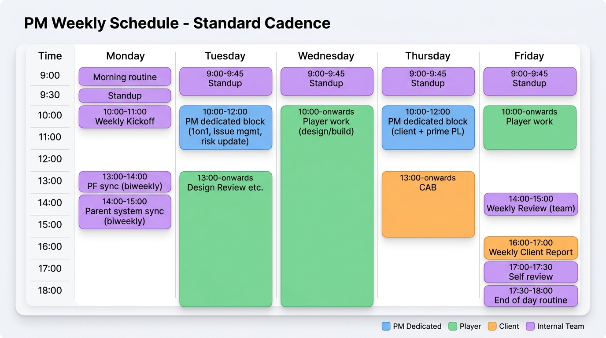

# PM-05. 週次 PM ルーチン (Yutaro 専用)

**目的**: 日次 / 週次 / 月次の PM 実務を自動化レベルで定型化する。考える前に手が動く状態にする。  
**前提**: PM 兼 SA 兼プレイヤー。プレイヤー業務に飲まれて進捗管理が後回しになるリスクを構造で防ぐ。

---



## 1. 日次ルーチン (毎営業日)

### 1.1 朝のルーチン (始業 30 分、9:00-9:30)

```markdown
## Daily Prep YYYY-MM-DD

### 昨日の進捗確認 (10 分)
- [ ] Jira/ServiceNow ステータス更新 (完了タスクを Done に)
- [ ] 昨日発生の Issue (新規起票漏れがないか)
- [ ] 親システム側 / PF 側からの連絡確認 (メール + Slack)

### 今日の作業確認 (10 分)
- [ ] 自分の TOP 3 タスク (記入)
- [ ] 顧客 / PF 側 / 親システム側との会議予定
- [ ] チームメンバーへの依頼事項
- [ ] 緊急対応必要事項

### Blocker 確認 (10 分)
- [ ] チームメンバーが詰まっていないか (Slack DM 確認)
- [ ] 承認待ちの案件 (Change Request / 設計レビュー)
- [ ] 外部依存 (AWS Support / PF 側 / 親システム側) の進捗
```

### 1.2 朝会 (15 分、9:30-9:45、チーム内)

```markdown
## Daily Standup YYYY-MM-DD HH:MM

参加者: PM, SA, IaC, QA (フェーズに応じて 1-4 名)

### 各メンバー (1 人 2 分)
- 昨日: (記入)
- 今日: (記入)
- Blocker: (記入)

### PM からの共有 (3 分)
- 顧客 / PF / 親システムからの連絡事項
- 今日の優先事項
- 来週の重要マイルストーン

### Action Item
- (記入)
```

### 1.3 火曜・木曜 AM (9:45-12:00) は PM 業務専用ブロック

**重要**: プレイヤー業務をブロックして PM 業務に集中する時間。

- 進捗管理表更新 (Jira / Confluence)
- 課題管理表更新 (新規発生 / 状況変化 / クローズ)
- リスクレジスタ更新 (`PM向け/04_リスク管理.md`)
- 未確定事項管理表更新
- 顧客側 / 元請 PL への連絡 (メール / Slack)
- 1on1 (チームメンバー、各 15 分)

### 1.4 終業前 (17:30-18:00、30 分)

```markdown
## End of Day YYYY-MM-DD

### 今日の進捗集計
- [ ] Jira ステータス更新済
- [ ] リスクレジスタ更新 (新規/状況変化)
- [ ] 課題管理表更新
- [ ] 工数記録 (顧客側 + 自社側両方)

### 明日への申し送り
- チームメンバーへの依頼事項 (Slack DM)
- 顧客への確認事項 (翌朝メール)
- 自分の TOP 3

### 体調確認
- 今日の稼働: X 時間
- 今週累計: Y 時間
- 月累計: Z 時間 (180h 超で SA 補強要請、200h 超で過負荷ゲート Red)
```

---

## 2. 週次ルーチン

### 2.1 月曜朝 (9:00-10:00、週次キックオフ)

```markdown
## Weekly Kickoff YYYY-MM-DD (Week N)

### 先週の振り返り (10 分)
- 達成マイルストーン
- 未達タスク (理由・対応)
- 課題 (発生 / 解決)

### 今週の優先事項 (10 分)
- マイルストーン (記入)
- TOP 5 タスク (記入)
- リスク TOP 5 (記入、`04_リスク管理.md` § 3)

### 待ち項目の確認 (10 分)
- PF 側待ち: N 件 (次回連絡日)
- 親システム側待ち: N 件
- 顧客側待ち: N 件
- 元請 PL 待ち: N 件

### 先行できる項目の確認 (10 分)
- (待ちと独立で進めるタスクを 5 件以上挙げる)

### Action Item
- (記入)
```

### 2.2 週次レビュー会議 (チーム内、金曜 14:00-15:00、60 分)

```markdown
## Weekly Review YYYY-MM-DD (Week N)

参加者: PM, 全チームメンバー

### Agenda
1. 先週マイルストーン進捗 (10 分)
2. 課題管理表レビュー (10 分)
3. リスクレジスタレビュー (10 分)
4. 来週の優先事項 (10 分)
5. 工数 / バーンダウン確認 (10 分)
6. 振返り (Keep / Problem / Try) (10 分)

### Action Item
- (記入)

### 議事録共有先
- チーム Slack #project
- Confluence /project/weekly-reviews
```

### 2.3 週次顧客報告会 (金曜 16:00-17:00 想定、30-60 分)

#### エスカレーション時間制約 (重要事象発生時)

| 重要度 | 一次通知 | 通知先 | 詳細報告 | 詳細通知先 |
|---|---|---|---|---|
| **P1** | **15 分以内** | 顧客責任者 (電話 + Slack) + 元請 PL (Slack) | **1 時間以内** | + CIO / 監査部門 |
| **P2** | **1 時間以内** | 顧客責任者 (Slack) + 元請 PL | **4 時間以内** | (該当時) 部門責任者 |
| **P3** | **4 時間以内** | 元請 PL (Slack) → 顧客責任者 | **1 営業日以内** | 週次報告に組込 |
| **P4** | **1 営業日以内** | 元請 PL のみ | 月次報告に組込 | - |

時間制約違反時:
- 一次通知遅延 → 元請 PL に経緯報告 + Postmortem 対象
- 詳細報告遅延 → 顧客責任者に謝罪 + 改善計画提示

#### 週次顧客報告 テンプレ

```markdown
## 週次顧客報告 YYYY-MM-DD (Week N)

宛先: 顧客責任者 + 元請 SIer PL (BP 立場では元請経由が原則)

### サマリ (3 行以内)
- 進捗: 計画通り / 遅れ / 前倒し
- リスク: 新規 N 件
- ハイライト: (記入)

### 今週の進捗
- 予定タスク N 件 / 完了 M 件 (達成率 XX%)
- 主要マイルストーン進捗
  - M1 要件定義 Exit: 進捗 XX%、予定通り
  - M2 ...

### 課題 / リスク
- 新規発生: (記入)
- 状況変化: (記入)
- クローズ: (記入)

### 来週の予定
- 主要タスク TOP 5
- 顧客側に確認したいこと: (記入)
- 顧客側にお願いしたいこと: (記入)

### 顧客側へのリクエスト
- 意思決定待ち: N 件
- レビュー待ち: N 件
- PF 側 / 親システム側との調整依頼: N 件
```

### 2.4 週次 1on1 (チームメンバーごと、15 分、火曜 or 木曜 AM)

```markdown
## 1on1 with [メンバー名] YYYY-MM-DD

### Agenda (メンバーが決める)
- (記入)

### 仕事の Status
- 順調 / 困っている / 詰まっている

### 困りごと
- (記入)

### キャリア / 成長
- (記入、月次でも可)

### PM からのフィードバック
- 良かった点
- 改善希望

### Action Item
- (記入)
```

### 2.5 週次 PM 自己振返り (15 分、金曜終業前)

```markdown
## PM Self Review Week N

### 達成できたこと
- (記入)

### できなかったこと / 課題
- (記入)

### 来週やる/やらない/委譲する
- やる: (記入)
- やらない: (記入)
- 委譲する: (記入)

### 体調 / 稼働
- 今週の稼働時間: XX h
- 来週の予定稼働: XX h
- 稼働超過リスク: 有 / 無

### 過負荷ゲート判定
- Green (< 160h): OK
- Yellow (160-180h): 注視
- Orange (180-200h): SA 補強要請、プレイヤー業務委譲
- Red (>= 200h): 即時補強要員調達、稼働ペース見直し
```

---

## 3. 月次ルーチン

### 3.1 月初 (1 営業日目、半日)

```markdown
## Monthly Kickoff YYYY-MM

### 先月の総括 (1 時間)
- マイルストーン達成状況
- 主要課題のクローズ状況
- 顧客満足度 (定性 / 月次レビューでの反応)

### 今月のテーマ (`PM向け/01_全体マスタープラン.md` § 2)
- (記入)

### 今月の TOP 3 タスク
- (記入)

### 今月の TOP 3 リスク
- (記入)

### 今月の体制
- 自分: XXh 想定
- SA: N 名 / IaC: N 名 / QA: N 名

### 補強要員の必要性
- 2 ヶ月後ピーク予測 → 必要なら今月中に要請開始
```

### 3.2 月次顧客報告会 (月末、60-90 分)

```markdown
## 月次顧客報告 YYYY-MM (Month M)

宛先: 顧客責任者 + 部門長 + 元請 PL + 監査部門 (該当時)

### Executive Summary (3 行)
- 月次進捗: ON TRACK / AT RISK / DELAYED
- 重要マイルストーン状況
- 翌月のフォーカス

### 進捗 (10 分)
- 月次予定タスク / 完了タスク / 達成率
- マイルストーン状況 (M1〜M7)
- ガントチャート (前月比)

### 課題・リスク (10 分)
- 新規発生 (重要度別)
- 状況変化
- クローズ済

### 規制対応 (5 分)
- FISC 対応マッピング進捗
- 監査エビデンス取得状況
- 金融庁ガイドライン関連

### 翌月予定 (5 分)
- 翌月の主要タスク
- 顧客側依頼事項

### コスト (10 分)
- 月次工数 / 月額予算消化率
- AWS コスト (試算 / 実績)

### 質疑応答 (15 分)
```

### 3.3 月次 PM 自己レビュー (月末、1 時間)

```markdown
## PM Monthly Self Review YYYY-MM

### マスタープランとの乖離
- (`PM向け/01_全体マスタープラン.md` § 2 の月次主目標と比較)

### 今月の成功要因
- (記入)

### 今月の失敗・反省
- (記入)

### 翌月の改善点
- (記入)

### 自分のスキル成長
- 学んだ AWS / Terraform / 金融規制
- 認定試験予定

### 過負荷状況
- 月稼働合計: XXh
- 健康状態 (D1 § 6.1 ベース)
- 翌月稼働見込み
```

---

## 4. 四半期ルーチン (3 ヶ月ごと)

### 4.1 四半期キックオフ (四半期初日、1 日)

```markdown
## Quarterly Planning YYYY-QN

### 前四半期総括
- マイルストーン達成
- 主要課題
- リスクのクローズ状況

### 今四半期のテーマ
- (記入)

### 今四半期の主要マイルストーン
- (記入)

### 体制計画
- 補強要員の追加 / フェーズアウト
- ナレッジ移管計画

### 顧客との中期合意事項の再確認
- スコープ / 期日 / 体制
```

### 4.2 四半期顧客レビュー (四半期末、90-120 分)

- 経営層 / CIO / 監査部門も招集
- マスタープラン進捗 (M1〜M7)
- 主要意思決定事項の確認
- 翌四半期の重要マイルストーン

---

## 5. 即時対応ルーチン (緊急時)

### 5.1 P1 インシデント発生時 (Cutover 後 / 構築期含む)

```markdown
## P1 Response YYYY-MM-DD HH:MM

### 15 分以内
- [ ] 顧客責任者に電話 + Slack 通知
- [ ] 元請 PL に Slack 通知
- [ ] チーム招集 (Slack War Room チャネル)

### 30 分以内
- [ ] 影響範囲特定 (どの機能 / どの顧客 / 件数)
- [ ] 一次対応開始 (ロールバック / 暫定対応)

### 1 時間以内
- [ ] 詳細報告 (顧客 + 元請 + CIO + 監査部門)
- [ ] Postmortem スケジュール設定 (48 時間以内)

### 4 時間以内
- [ ] 復旧完了 or 暫定対応完了
- [ ] 顧客側への定期更新 (30 分ごと)

### 24 時間以内
- [ ] Postmortem ドラフト
- [ ] 再発防止策の提案

### 48-72 時間以内
- [ ] Postmortem 確定 (顧客レビュー込み)
- [ ] 再発防止策の Action Item 着手
```

### 5.2 PF 側 / 親システム側からの突然の仕様変更通知

```markdown
## Spec Change Notification YYYY-MM-DD

### 当日中
- [ ] 通知内容を Decision Log に記録
- [ ] 影響範囲を初期評価 (Yes / No / 要分析)

### 翌営業日
- [ ] 影響分析 (機能 / 設計 / コスト / スケジュール)
- [ ] 顧客責任者に第一報

### 2 営業日以内
- [ ] 影響分析詳細 + 対応案 (3 つ以上) を顧客 / 元請に提示
- [ ] 意思決定依頼

### 2 週間以内
- [ ] 顧客側意思決定取得
- [ ] 計画反映 (マスタープラン / リスクレジスタ)
```

---

## 6. ツール運用

### 6.1 必須ツール (顧客環境に従う前提)

| 用途 | 推奨ツール | 代替 |
|---|---|---|
| 進捗 / WBS | Jira / ServiceNow | Microsoft Project |
| ドキュメント | Confluence | SharePoint / Notion |
| コミュニケーション | Slack / Teams | メール |
| 工数 | 顧客側 BP システム + 自社側 | Excel |
| CAB | ServiceNow / Confluence | Excel |

### 6.2 個人ツール (自分用)

| 用途 | ツール |
|---|---|
| 個人 TODO | Notion / Apple Reminders |
| カレンダー | Google Calendar / Outlook |
| メモ | Notion / Obsidian |
| ナレッジ | Confluence (顧客側) + 個人 Notion |

---

## 7. 出典

- 既存類似案件「ANK-未割当-金融AWS共通基盤」D4 PM 実務テンプレ (構造参考、本案件向けにカスタマイズ)
- ITIL 4 (インシデント対応プロセス参考)
- 各種 PM ガイドブック (PMBOK Guide 7th Edition 等)
