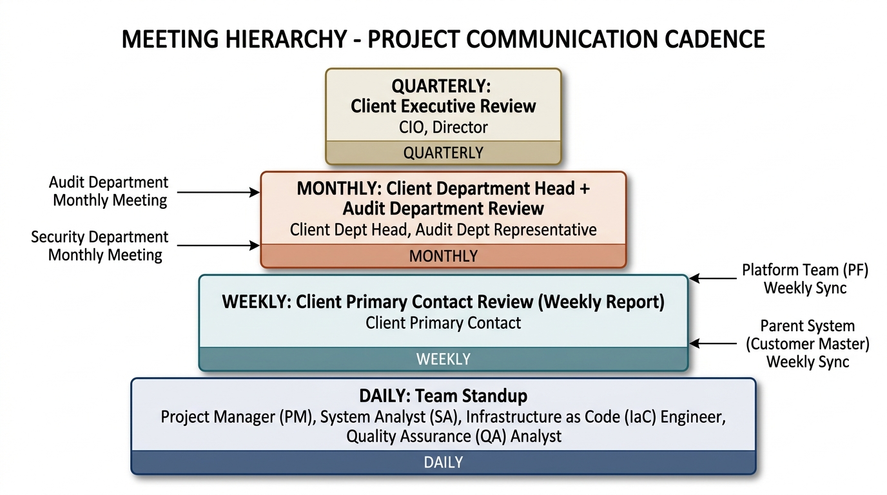

# PM-06. 会議体運営テンプレ (Yutaro 専用)

**目的**: 案件キックオフから Cutover まで必要な会議体を予め設計し、テンプレ化する。会議の質が PM の評価を決める。

---

## 1. 案件全体の会議体マップ



---

## 2. 会議体定義一覧

| 会議名 | 頻度 | 時間 | 参加者 | 主目的 |
|---|---|---|---|---|
| 朝会 (Daily Standup) | 毎営業日 | 15 分 | PM + チーム | Blocker 解消 |
| 週次レビュー (内部) | 週 1 (金) | 60 分 | PM + チーム | 進捗・課題・リスク |
| 週次報告会 (対顧客) | 週 1 (金 PM) | 30-60 分 | PM + 顧客主担当 + 元請 PL | 進捗報告 |
| 月次報告会 (対顧客) | 月 1 (月末) | 60-90 分 | PM + 顧客責任者 + 部門長 + 元請 PL + (監査) | 月次総括 |
| 四半期報告会 | Q 1 (Q 末) | 90-120 分 | + CIO + 経営層 | 中期進捗 |
| PF 側同期会議 | 週 1 | 60 分 | PM + SA + PF 側責任者 | ガイドライン受領 / 調整 |
| 親システム側同期会議 | 週 1 (初期) → 隔週 | 60 分 | PM + SA + 名寄せ側責任者 | I/F 仕様調整 |
| 顧客監査部門レビュー | 月 1 | 60 分 | PM + 顧客監査責任者 + (元請 PL) | FISC / 金融庁対応 |
| 設計レビュー | 都度 | 90-120 分 | PM + SA + 顧客レビュアー | 設計成果物確認 |
| CAB (Change Advisory Board) | 週 1 (構築〜本番) | 60 分 | PM + 顧客運用責任者 + 元請 + (監査) | 変更承認 |
| キックオフ (案件 / フェーズ) | フェーズ開始時 | 120 分 | 全関係者 | スコープ・体制・スケジュール合意 |
| Postmortem (障害発生時) | 障害後 48-72h | 90 分 | PM + 関係者 + (顧客) | 振り返り / 再発防止策 |
| Cutover 判定会議 | Cutover 直前 | 90 分 | 全関係者 + 経営層 | Go/No-Go 判定 |

---

## 3. 主要会議体のテンプレ詳細

### 3.1 案件キックオフ (2026/6、120 分)

#### Agenda
1. 自己紹介・参加者紹介 (15 分)
2. 案件概要・スコープ確認 (15 分)
3. 体制図・役割分担 (10 分)
4. スケジュール (M1〜M7) (15 分)
5. 主要リスク TOP 5 (10 分)
6. 連絡ルール (Slack / メール / 緊急時) (10 分)
7. 会議体一覧の合意 (10 分)
8. 各種ルール (変更管理 / 顧客接点 / エスカレーション) (15 分)
9. Q&A (15 分)
10. 次回までの宿題確認 (5 分)

#### 事前準備チェック
- [ ] 全関係者リスト (顧客 / PF / 親システム / 元請 / 自社) 取得済
- [ ] 案件概要資料 (`業務用/00_案件概要.md` ベース) を整形済
- [ ] スケジュール ガント図完成 (`PM向け/01_全体マスタープラン.md` § 1 ベース)
- [ ] リスクレジスタ TOP 5 ピックアップ済 (`PM向け/04_リスク管理.md`)
- [ ] 会議体一覧合意案 (本ドキュメント § 2)

#### 議事録テンプレ
```markdown
# 案件キックオフ 議事録

## 開催情報
- 日時: YYYY-MM-DD HH:MM-HH:MM
- 場所: ハイブリッド (オフィス + Zoom)
- 参加者: (記入)

## 合意事項
1. スコープ: (記入)
2. 体制: (記入)
3. スケジュール: M1=YYYY-MM-DD, M2=..., M7=...
4. 連絡ルール: (記入)
5. 会議体: (本ドキュメント § 2 採用 / 修正点)

## Action Item
| # | 内容 | 担当 | 期限 |
|---|---|---|---|
| 1 | (記入) | (記入) | (記入) |

## 次回
- 次回会議: YYYY-MM-DD HH:MM
```

### 3.2 PF 側同期会議 (週 1、60 分)

PoC 中の PF 側との週次同期は **本案件最重要会議**。ここでガイドライン受領タイミング・差分対応を握る。

#### Agenda
1. 先週の PF 側進捗 (10 分): PoC 結果、新ガイドライン、変更通知
2. 本案件側の受領状況 (10 分): 既受領分の整理、影響分析の進捗
3. 待ち項目の確認 (15 分): 未受領ガイドライン、次回提供予定
4. 調整事項 (15 分): 本案件側要望、PF 側からの依頼
5. Action Item (10 分)

#### 必須記録項目
- 受領したガイドライン名 + バージョン + 受領日
- 影響分析期限 (= 受領日 + 2 週間)
- 顧客合意期限 (= 受領日 + 4 週間)
- Decision Log (PF 側決定事項) — 後日参照用

#### 注意事項
- **必ずアジェンダ + 議事録を残す** (口頭合意は後で揉める)
- **議事録は当日中に送る** (PF 側が忘れる前に)
- 議事録に必ず「PF 側 vs 本案件側」の責任分界を書く

### 3.3 顧客監査部門レビュー (月 1、60 分)

監査部門との関係は **早期構築が必須**。要件定義中から月次で接点を持つ。

#### Agenda
1. FISC 対応マッピング進捗 (15 分): 全項目数 / 対応済 / 未対応
2. AWS FISC リファレンス第 2 版 への準拠状況 (10 分)
3. 金融庁ガイドライン対応 (10 分)
4. 個人情報保護法対応 (5 分): 顧客 ID 管理 / 親システム連携
5. PCI DSS 適用範囲 (5 分): カード情報を扱わない設計の確認
6. 監査エビデンス取得計画 (10 分): CloudTrail / Config / GuardDuty / KMS / IAM
7. Q&A (5 分)

#### 必須記録項目
- 監査部門からの指摘事項 (リスクレジスタに反映)
- 対応期限 (フェーズ別)
- エビデンス取得方法の合意

### 3.4 設計レビュー (フェーズ別、90-120 分)

#### Agenda (フェーズ共通)
1. 設計対象の概要 (10 分)
2. 設計の主要判断 (ADR 抜粋) (20 分)
3. 図解 (構成図 / フロー図 / シーケンス図) (20 分)
4. 非機能要件への準拠 (15 分): 可用性 / 性能 / セキュリティ
5. リスク・トレードオフ (10 分)
6. レビュアーからの質問 (20 分)
7. Action Item (5 分)

#### 事前準備チェック
- [ ] 設計書 v0.9 以上 (誤字脱字レベルを除き完成)
- [ ] 図解は必ず最新
- [ ] ADR 添付
- [ ] レビュアーに資料を 3 営業日前に送付
- [ ] レビュアーからの質問を 1 営業日前に受領、回答準備

#### 議事録テンプレ
```markdown
# 設計レビュー 議事録

## 開催情報
- 日時: YYYY-MM-DD
- 設計対象: (記入)
- レビュアー: (記入)
- 設計者: (記入)

## レビュー結果
- 承認 / 条件付承認 / 差し戻し

## 指摘事項
| # | 指摘 | 重要度 | 対応 | 担当 | 期限 |
|---|---|---|---|---|---|
| 1 | (記入) | 高/中/低 | 修正/協議/受容 | (記入) | (記入) |

## 次回
- 修正版提示: YYYY-MM-DD
```

### 3.5 CAB (Change Advisory Board、構築〜本番、週 1、60 分)

CAB は **構築フェーズ後半から本番まで** 必須。

#### Agenda
1. 先週の変更実績 (10 分): 件数 / 成功 / 失敗 / Rollback
2. 今週の予定変更 (30 分): 各変更について
   - 変更内容
   - 影響範囲
   - リスク評価
   - テスト結果 (ST 環境)
   - ロールバック計画
   - Change Calendar との整合性
3. 凍結期間との整合性 (5 分)
4. 緊急変更の事後承認 (10 分): 該当あれば
5. Action Item (5 分)

#### 変更管理ルール
- 全変更は CAB 承認必須 (緊急変更は事後承認可)
- 変更分類: 標準変更 (事前承認済) / 通常変更 (CAB 承認) / 緊急変更 (事後承認)
- 凍結期間内の変更は緊急変更のみ (CIO 承認必要)

### 3.6 Cutover 判定会議 (2028/3、90 分)

#### Agenda
1. Cutover 判定基準の確認 (10 分)
2. 総合テスト結果報告 (20 分)
   - OT 業務シナリオ全件結果
   - 性能試験 SLO 達成状況
   - DR リハーサル結果
   - 切り戻し手順検証結果
3. 残課題 (10 分): 重要度別
4. リスク (10 分): Cutover 後の想定リスク
5. Hyper Care 体制 (10 分): 24x365 オンコール (該当時)
6. 切り戻し判断基準 (10 分)
7. Go/No-Go 判定 (10 分): 経営層が最終判断
8. Action Item (10 分)

#### Go 判定基準 (Day-1 で顧客と合意必須)
- [ ] OT 全シナリオ PASS
- [ ] 重要不具合 0 件 (中・低不具合のリスト提示)
- [ ] 性能 SLO 達成 (P95)
- [ ] DR リハーサル PASS
- [ ] 切り戻し手順検証 PASS
- [ ] FISC 第 11 版エビデンス取得済
- [ ] 監査部門承認
- [ ] Hyper Care 体制確定

---

## 4. 会議体運営の Tips

### 4.1 会議の質を上げる 5 つの原則

1. **Agenda を事前に送る** (24 時間前まで)
2. **議事録を当日中に送る** (記憶が新しいうちに)
3. **Action Item には必ず担当 + 期限** (曖昧な「次回確認」は禁止)
4. **時間を厳守** (15 分 standup を 30 分にしない)
5. **Off-topic は別会議に切り出す** (脱線したら「別途設定します」)

### 4.2 BP 立場での会議体運営の注意

- **顧客との直接交渉は元請経由が原則** (D5 § 3.2 顧客接点 3 分類ルール)
  - 直接連携可: 技術詳細・設計確認・QA
  - 要同席: 商務・契約・予算・スコープ
  - 要事後報告: 緊急対応の事後説明
- **議事録は元請 PL にも必ず CC**
- **顧客の意思決定が必要な場面は元請 PL を巻き込む**

### 4.3 PF 側 / 親システム側との会議

- **責任分界を毎回確認** (どっち側がやるか曖昧にしない)
- **Decision Log を別管理** (PF / 親システム側決定事項は別ファイル)
- **議事録は両者で共有** (片側の記録のみだと食い違いが起きる)

---

## 5. 会議体スケジュール例 (週次定型)

```
月曜:
  9:00-9:30   朝のルーチン (個人)
  9:30-9:45   朝会 (チーム)
  10:00-11:00 週次キックオフ (個人 + チーム)
  13:00-14:00 PF 側同期会議 (隔週)
  14:00-15:00 親システム側同期会議 (隔週)

火曜:
  9:00-9:45   朝のルーチン + 朝会
  10:00-12:00 PM 業務専用ブロック (1on1 / 課題管理 / リスク更新)
  13:00-     設計レビュー / その他 (フェーズ依存)

水曜:
  9:00-9:45   朝のルーチン + 朝会
  10:00-     プレイヤー業務 (設計 / 構築)

木曜:
  9:00-9:45   朝のルーチン + 朝会
  10:00-12:00 PM 業務専用ブロック (顧客対応 / 元請対応)
  13:00-     CAB (構築フェーズ後半以降)

金曜:
  9:00-9:45   朝のルーチン + 朝会
  10:00-     プレイヤー業務
  14:00-15:00 週次レビュー (チーム)
  16:00-17:00 週次顧客報告会
  17:00-17:30 週次 PM 自己振返り
  17:30-18:00 終業前ルーチン
```

---

## 6. 出典

- 既存類似案件「ANK-未割当-金融AWS共通基盤」D4 PM 実務テンプレ
- ITIL 4 (Change Management、CAB)
- ISACA (監査関連)
