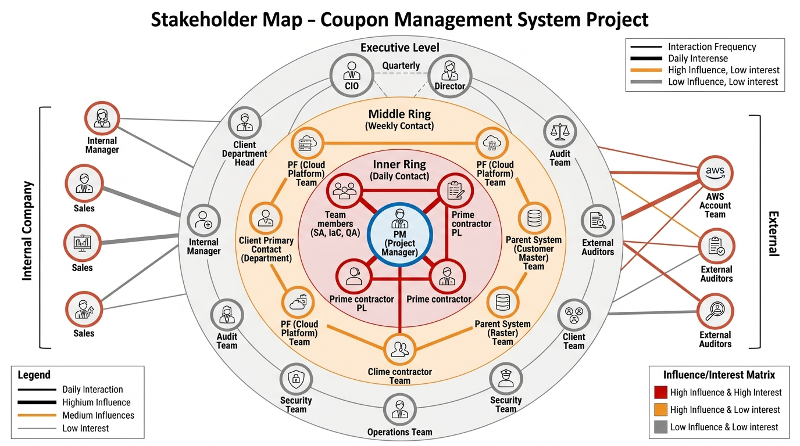

# PM-07. ステークホルダーマップ (Yutaro 専用)

**目的**: 案件を取り巻く関係者を全て可視化し、関係性 (影響度 × 関心度) と接点ルールを定義する。  
**Restricted**: 個別プロファイル (会食記録 / 摩擦履歴等) は別ファイル (gitignore) で管理。

---



## 1. ステークホルダーマップ

```
                          ┌─────────────────┐
                          │ 経営層 (顧客)   │
                          │  CIO / 担当役員 │
                          │  影響:高 関心:中 │
                          └────────┬────────┘
                                    │
                ┌──────────────────┼──────────────────┐
                │                   │                  │
        ┌────────────┐       ┌─────────────┐    ┌─────────────┐
        │ 顧客責任者 │       │ 監査部門    │    │ 親システム責任者 │
        │ 部門長     │       │ 監査責任者  │    │ 名寄せシステム  │
        │ 影:高 関:高 │     │ 影:中 関:高 │    │ 影:高 関:中    │
        └─────┬──────┘       └─────────────┘    └─────────────┘
              │
   ┌──────────┼──────────┐                ┌────────────────┐
   │           │          │                │ PF 側責任者    │
┌───────┐ ┌────────┐ ┌───────┐         │ オープン勘定系  │
│販促企 │ │ IT 統括 │ │ 運用部門 │       │ 影:高 関:中    │
│画部門 │ │  部門   │ │         │         └────────────────┘
│影:中   │ │影:高    │ │ 影:中   │
│関:高   │ │関:高    │ │ 関:中   │
└───────┘ └────────┘ └───────┘
                │
        ┌───────┴────────┐
        │ 顧客主担当者   │
        │  (日常窓口)    │
        │  影:中 関:高   │
        └───────┬────────┘
                │
        ┌───────┴────────┐
        │ 元請 SIer PL   │  ← BP として自分は元請経由
        │  影:高 関:高   │
        └───────┬────────┘
                │
        ┌───────┴────────┐
        │ 自分 (PM)       │
        │ + SA / IaC / QA │
        └────────────────┘
```

---

## 2. ステークホルダー一覧 (役割別)

### A. 顧客側

| ID | 役割 | 影響度 | 関心度 | 接点頻度 | 接点形態 | 注意点 |
|---|---|---|---|---|---|---|
| C-01 | CIO / 担当役員 | 高 | 中 | 四半期 | 四半期報告会 + 緊急時 | 経営層対応。要点だけ、図解で |
| C-02 | 顧客責任者 (部門長) | 高 | 高 | 月次 | 月次報告会 + 隔週 1on1 | 案件成否の主担当 |
| C-03 | 顧客主担当者 | 中 | 高 | 週次 | 週次報告会 + 日常 Slack | 日常の窓口 |
| C-04 | 販促企画部門 (要件提供) | 中 | 高 | 週次〜月次 | 業務ヒアリング会議 | 業務要件の主オーナー |
| C-05 | IT 統括部門 | 高 | 高 | 週次 | 設計レビュー + CAB | 技術要件の主オーナー |
| C-06 | 運用部門 | 中 | 中 | 週次 (構築後半) | 運用設計レビュー + 引き継ぎ | Hyper Care 引き継ぎ先 |
| C-07 | 監査部門 | 中 | 高 | 月次 | 監査レビュー | FISC / 金融庁対応 |
| C-08 | セキュリティ部門 | 中 | 高 | 月次 | セキュリティレビュー | 鍵管理 / アクセス管理 |
| C-09 | 法務 / コンプライアンス | 中 | 中 | 都度 | 契約・規制関連 | 契約変更時 |

### B. PF 側 (オープン勘定系プラットフォーム)

| ID | 役割 | 影響度 | 関心度 | 接点頻度 | 接点形態 | 注意点 |
|---|---|---|---|---|---|---|
| P-01 | PF 側責任者 | 高 | 中 | 月次 | 月次同期 | 全体方針調整 |
| P-02 | PF 側設計担当 | 高 | 中 | 週次 | 週次同期会議 | ガイドライン提供窓口 |
| P-03 | PF 側構築担当 | 中 | 中 | 月次 → 週次 (構築期) | 技術同期 | TGW / IAM IdC / 監視連携 |
| P-04 | PF 側運用担当 | 中 | 中 | 構築後半〜運用 | 運用引き継ぎ | Cutover 後の窓口 |

### C. 親システム (顧客名寄せ)

| ID | 役割 | 影響度 | 関心度 | 接点頻度 | 接点形態 | 注意点 |
|---|---|---|---|---|---|---|
| K-01 | 親システム責任者 | 高 | 中 | 月次 | 月次同期 | I/F 仕様の主オーナー |
| K-02 | 親システム設計担当 | 高 | 中 | 週次 (初期) → 隔週 | 同期会議 | I/F 仕様提供 |
| K-03 | 親システム構築担当 | 中 | 中 | 結合試験期 | 試験同期 | 結合試験窓口 |
| K-04 | 親システム運用担当 | 中 | 低 | 結合後 | データ品質確認 | バッチ I/F の運用 |

### D. 元請 SIer

| ID | 役割 | 影響度 | 関心度 | 接点頻度 | 接点形態 | 注意点 |
|---|---|---|---|---|---|---|
| S-01 | 元請 PL | 高 | 高 | 週次 | 週次同期 + 日常 Slack | BP 立場では元請経由原則 |
| S-02 | 元請営業 | 中 | 中 | 月次 | 月次定例 | 商務・契約 |
| S-03 | 元請技術 SA | 中 | 中 | 都度 | 技術相談 | 元請内技術リソース |

### E. 自社 (BP 派遣元)

| ID | 役割 | 影響度 | 関心度 | 接点頻度 | 接点形態 | 注意点 |
|---|---|---|---|---|---|---|
| B-01 | 自社マネージャ | 中 | 高 | 月次 | 月次 1on1 | キャリア / 単価 |
| B-02 | 自社営業 | 低 | 中 | 都度 | 契約更新時 | 契約・単価交渉 |
| B-03 | 自社チームメンバー (他案件) | 低 | 低 | 都度 | ナレッジ共有 | 補強要員候補 |

### F. チームメンバー (本案件)

| ID | 役割 | 影響度 | 関心度 | 接点頻度 | 接点形態 | 注意点 |
|---|---|---|---|---|---|---|
| T-01 | SA (基本設計者) | 高 | 高 | 日次 | 朝会 + 1on1 | 設計品質の鍵 |
| T-02 | IaC エンジニア | 高 | 高 | 日次 | 朝会 + 1on1 | 構築品質の鍵 |
| T-03 | QA エンジニア | 中 | 高 | 日次 → 週次 | 朝会 + 1on1 | テスト品質の鍵 |
| T-04 | 運用エンジニア | 中 | 中 | 構築後半以降 | 朝会 + 1on1 | Cutover 後の運用 |

---

## 3. 接点ルール (BP 立場)

### 3.1 顧客接点 3 分類 (D5 § 3.2 由来)

| 分類 | 例 | ルール |
|---|---|---|
| **直接連携可** | 技術詳細・設計確認・Q&A・日常 Slack | 元請 PL に CC 不要、議事録のみ共有 |
| **要同席** | 商務・契約・予算・スコープ変更 | 元請 PL に同席依頼必須 |
| **要事後報告** | 緊急対応の事後説明 | 元請 PL に 24h 以内に事後報告 |

### 3.2 顧客直接交渉禁止項目 (R-G04 リスク回避)

- 単価交渉 / 契約条件交渉
- 別案件の打診
- 自社社員の引き抜き打診の受領
- 元請を介さない費用負担合意

これらは元請 PL に必ず引き継ぐ。

### 3.3 PF 側 / 親システム側との接点ルール

- 顧客側責任者を必ず CC または会議に同席させる (案件横断の調整は顧客主導が原則)
- 議事録は顧客 + 元請 PL + 自分の 3 者で共有
- PF / 親システム側との直接合意は **顧客承認なし**では効力なし

---

## 4. 関係構築の優先順位 (Day-1〜90)

### Day-1〜7 (最優先 5 名)
1. **元請 PL (S-01)**: BP 立場の窓口、関係構築 #1
2. **顧客主担当者 (C-03)**: 日常窓口、関係構築 #2
3. **既存 PM (引き継ぎ元)**: 過去の経緯把握
4. **PF 側設計担当 (P-02)**: PoC 状況の把握
5. **親システム設計担当 (K-02)**: I/F 仕様の把握

### Day-7〜30 (拡大、+ 10 名)
6. **顧客責任者 (C-02)**: 案件成否の主担当
7. **IT 統括部門 (C-05)**: 技術要件の主オーナー
8. **販促企画部門 (C-04)**: 業務要件の主オーナー
9. **PF 側責任者 (P-01)**: 全体方針調整
10. **親システム責任者 (K-01)**: I/F 仕様の主オーナー
11. **監査部門 (C-07)**: FISC 対応の早期合意
12. **セキュリティ部門 (C-08)**: 鍵管理・アクセス管理
13. **運用部門 (C-06)**: Hyper Care 引き継ぎ先
14. **自社マネージャ (B-01)**: キャリア・単価
15. **SA (T-01)**: チームの設計品質

### Day-30〜90 (継続、+ 適宜)
- CIO / 役員 (C-01): 四半期接点
- 法務 / コンプライアンス (C-09): 契約変動時
- PF 側構築担当 (P-03): 構築時に強化
- 元請営業 (S-02): 月次

---

## 5. ステークホルダー別 NG ワード集

「言ってはいけない」を予め整理する。

| 相手 | NG ワード | 理由 / 代替 |
|---|---|---|
| 顧客 (全般) | 「無理です」「できません」 | → 「現状の制約ですと X です。代替案として Y / Z があります」 |
| 顧客 (技術詳細不明) | 「AWS のここがこう」(裏取りなし) | → 「持ち帰って確認します」 |
| 元請 PL (BP として) | 「顧客と直接話して合意しました」 | → 「顧客と確認したいことがあるのでお時間いただけますか」 |
| 監査部門 | 「FISC は緩めに解釈」 | → 「FISC 第 11 版の該当項目は X で、当社対応は Y です」 |
| PF 側 | 「PF 側都合で進めません」 | → 「PF 側 X 受領待ちです。先行できる Y を進めています」 |
| 親システム側 | 「親システム側が悪い」 | → 「I/F 仕様の確認が必要です。一緒に整理しましょう」 |
| チームメンバー | 「なぜできないの?」(詰問口調) | → 「どこで詰まってる?」「何があれば進む?」 |

---

## 6. 個別プロファイル (gitignore 推奨、本ファイル別管理)

以下は本ファイルに書かず、別ファイル `PM向け/07a_個別プロファイル_Restricted.md` (gitignore) に記載:

- 個別人物の性格 / コミュニケーションスタイル
- 過去の摩擦履歴 / Postmortem
- 会食 / イベント記録
- 個人的趣味 / 配慮事項

> **倫理原則**: 個別プロファイルは案件遂行のために必要最小限。差別 / プライバシー侵害は厳禁。本人がアクセス要求した場合は開示可能。

---

## 7. 出典

- 既存類似案件「ANK-未割当-金融AWS共通基盤」G4 ステークホルダー個別プロファイル / G5 ソフトスキル (構造参考)
- ステークホルダー分析手法 (PMBOK Guide 7th Edition)
