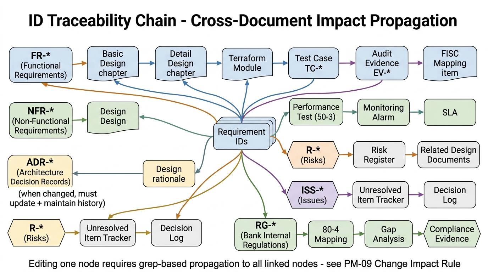

# PM-09. 変更時の影響範囲対応ルール

**目的**: 本パッケージ内のいずれかの文書・図・コード片を編集する際、**影響を受ける他文書を必ず連動修正する** ためのルールとチェックリスト。  
**背景**: 設計判断 / 数値 / 用語の不整合は監査・レビューで即座に検出される。手戻りコストが大きいため、編集と同時に整合性を担保する。

---

## 1. 基本原則

### 1.1 編集 = 影響波及を必ず想定する
- 1 ファイルだけ直して終わりは **原則禁止**
- 編集前に「この変更で影響を受ける箇所はどこか」を声に出して列挙する (脳内 / Slack スレッド / コミットメッセージ)
- 影響範囲が広い変更は、変更前に PM レビュー + Decision Log 起票

### 1.2 トレーサビリティ ID の連鎖



本パッケージは ID 連鎖で文書を結ぶ設計:

```
要件 ID (FR-* / NFR-*) ─┬─ 基本設計章
                        ├─ 詳細設計章
                        ├─ Terraform module
                        ├─ テストケース (TC-*)
                        ├─ 監査エビデンス (EV-*)
                        └─ FISC 対応マッピング項目

ADR (ADR-*) ────────── 設計判断の根拠 (覆る時は ADR を更新+履歴維持)

Risk (R-*) ─────────── リスクレジスタ + 関連設計書

Issue (ISS-*) ──────── 未確定事項管理表 + Decision Log
```

ID を変える / 削除する / 追加する時は、**ID で grep してすべてのヒット箇所を確認**。

```bash
# 例: NFR-PF-001 を変更する前の影響範囲調査
grep -rn 'NFR-PF-001' .
```

---

## 2. 変更カテゴリ別 影響範囲チェックリスト

### A. 非機能要件 (NFR) の目標値を変更したとき

| 影響先 | 該当章 |
|---|---|
| 非機能要件整理シート | `業務用/10_要件定義/10-3_非機能要件整理シート.md` (本体) |
| 要件定義書 | `業務用/10_要件定義/10-1_要件定義書テンプレ.md` §5 非機能要件 |
| 基本設計 (該当領域) | システム方式 / NW・インフラ / セキュリティ / 運用 のうち該当 |
| 詳細設計 | `業務用/30_詳細設計/30-1_詳細設計書テンプレ.md` 該当 §A.10 性能要件等 |
| インフラパラメータ一覧 | `業務用/30_詳細設計/30-2_インフラパラメータ一覧.md` (リソース別) |
| Terraform skeleton | `技術検証/terraform-skeleton/` (auto_scaling_target、backup_retention 等) |
| テスト計画 | `業務用/50_テスト/50-1_テスト計画書テンプレ.md` Exit Criteria |
| 性能試験計画 | `業務用/50_テスト/50-3_性能試験計画.md` (主要目標値、シナリオ判定基準) |
| 監視運用設計 | `業務用/60_運用/60-2_監視運用設計書.md` (Alarm 閾値) |
| 規制対応 | `業務用/80_規制対応/80-1_FISC対応マッピング.md` (該当項目があれば) |

### B. 機能要件 (FR) を追加・変更・削除したとき

| 影響先 | 該当章 |
|---|---|
| 機能要件一覧 | `業務用/10_要件定義/10-2_機能要件一覧テンプレ.md` (本体、トレサ表含む) |
| 要件定義書 | `業務用/10_要件定義/10-1_要件定義書テンプレ.md` §4 機能要件 |
| アプリ機能設計書 | `業務用/20_基本設計/20-2_アプリケーション機能設計書テンプレ.md` |
| データ設計書 | `業務用/20_基本設計/20-3_データ設計書テンプレ.md` (DB スキーマ影響) |
| 詳細設計書 | `業務用/30_詳細設計/30-1_詳細設計書テンプレ.md` (該当機能 A.1〜A.12) |
| テストケース | `業務用/50_テスト/50-1_テスト計画書テンプレ.md` (UT/IT/SIT/OT シナリオ) |
| 監査エビデンス | `業務用/80_規制対応/80-3_監査エビデンス一覧.md` (該当 EV-* があれば) |

### C. AWS サービス選定を変更したとき (例: ECS → EKS)

| 影響先 | 該当章 |
|---|---|
| ADR | `業務用/20_基本設計/20-1_システム方式設計書テンプレ.md` §2 ADR (該当 ADR-* を **更新+履歴維持**、無視ではなく明示的に Supersedes 記載) |
| システム方式設計書 | 同上 (§1 全体像、§3 機能配置) |
| NW・インフラ基本設計書 | `業務用/20_基本設計/20-4_NW_インフラ基本設計書テンプレ.md` (リソース構成) |
| 詳細設計書 | `業務用/30_詳細設計/30-1_詳細設計書テンプレ.md` 該当リソース |
| インフラパラメータ一覧 | `業務用/30_詳細設計/30-2_インフラパラメータ一覧.md` (リソース別パラメータ) |
| Terraform skeleton | `技術検証/terraform-skeleton/modules/<該当>` 全面書き換え |
| Terraform 実装ガイドライン | `業務用/40_構築/40-1_Terraform実装ガイドライン.md` |
| CI/CD パイプライン | `業務用/40_構築/40-3_CI-CDパイプライン定義.md` (ECR Push / Service Update 部分) |
| 監視運用設計 | `業務用/60_運用/60-2_監視運用設計書.md` (Alarm メトリクス変更) |
| コスト試算 | `業務用/20_基本設計/20-1_システム方式設計書テンプレ.md` §10 コスト |
| 図 | `figures/01_system_overview.png` 等、該当図を **gsk img で再生成** |
| 技術用語解説 | `商談用/技術用語解説.md` |
| 想定 Q&A | `商談用/想定Q&A.md` (該当サービスの説明) |
| FISC マッピング | `業務用/80_規制対応/80-1_FISC対応マッピング.md` (責任分界モデル / クラウド固有事項) |

### D. PF 側ガイドライン受領による前提変更

| 影響先 | 該当章 |
|---|---|
| PF 連携要件確認リスト | `業務用/10_要件定義/10-6_PF連携要件確認リスト.md` (該当 G-* の Status 更新) |
| 未確定事項管理表 | `業務用/10_要件定義/10-5_未確定事項管理表.md` (該当 ISS-* をクローズ + Decision Log 起票) |
| 該当領域の設計 | NW/IAM/監視/CI/CD/Change Calendar のうち該当 |
| リスクレジスタ | `PM向け/04_リスク管理.md` (R-B* がクローズ・状況変化したか) |
| 全体マスタープラン | `PM向け/01_全体マスタープラン.md` (マイルストーン影響) |

### E. リスク (R-*) 状況変化

| 影響先 | 該当章 |
|---|---|
| リスク管理レジスタ | `PM向け/04_リスク管理.md` (状況・確率・影響度) |
| リスクレジスタ (商談用) | `商談用/リスクレジスタ.md` (TOP 10 反映) |
| 案件概要 | `業務用/00_案件概要.md` §6 主要リスク TOP 5 (順位変動) |
| 全体マスタープラン | `PM向け/01_全体マスタープラン.md` §6 自分が陥る予測リスク |
| 月次顧客報告 | `PM向け/05_週次PMルーチン.md` (報告テンプレ) |

### F. スケジュール変更

| 影響先 | 該当章 |
|---|---|
| 全体マスタープラン | `PM向け/01_全体マスタープラン.md` |
| 案件概要 | `業務用/00_案件概要.md` §2 工程・スケジュール |
| 要件定義書 | `業務用/10_要件定義/10-1_要件定義書テンプレ.md` §6 制約 |
| テスト計画 | `業務用/50_テスト/50-1_テスト計画書テンプレ.md` §12 工程スケジュール |
| 本番移行計画 | `業務用/70_移行/70-1_本番移行計画書.md` (Cutover 日付影響) |
| 図 | `figures/11_gantt_master_plan.png` を **gsk img で再生成** |

### G. 規制対応の変更 (FISC 改訂 / 金融庁ガイドライン改訂 / 法改正)

| 影響先 | 該当章 |
|---|---|
| FISC 対応マッピング | `業務用/80_規制対応/80-1_FISC対応マッピング.md` (該当項目) |
| 金融庁ガイドライン対応 | `業務用/80_規制対応/80-2_金融庁ガイドライン対応.md` |
| 監査エビデンス一覧 | `業務用/80_規制対応/80-3_監査エビデンス一覧.md` (取得対象が増えていないか) |
| セキュリティ設計書 | `業務用/20_基本設計/20-5_セキュリティ設計書テンプレ.md` (§9 規制対応) |
| 要件定義書 | `業務用/10_要件定義/10-1_要件定義書テンプレ.md` §6.2 規制制約 |
| リスクレジスタ | `PM向け/04_リスク管理.md` (R-D* セクション) |

### H. 体制変更 (要員追加・離脱)

| 影響先 | 該当章 |
|---|---|
| 案件概要 | `業務用/00_案件概要.md` §4 体制・商流 |
| 全体マスタープラン | `PM向け/01_全体マスタープラン.md` §5 体制図 |
| ステークホルダーマップ | `PM向け/07_ステークホルダーマップ.md` + `figures/06_stakeholder_map.png` 再生成検討 |
| 週次 PM ルーチン | `PM向け/05_週次PMルーチン.md` (1on1 対象更新) |

### H-bis. 図 (figures/) を新規作成・更新する時のルール

**基本ルール (グローバル CLAUDE.md 連動)**: 全ての図は GenSpark CLI (`gsk img`) で生成する。ASCII アート / Mermaid を新規作成しない。

#### 図生成手順
1. プロンプト英語で記述 (`gsk img` の入力は英語推奨、ただし日本語ラベルは保持可)
2. `gsk img -o figures/NN_name.png -r "16:9" "<英語プロンプト>"` で生成
3. 各章 Markdown に `` 形式で挿入
4. 価値選別なし: 図が必要な箇所は全て生成 (絞らない)
5. AWS アーキ図は「Use AWS official architecture icons」をプロンプトに含める

#### 並列生成例
```bash
gsk img -o figures/40_xxx.png -r "16:9" "<prompt 1>" > /tmp/g40.log 2>&1 &
gsk img -o figures/41_yyy.png -r "16:9" "<prompt 2>" > /tmp/g41.log 2>&1 &
wait
```

#### 連動修正対象 (図更新時)
- 関連 Markdown 章 (図参照箇所の数値 / 固有名詞整合)
- README § 4 図解資料 (一覧表更新)
- 商談用 GenSpark プロンプト集 (再現用プロンプト記録)

### I. 図 (figures/) の更新・追加

| 影響先 | 該当章 |
|---|---|
| 関連 Markdown 章 | 図を参照している章本文の数値・固有名詞・矢印方向が図と一致するか確認 |
| README | `README.md` § 4 図解資料 (一覧表を更新) |
| 商談用 GenSpark プロンプト | `商談用/資料/GenSpark_プロンプト.md` (再現用プロンプトを更新) |

### J. Terraform skeleton の変更

| 影響先 | 該当章 |
|---|---|
| Terraform 実装ガイドライン | `業務用/40_構築/40-1_Terraform実装ガイドライン.md` (バージョン / 命名規則変更) |
| インフラパラメータ一覧 | `業務用/30_詳細設計/30-2_インフラパラメータ一覧.md` (パラメータ整合) |
| CI/CD パイプライン | `業務用/40_構築/40-3_CI-CDパイプライン定義.md` (terraform 命令変更があれば) |
| 該当 module README | `技術検証/terraform-skeleton/modules/<名>/README.md` (存在すれば) |

---

## 3. 変更コミット時の最低限フロー

```
1. 変更前: 「この変更で影響を受ける文書を列挙せよ」を自問
2. 変更前: grep -rn '<該当 ID / 該当用語>' . で影響範囲を可視化
3. 主変更ファイルを編集
4. 影響先を一気に編集 (同一コミット推奨、レビュー時の整合性確認のため)
5. 変更があった図 (figures/) を gsk img で再生成
6. README の対応箇所を更新
7. コミットメッセージに「影響範囲: <ファイル列挙>」を明記
8. push → Codex 辛口レビューで整合性チェック
```

---

## 4. やってはいけない編集パターン

### 4.1 「とりあえず 1 ファイルだけ直す」
- リスクレジスタの R-XX のステータスだけ更新 → 案件概要 §6 TOP 5 が古いまま
- ADR-001 の Decision を更新 → 詳細設計が古い前提のまま

### 4.2 ID をサイレントに変える
- FR-USE-001 → FR-USE-101 に番号を変更したのに、トレサ表 / テストケース / 監査エビデンス は古い ID のまま

### 4.3 数値だけ変えて、ロジックを変えない
- NFR-PF-001 を P95 < 1 秒 → P95 < 500ms に変更したが、性能試験シナリオ判定は 1 秒のまま

### 4.4 図と本文を別タイミングで更新
- システム構成図 (figure 01) を更新したが、20-1 本文の構成要素表が古い

---

## 5. 整合性チェッカー (定期実行推奨)

### 5.1 週次セルフチェック (PM)
- [ ] 未確定事項管理表 (10-5) の Open 件数が前週比で増減しているか確認
- [ ] リスクレジスタ (04) の TOP 5 が案件概要 (00) §6 と一致しているか確認
- [ ] 図 (figures/) の更新がある場合、関連章本文と齟齬がないか確認

### 5.2 月次セルフチェック (PM)
- [ ] grep -rn 'TODO\|要記入\|要数値\|要協議\|要確認' . で未確定箇所を全件洗い出し
- [ ] ADR が新規追加・更新されたか、その影響先が反映済か
- [ ] 出典 URL の Dead Link 確認 (主要 10 件)

### 5.3 フェーズ Exit 前チェック (該当フェーズ)
- [ ] 該当フェーズの Exit Criteria 全項目が緑か
- [ ] 該当フェーズで言及されている要件 ID / リソース ID が全文書で一意・整合しているか
- [ ] 図と本文の整合性 (図に描いていない要素が本文にない・逆もない)

---

## 6. Codex 辛口レビューによる自動検出

Stop hook 経由で Codex (gpt-5.5) 辛口レビューが自動発火する設計のため、以下のパターンは **応答停止 (BLOCK) で警告される** ことを期待:

- 数値の不整合 (例: NFR-PF-001 P95 < 1 秒 と 性能試験計画 P95 < 500ms)
- ID の重複・欠番
- 図と本文の固有名詞ずれ
- 出典 URL の脱落

ただし Codex も完璧ではないため、本ルールに沿った **手動チェックを優先** する。

---

## 7. 出典・参考

- 本ルールは社内編集規約のローカル版。プロジェクト固有の運用に応じて随時更新。
- 既存類似案件「ANK-未割当-金融AWS共通基盤」H1 監査ガバナンス共通本体 (構造参考)
