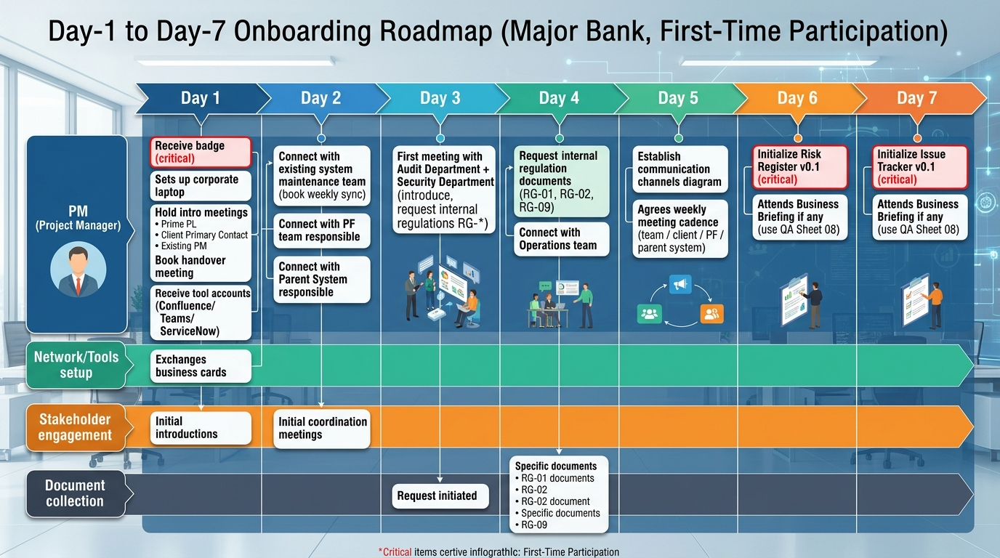

# PM-10. 大手金融機関案件 初参画ガイド (PM 自身用)

**目的**: 大手金融機関向け案件への **初参画** にあたり、技術以外の領域 (物理セキュリティ / 作業環境 / 文化 / マナー / 言葉遣い / 文書管理 / 稟議プロセス) で押さえるべき事項をチェックリスト化する。  
**前提**: 本案件は **顧客貸与端末 + VPN/閉域網経由** での作業、**完全プライベート業務系**、参画まで資料を受領できない可能性が高い、行内独自統制が多数。

---

## 1. 物理セキュリティ・入退館

### 1.1 出社時のルール (典型)
- **入館証 (ICカード)** が必須。受け取りに 1-2 週間かかることがある (参画当日に間に合わない前提でスケジュール)
- **共連れ禁止** (1 人 1 タップ厳守)。注意されたら素直に従う
- **来客同伴** が必要なエリアが存在する場合あり (顧客側担当者の同伴必須)
- **写真撮影禁止** (社内、特に執務スペース)。スマホ持込制限がある場合は持参禁止 or ロッカー預け
- **私物制限** (USB / 外部ストレージ / 個人 PC は持込不可)
- **書類持出禁止** (会議メモも社外持ち出し NG が原則)

### 1.2 服装
- **スーツ着用が標準** (ジャケット必須、ノーネクタイ可の場合あり)
- カジュアル可とされても、初日〜数週間はスーツ無難
- 顧客先で迷ったら、元請 PL に「初日の服装は何が良いか」を **明示的に確認**

### 1.3 持ち物 (初日)
- 入館証 (受領前なら来客対応で入る)
- 印鑑 (認印 + シャチハタ。書類押印必要時に必須)
- 名刺 (元請 SIer 名 + 自社名で複数枚)
- メモ帳・筆記具 (パソコン入力できない会議もあり)
- 健康保険証 (本人確認用)

---

## 2. 作業環境 (VPN / 閉域網 / 顧客貸与端末)

### 2.1 標準的な作業環境
- **顧客貸与端末** (Windows ノート PC が多い)
- **VPN クライアント or 専用 VDI (仮想デスクトップ)** 経由でしか顧客環境にアクセス不可
- **インターネットアクセスは制限あり** (社内承認済の URL のみ、業務外サイトは閉鎖)
- **個人デバイス・自宅 PC からの作業は原則禁止**
- **外部 SaaS (個人 GitHub / Gmail / Dropbox / Slack 個人ワークスペース) は使えない**

### 2.2 ツール (本案件想定)
| 用途 | 典型 |
|---|---|
| バージョン管理 | 顧客社内 GitLab / Bitbucket (GitHub は基本 NG) |
| ドキュメント | Confluence (顧客社内) / SharePoint |
| コミュニケーション | Teams (Microsoft 365) または社内 Slack |
| Ticket | ServiceNow / JIRA (顧客社内) |
| 会議 | Teams / Zoom (顧客承認版) |
| 端末 | 顧客貸与 Windows + VDI |
| AWS マネジメントコンソール | 顧客貸与端末 + 専用 IAM Identity Center 経由 |
| ターミナル | 制限ある可能性 (cmd / PowerShell のみ、bash は WSL 不可など) |

### 2.3 端末トラブル想定
- 顧客貸与端末は **動作が重い** ことがある (ウイルス対策・DLP 多数導入)
- **再起動・更新で 30-60 分待たされる** ことが頻発
- **ヘルプデスク経由でしか権限変更ができない** (sudo / 管理者権限なし)
- 対応: ローカル PC 上で先行検証 + 結果スクリーンショットを顧客環境にコピー、という運用パターンも想定

### 2.4 セキュリティ違反となる典型行動 (絶対回避)
- **顧客環境にアクセスした個人 PC を使う**
- **VPN 接続中に個人サイトを開く** (履歴監査される)
- **顧客データを個人クラウド / 個人メールに送る** (即時契約解除リスク)
- **画面共有時に他の顧客情報が映る** (DLP に検知される)
- **会議中に勝手にメモを録音する** (機密漏洩リスク)
- **席を離れる時にロックしない** (Windows + L 必須)

---

## 3. 言葉遣い・コミュニケーション

### 3.1 敬称・呼び方
- 顧客側担当者は **「○○様」 + 役職** (例: 田中様、田中部長)
- 元請 SIer の担当は **「○○さん」** または初対面は「○○様」
- 自社内は通常通り

### 3.2 メール・チャット
- 件名: **【案件名】(用件) / 送信者所属** (例: 「【ANK クーポン管理】要件定義書 v0.5 ご確認のお願い / 自社ABC」)
- 冒頭の挨拶: 「お世話になっております」「ご連絡ありがとうございます」
- 結びの挨拶: 「よろしくお願いいたします」「ご確認のほど、よろしくお願いいたします」
- 文末: 自分の所属・氏名・連絡先 (シグネチャ)
- **「お疲れさまです」** は社内向け、**「お世話になっております」** は社外・顧客向け
- 急ぎ案件は冒頭に **「【至急】」** 「【お手すきの際に】」を明記

### 3.3 会議
- **遅刻厳禁** (5 分前着席が標準)
- 自己紹介: 「○○SIer 様経由で参画しております、ABC の前田と申します」
- **顧客発言を遮らない** (PM 兼任でも顧客責任者の発言中は黙る)
- 議事録は **当日中** に送る
- 録音は **顧客許可必須**

### 3.4 報告
- **悪い報告ほど早く** (隠そうとして遅れると信用失墜)
- 報告の構造: **結論 → 根拠 → 対応案 → 確認事項**
- 数値で語る (定性的表現を避ける、「だいたい」「割と」NG)

---

## 4. 文書管理・稟議

### 4.1 文書管理 (顧客標準に従う)
- **命名規則を Day-1 で確認**: 「{案件}_{文書ID}_{タイトル}_v{版}_{YYYYMMDD}.md」など
- **版管理**: Major.Minor (v0.1 Draft → v1.0 Approved → v1.1 改訂)
- **保管先**: Confluence / SharePoint / 顧客指定共有ドライブ
- **配布範囲を必ず明示**: 文書冒頭に「配布範囲: ○○部門のみ」「機密度: 機密」

### 4.2 稟議・承認プロセス (大手金融機関の特徴)
- **承認階層が多い** (担当 → 課長 → 部長 → 役員 → CIO 等)
- **押印が必要な場合あり** (PDF への電子押印または物理押印)
- **稟議 1 件あたり 1-4 週間** かかることが珍しくない
- **稟議書フォーマット** は顧客側標準に従う
- **対応**: 主要承認イベントを 1 ヶ月前から仕込む。マスタープラン上でも稟議リードタイムを工程に含める

### 4.3 セキュリティ申請 (本案件特有)
- AWS リソース新規申請、IAM ロール変更、SG 緩和、VPC 拡張など、**個別申請が必要**
- 申請から承認まで **5-10 営業日** かかる場合あり
- **対応**: 設計時に必要なリソース一覧を洗い出し、まとめて申請する

---

## 5. 大手金融機関特有の文化・暗黙ルール

### 5.1 上下関係・組織
- **部門間連携が縦割り** (本部 / 支店 / IT / 業務部門が独立、連携窓口を明確化必要)
- **役職呼び** が一般的 (部長 / 課長 / 担当)
- **意思決定は上位階層** (担当レベルでは決められないことが多い)

### 5.2 「行内文化」
- **保守的・慎重** (新技術への抵抗感がある場合あり、根拠を必ず示す)
- **書面主義** (口頭合意のみは効力薄、メール or 議事録で残す)
- **慎重な改革姿勢** (アジャイル全面採用は珍しい。本案件もウォーターフォール想定)
- **金融特有のリスク感覚** (1 円のずれ・1 件の不一致が大事故、絶対に「だいたい」NG)

### 5.3 タブー (絶対に避ける)
- **他行・他案件の名前を口外** (NDA 違反)
- **顧客情報・顧客識別情報の口外** (絶対 NG)
- **AWS Marketplace で勝手にサービス購入** (経費承認なしの追加発注 NG)
- **SNS で案件に触れる** (個人 SNS でも会社名すら NG)
- **会食での酒席暴走** (金融機関の会食はクリーンが原則、無礼講なし)

---

## 6. 業務遂行の指針 (本案件適用)

### 6.1 何を、いつ、どの順番で進めるか (フェーズ別マスター)
- **要件定義 (2026/6-12) の進め方**:
  1. Day-1〜7: 全関係者との初顔合わせ、連絡網確立
  2. Day-7〜14: **既存システム現状調査** (本案件最重要、リフト元の挙動把握)
  3. Day-14〜30: 業務要件 / 機能要件ヒアリング
  4. 月次: 非機能要件 1 領域ずつ深掘り (7 月可用性、8 月性能、9 月セキュリティ、10 月バックアップ・拡張性、11 月運用・コスト)
  5. 並行: FISC + **行内独自統制** マッピング着手
  6. 並行: 親システム I/F 仕様確認、PF ガイドライン受領サイクル運用

- **基本設計 (2027/1-4) の進め方**:
  1. 設計者 2 名以上アサイン (NW・データ側 / アプリ側)
  2. ADR を主要設計判断ごとに記録
  3. 詳細設計と並走するなら責任分界を書面化
  4. 移行設計 (データ移行・カットオーバー) を基本設計内に組み込み

- **詳細設計 (2027/2-5) の進め方**:
  1. パラメータ全項目を 4 月末までに起票、5 月末までに確定
  2. データ移行詳細手順を確定 (リハーサル準備)
  3. Terraform バージョン / Provider バージョン固定

- **構築・UT (2027/2-9) の進め方**:
  1. MUT: 単体確認、Auto Scaling 最小、Multi-AZ なし
  2. LT: 結合確認、Multi-AZ あり、本番に近い
  3. ST: 性能 / セキュリティ試験、本番相当
  4. 移行リハーサル (LT/ST で複数回実施)

- **以降のフェーズ**: 詳細は `PM向け/01_全体マスタープラン.md` 参照

### 6.2 報告・コミュニケーションの頻度
- **日次**: 朝会 15 分 (チーム内)
- **週次**: 週次レビュー (チーム、金曜) + 週次顧客報告 (金曜午後)
- **月次**: 月次顧客報告会 + 月次内部振り返り
- **四半期**: 経営層 / CIO レビュー
- **緊急時**: P1 は 15 分以内に一次通知

### 6.3 自分の動き方の指針
- **「待ち」を理由に停止しない**: 待ち項目と先行項目を毎週仕分け
- **金融案件は減点法**: 1 つの致命的ミスで信用失墜。慎重に
- **書面化で身を守る**: 口頭合意は必ず議事録 + メール送付で確定
- **時間が読めないことを前提に**: 承認・申請には倍のリードタイム
- **稼働超過を早期に申告**: 180h 超で SA 補強要請、200h 超は過負荷ゲート Red
- **顧客直接交渉は元請経由が原則**: BP 立場の地雷踏まない (D5 § 3.2 顧客接点 3 分類)

---

## 7. 「リフトアンドシフト」案件特有の進め方

### 7.1 既存システム現状調査が最優先
- **アプリケーション仕様書 / ソースコード** の入手 (顧客 + 既存保守ベンダー)
- **既存環境の構成図 / IPアドレス一覧 / 設定値** の入手
- **既存運用の Runbook / 障害履歴 / Postmortem** の入手
- **既存システム保守担当者との週次同期** (Day-7 までに設定)

### 7.2 既存挙動との同等性検証
- **「動けばいい」ではなく「既存と等価」が判定基準**
- レスポンス時間 / スループット / エラー率 / バッチ完了時間 を既存実績と比較
- **既存環境と並行動作 (Shadow Traffic)** が可能か Day-30 までに合意

### 7.3 データ移行の徹底準備
- データ量・データ種別・整合性ルール を Day-30 までに完全把握
- 移行リハーサル 2 回以上
- 切り戻し用の既存システム並行運転計画

### 7.4 「変えない判断」を恐れない
- 既存で動いているものは原則変えない
- 「AWS マネージドサービスに置き換えた方が良い」と思っても、リフト目的を優先
- 改善は別フェーズ (Cutover 後 6 ヶ月以降) で計画

---

## 8. PM 自身のメンタル・健康管理

### 8.1 ストレスマネジメント
- 大手金融機関案件は **プレッシャーが大きい** (1ミスで多大な影響)
- **完璧主義に陥らない** (8割で進めて反復改善)
- **早期に困りごとを共有** (1on1 で元請 PL や自社マネージャに相談)

### 8.2 ワークライフバランス
- 月稼働 180h を超えたら **赤信号**
- 残業前提の計画は組まない (補強要員調達を優先)
- 健康診断は毎年受診、メンタル不調を感じたら早期に EAP / 産業医相談

### 8.3 学習投資
- **AWS 認定** を継続更新 (案件中も新サービスをキャッチアップ)
- **金融規制 (FISC / 金融庁ガイドライン)** の改訂を毎月チェック
- **書面 / プレゼン技術** を継続改善 (大手金融機関は文書品質が評価される)

---

## 9. Day-1〜Day-7 やるべきこと (詳細)

### Day-1 (初出社)
- [ ] 入館証受領 (なければ来客対応)
- [ ] 顧客貸与端末セットアップ (ヘルプデスク経由)
- [ ] 自己紹介 (元請 PL + 顧客主担当 + 既存 PM)
- [ ] 既存 PM からの引継ぎミーティング設定 (1 週間以内)
- [ ] 顧客標準ツール (Confluence / Teams / ServiceNow) アカウント受領
- [ ] 名刺交換 (主要関係者 5-10 名)
- [ ] 食堂・会議室の場所確認
- [ ] 緊急連絡先取得 (元請 PL の携帯、顧客主担当の内線)

### Day-2〜Day-7
- [ ] 既存システム保守担当との接続 (週次同期予約)
- [ ] PF 側責任者との初回会議 (週次同期予約)
- [ ] 親システム責任者との初回会議
- [ ] 顧客監査部門 / セキュリティ部門との初回挨拶
- [ ] 行内独自統制資料の入手 (セキュリティ規程・統制要件一覧)
- [ ] 案件概要・現状資料 (顧客側で持っているもの) の入手
- [ ] 連絡網 (連絡フロー図) を作成 → 顧客と合意
- [ ] 週次定例会議の日程確定 (チーム内・対顧客・対 PF・対親システム)
- [ ] リスクレジスタ v0.1 起票 (`PM向け/04_リスク管理.md` ベース)
- [ ] 未確定事項管理表 v0.1 起票 (`業務用/10_要件定義/10-5_未確定事項管理表.md` ベース)
- [ ] 業務説明会 (もしあれば) で `PM向け/08_初回業務説明QAシート.md` 活用

---

## 10. やってはいけないこと (再掲)

- [ ] **個人 PC で顧客環境作業** → 即時契約解除リスク
- [ ] **個人メール / 個人クラウドへの情報送信** → 監査で即発覚
- [ ] **「だいたい」「割と」「たぶん」発言** → 金融機関では信用失墜
- [ ] **顧客との直接単独交渉 (BP 立場)** → 元請経由ルール違反
- [ ] **承認なしのリソース変更** → 監査で叱責
- [ ] **アジャイル原理主義** → ウォーターフォール文化との衝突
- [ ] **過度な技術アピール** → 「机上の空論」と見なされる、実装で実績示す
- [ ] **報告遅延** → 悪い報告ほど早く

---

## 11. 出典・参考

- 金融機関での SES 経験者向けガイド (一般論)
- AWS Customer Pen Test ポリシー: https://aws.amazon.com/security/penetration-testing/
- FISC 第 11 版 (作業環境関連項目): https://www.fisc.or.jp/publication/book/005831.php
- 一般的なビジネスマナー (大手金融機関カルチャー)
- 既存類似案件「ANK-未割当-金融AWS共通基盤」D5 BP/SES 立場特有準備 (構造参考)
