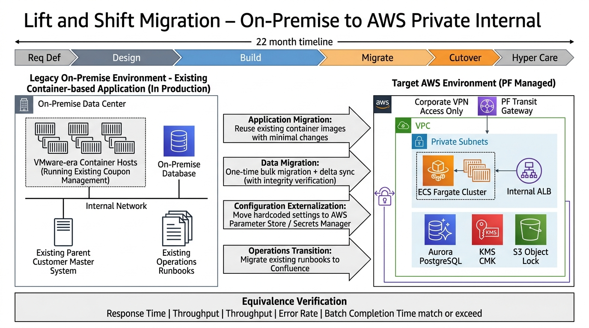

# 00. 案件概要 — 特別金利電子クーポン管理子システム (オンプレ→AWS リフトアンドシフト)

## 0. 文書管理情報

| 項目 | 値 |
|---|---|
| 文書 ID | OVR-001 |
| 版数 | 0.2 (Draft) |
| 作成日 | 2026-05-20 |
| 主担当 | PM |
| 顧客側責任者 | (要記入) |
| 配布範囲 | プロジェクトメンバー / 顧客責任者 / 元請 SIer PL |

---

## 1. 案件背景

### 1.1 ビジネス背景

| 項目 | 内容 |
|---|---|
| 推進母体 | 大手金融機関 (グループ持株会社配下) |
| 戦略テーマ | グループ顧客化促進・グループ外損失利益低減 |
| 本システムの役割 | グループ顧客に提供する **特別金利電子クーポン** の発行・利用・失効を **行員操作経由で** 一元管理する業務系システム |
| 現行稼働 | **オンプレミス環境のコンテナ基盤で既に本番稼働中** (本案件はリフトアンドシフト対象) |
| 親システム | 顧客名寄せ親システム (全店名寄せ相当) — 顧客 ID / 属性のマスタソース |
| 関連施策 | (要記入: 中期経営計画上の位置付け、対象顧客セグメント、KPI) |

### 1.2 技術背景 (本案件の根本)

| 項目 | 内容 |
|---|---|
| 旧計画 | 親システム (全店名寄せ) のオンプレ共通基盤 (コンテナ環境) を流用し、その上に本システムを継続稼働 |
| 計画変更トリガ | 旧仮想化基盤ベンダーの戦略変更により、次期共通基盤をクラウド (AWS ベースの次期共通クラウド勘定系 PF) に移行することが決定 |
| 本案件の性格 | **オンプレ → AWS のリフトアンドシフト**。既存コンテナ化済みアプリを最小変更で AWS 環境に再ホスト |
| 移行方針 | アプリケーション本体は原則そのまま (コンテナイメージ流用)。インフラ層 (Compute / Network / Storage / DB) を AWS マネージドサービスに置換 |
| PF 側状況 | **次期共通クラウド勘定系 PF は現在 PoC 中**。ガイドラインは要件定義期間 (2026/4-12) 中に複数イベントで提供される予定。**確定情報は限定的に取得していく前提** |
| **作業環境** | **顧客貸与端末** + **VPN / 閉域網経由** での作業が前提。インターネット越しでの作業や外部 SaaS 利用は原則不可 (社内承認済ツールのみ) |
| **公開度合い** | **完全プライベート環境の業務系システム**。インターネット公開なし。顧客 (預金者) は本システムに直接アクセスしない。利用者は行員のみ |
| **顧客 (預金者) との接点** | 別チャネルシステム (バンクアプリ / Web / 窓口) 経由で間接的に。本案件はその裏側で行員が操作する業務系として位置付け |

### 1.3 担当範囲

本案件は **PM 兼 SA (構築フェーズ一気通貫担当)** として、以下を担当する:

- 要件定義 → 基本設計 → 詳細設計 → 構築 (MUT/LT/ST/開発結合) → 運用機能開発 → 結合試験 → 本番構築・結合 → 総合テスト
- **既存オンプレ環境からの移行要件整理** (アプリ・データ・運用・セキュリティ要件の現状調査)
- PF 側との連携・調整 (ガイドライン受領・差分整理・PF 側依頼)
- 親システム (名寄せ) 側との I/F 調整
- 顧客側部門 (販促企画 / IT 統括 / 運用部門) との要件すり合わせ
- 行内独自セキュリティ要件・統制要件のマッピング
- ベンダー / BP 要員管理 (最大 4 名体制)

> **担当外 (Out of Scope) 想定**: PF 共通基盤本体の構築 (PF 側別案件) / 親システム改修 / 別チャネルシステム (バンクアプリ等) の改修 / カットオーバー後の長期運用保守 (別契約となる可能性)

### 1.4 「リフトアンドシフト」案件としての特性

| 観点 | 特性 |
|---|---|
| アプリ変更量 | 最小 (コンテナイメージ流用、設定外出し・パス変更のみ想定) |
| 機能追加 | 原則なし (ただし AWS 環境への適応で発生する付随変更はあり) |
| 設計工数の重点 | 既存アプリの挙動把握 + AWS インフラへの**等価実装** |
| データ移行 | **既存オンプレ DB → Aurora への一括移行 + 差分同期** が必須。これが最大の技術リスク |
| パフォーマンス基準 | 既存運用実績に対する **同等性検証** が主目的 (劣化させない) |
| セキュリティ統制 | 既存統制をクラウド環境で **等価以上に再現**。行内独自統制への適合必須 |
| カットオーバー | 既存システム停止 → データ移行 → 新環境切替 (並行運転は要件次第) |

---

## 2. 工程・スケジュール

| 工程 | 期間 | 主担当 | 主成果物 | Exit Criteria |
|---|---|---|---|---|
| 要件定義 | 2026/4-12 | PM/SA | 業務要件 / 機能要件 / 非機能要件 / **既存システム現状調査結果** / 移行要件 / 行内独自要件マッピング / PF 連携要件 / 未確定事項管理表 | 顧客承認 + PF ガイドライン受領済 + 既存システム調査完了 + 未確定 < 5 件 |
| 基本設計 | 2027/1-4 | SA | 6 種設計書 (システム方式 / アプリ / データ / NW・インフラ / セキュリティ / 運用) + **移行設計書** | 顧客承認 + 設計レビュー全件クローズ |
| 詳細設計 | 2027/2-5 | SA + 構築 | 詳細設計書 + パラメータシート + **データ移行詳細設計** | 顧客承認 + IaC 着手可能 |
| 構築 (MUT) | 2027/2 中 | 構築 | Terraform main 適用 (MUT 環境) | apply 成功 + ヘルスチェック OK |
| 構築・UT (LT〜ST) | 2027/5中〜9中 | 構築 + QA | LT/ST 環境構築、UT 全件 PASS、**移行リハーサル** | UT 100% PASS + 移行手順検証完了 |
| 運用機能開発 | 2027/6-10中 | 構築 + 運用 | 監視 / バッチ / 通知 / 障害復旧 | 運用要件全件カバー |
| 結合試験 (開発) | 2027/10中-11 | QA | IT (内部)、SIT (親 PF 連携)、**既存挙動との同等性検証** | 全シナリオ PASS + 同等性 OK |
| 構築・結合試験 (本番) | 2027/12-2028/1 | 構築 + QA | 本番環境構築、本番 IT、本番リハーサル | apply 成功 + 本番 IT PASS |
| 総合テスト (開発・本番) | 2028/1-3 | QA + PM | OT / 業務シナリオ / DR / 移行リハーサル | 顧客総合判定 OK |

### マイルストーン (M)
- **M1**: 2026-12-末 要件定義 Exit / PF ガイドライン v1.0 受領 / 既存システム現状調査完了
- **M2**: 2027-04-末 基本設計 Exit / 移行設計 v1.0
- **M3**: 2027-05-末 詳細設計 Exit / Terraform main 凍結
- **M4**: 2027-09-中 構築・UT (開発) Exit / 移行リハーサル PASS
- **M5**: 2027-11-末 結合試験 (開発) Exit / 既存挙動同等性確認 OK
- **M6**: 2028-01-末 本番構築完了 / 本番移行リハーサル
- **M7**: 2028-03-末 総合テスト Exit / カットオーバー判定

---

## 3. システム概要 (要件定義 Day-1 仮説)

> **重要**: 以下は要件定義開始前の **PM 仮説**。参画まで公式資料は受領できない前提のため、Day-1 のヒアリングで全項目確認・更新する。

### 3.1 想定 AWS サービス (要件定義時点)

| 領域 | サービス | 用途 | 公開度 |
|---|---|---|---|
| ネットワーク | VPC, Subnet, Route53 Private, TGW(PF 経由) | システム境界 / 内部名前解決 | **完全プライベート** |
| ALB | Application Load Balancer (**Internal 限定**) | 行員系チャネル → ECS への内部負荷分散 | **Internal Only** |
| コンピュート | ECS Fargate | 既存コンテナイメージの再ホスト | プライベート |
| データベース | Aurora PostgreSQL | クーポン情報、利用履歴、設定マスタ | プライベート |
| ストレージ | S3 (各種), EFS (共有ファイル、要件次第) | ログ・帳票・ファイル受け渡し | プライベート (VPC Endpoint 経由) |
| 認証認可 | IAM, IAM Identity Center (PF 集中想定) | 行員 SSO・サービス間権限 | プライベート |
| メッセージング | SQS / EventBridge / SNS | 親システム連携、内部疎結合 | プライベート |
| 監視運用 | CloudWatch, Change Calendar | 稼働監視 / 変更管理 | プライベート |
| セキュリティ | KMS, Secrets Manager, GuardDuty (PF 集中)、SecurityHub (PF 集中) | 暗号化 / 機密管理 / 脅威検知 | プライベート |
| デプロイ | (PF 側 CI/CD ガイドライン待ち、社内 GitLab 想定) | 構築〜本番デプロイ | 社内閉域 |

> **重要**: **AWS WAF / CloudFront / API Gateway (Public) / Public ALB / Internet Gateway は本案件では使用しない**。インターネット公開のエンドポイントは持たない。

### 3.2 想定アプリケーション機能 (既存からのリフト前提)

- クーポン発行管理 (キャンペーン定義、対象顧客抽出 (親システム連携)、発行)
- クーポン利用受付 (**行員操作経由** での利用判定 → 勘定系へ渡す I/F)
- クーポン履歴管理 (発行・利用・失効ステータス管理、監査ログ保管)
- 帳票・分析 (利用状況レポート、分析データ抽出)
- マスタ管理 (キャンペーンマスタ、商品マスタ、利用条件マスタ)
- 運用機能 (バッチ、夜間処理、データクレンジング、システム監視、リカバリ)

### 3.3 連携先 (Day-1 確認、全て社内 NW 経由)
- 親システム (顧客名寄せ親システム): 顧客 ID / 属性取得 (バッチ / API、社内 NW)
- 勘定系 (PF 側経由) : 金利優遇情報の連携 (PF TGW)
- データ分析基盤: クーポン利用実績連携 (社内 NW)
- 認証基盤 (IAM IdC / SSO): 行員ログイン (社内 NW)
- 別チャネルシステム (バンクアプリ / Web / 窓口端末): クーポン提示要求受信 / 結果返却 (社内 NW、本案件側は内部 API として提供)

---

## 4. 体制・商流

| 項目 | 内容 |
|---|---|
| 商流 | 1 社先 (元請 SIer 経由)。所属が御社なら派遣等可 |
| 体制 | **最大 4 名** (現在 PM 1 名在籍、要件定義工程) |
| 役割想定 | PM (自分) + SA + IaC エンジニア + QA / 運用 (フェーズに応じて) |
| 顧客側 | (要記入: 顧客側主担当者 / 部門長 / 監査責任者 / 行内独自統制責任者) |
| PF 側 | (要記入: PF 側責任者 / 担当エンジニア) |
| 親システム側 | (要記入: 名寄せシステム責任者 / 担当エンジニア) |
| 既存システム保守側 | (要記入: 現行クーポン管理システム保守担当 — リフト元の挙動把握に必須) |

---

## 5. 勤務条件

- **稼働想定**: 平日 9-18 (顧客標準)。月稼働 160h 想定 / 上限 200h (D1 § 6.1 過負荷ゲート Red 基準)
- **作業環境**: 顧客貸与端末 + VPN/閉域網経由。自前 PC 利用および外部 SaaS (個人 GitHub / Slack / Gmail 等) は原則禁止。詳細は [`PM向け/10_金融機関案件初参画ガイド.md`](../PM向け/10_金融機関案件初参画ガイド.md)

---

## 6. 主要リスク (TOP 7、詳細は `PM向け/04_リスク管理.md`)

| ID | リスク | 影響度 | 発生確率 | 緩和策 |
|---|---|---|---|---|
| R-01 | **既存システム挙動の完全把握不足** → 同等性検証で再現できない | 高 | 高 | Day-1 で既存保守担当と接続、現状調査計画を 1 ヶ月前倒し |
| R-02 | **データ移行の整合性破綻** → カットオーバー失敗 | 高 | 中 | 移行設計を基本設計内に組み込み、リハーサル 2 回以上 |
| R-03 | PF 側 PoC 結果遅延 → 要件定義の前提崩壊 | 高 | 中 | 早期に PF 側との同期ミーティング設定 (週次)、Decision Log 化 |
| R-04 | 親システム I/F 仕様の確定遅延 | 高 | 高 | Day-1 で名寄せ側と接続テスト計画合意 |
| R-05 | FISC 第 11 版 + **行内独自統制** 解釈差 | 高 | 中 | AWS FISC リファレンスで FISC 全項目マッピング、**独自統制は 80-4 で別表管理**、監査部門と早期レビュー |
| R-06 | **コンテナイメージのクラウド適応で予期せぬ動作差** | 中 | 高 | MUT 環境で早期検証、既存環境と並行動作確認 |
| R-07 | 4 名体制での要員不足 (フェーズ並走時) | 高 | 高 | 設計工程の並走計画を事前に作成、補強要員調達計画準備 |

---

## 7. 出典

- AWS 公式 FISC リファレンス (第 2 版): https://aws.amazon.com/jp/blogs/news/financereferencearchitecture-fisc11-update/
- FISC 安全対策基準 第 11 版: https://www.fisc.or.jp/publication/book/005831.php
- AWS FISC Reference Part 1 (PDF): https://d1.awsstatic.com/whitepapers/jp/security/AWS_FISC%20Reference%20Part%201.pdf
- AWS Systems Manager Change Calendar: https://docs.aws.amazon.com/ja_jp/systems-manager/latest/userguide/systems-manager-change-calendar.html
- AWS リフトアンドシフト (Migration Strategy): https://docs.aws.amazon.com/whitepapers/latest/migration-strategy/migration-strategy.html
- 案件概要原文 (記載スキル・工程・条件・前提): 元請 SIer 提示資料 (2026-05-20 受領)
