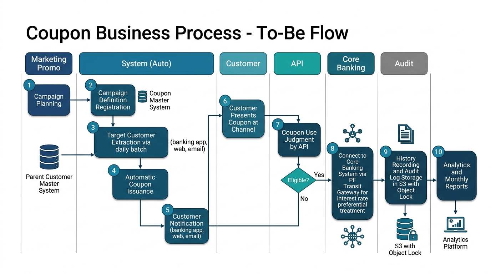

# 10-1. 要件定義書テンプレート

## 0. 文書管理情報

| 項目 | 値 |
|---|---|
| 文書 ID | REQ-001 |
| 版数 | 0.1 (Draft) |
| 作成日 | YYYY-MM-DD |
| 主担当 | PM (Yutaro Maeda) |
| 顧客側責任者 | (記入) |
| 承認者 | (記入) |
| 承認日 | YYYY-MM-DD |
| 配布範囲 | (記入) |

---

## 1. プロジェクト目的・背景

### 1.1 ビジネス目的
- 大手金融機関グループの **グループ顧客化促進** および **グループ外損失利益低減**
- 施策の一部として **特別金利電子クーポン** を発行・管理することで、顧客のグループ内取引を促す
- (記入: 中期経営計画上の位置付け、対象顧客セグメント、想定 KPI)

### 1.2 IT プロジェクト目的
- 特別金利電子クーポンを管理するシステム (本システム) を構築する
- 親システム「顧客名寄せ親システム (全店名寄せ相当)」の子プロジェクトとして I/F 連携
- 次期クラウド共通基盤 (オープン勘定系 PF 相当) へクラウドシフトして構築する

### 1.3 達成指標 (KGI / KPI)

| 指標 | 目標値 | 測定方法 |
|---|---|---|
| クーポン発行処理可用性 | 99.95% / 月 | CloudWatch / アプリ監視 |
| クーポン利用判定応答時間 | < 1 秒 (P95) | アプリログ集計 |
| キャンペーン期間中ピーク処理性能 | XX 件/秒 | 性能試験 |
| 監査エビデンス取得率 | 100% (FISC 第 11 版該当項目) | 監査ログ集計 |
| カットオーバー後 30 日無重大障害 | P1 障害 0 件 | 障害管理表 |

---

## 2. スコープ

### 2.1 In Scope
- クーポン管理アプリケーション (発行 / 利用受付 / 履歴 / マスタ / 帳票)
- AWS インフラ (VPC / ECS / Aurora / S3 / EFS / IAM / Route 53 / CloudWatch / Change Calendar 等)
- 親システム (顧客名寄せ) との I/F (顧客 ID 取得バッチ、属性参照 API)
- 勘定系との I/F (PF 側経由、金利優遇情報の連携)
- 認証基盤 (IAM Identity Center) との SSO 連携
- IaC (Terraform) と CI/CD パイプライン
- 監視・運用基盤 (アラート / ログ / 監査エビデンス取得)
- 運用機能 (バッチ / 通知 / 障害復旧自動化)
- 4 環境構築 (MUT / LT / ST / 開発結合 / 本番) ※ 実体は MUT / LT / ST / PROD の 4 想定
- FISC 第 11 版 / 金融庁ガイドライン対応マッピング

### 2.2 Out of Scope
- 顧客向けチャネル (銀行アプリ / Web) 自体の改修 (連携 I/F のみ本案件)
- 親システム (顧客名寄せ) 本体の改修
- 次期クラウド共通基盤 (オープン勘定系 PF) 自体の構築 (PF 側案件)
- データ分析基盤 (BI / DWH) の構築 (連携 I/F のみ)
- カットオーバー後の長期運用保守 (Hyper Care 期間のみ。長期は別契約想定)
- 24x365 オンコール体制 (要件定義のみ、実体制は別契約)

### 2.3 Out of Scope だが要協議
- (記入: 顧客との協議が必要な境界領域)

---

## 3. 業務要件

### 3.1 業務フロー (As-Is / To-Be)

#### As-Is (現状) ※ 確認後記入
- 紙クーポンや既存システムでの取扱い (要ヒアリング)
- 親システムでの顧客管理状況

#### To-Be (本システム)

### 3.2 関係者 (Actor)
- 販促企画担当者 (キャンペーン定義)
- 顧客 (クーポン取得・利用)
- 運用担当者 (システム監視・障害対応)
- 監査担当者 (監査エビデンス確認)
- 親システム管理者 (顧客マスタ提供)
- PF 側管理者 (基盤レベル運用)

---

## 4. 機能要件

> 各要件 ID は `FR-{カテゴリ}-NNN` 形式。優先度: Must / Should / Could (MoSCoW)

### 4.1 クーポン発行管理 (FR-CPN)

| 要件 ID | 要件 | 優先度 | 備考 |
|---|---|---|---|
| FR-CPN-001 | 販促企画担当者がキャンペーン定義を登録できる | Must | キャンペーン期間 / 金利優遇率 / 対象顧客セグメント |
| FR-CPN-002 | 親システムから顧客 ID リストをバッチ取込できる | Must | 日次バッチ想定。再実行可能 |
| FR-CPN-003 | 対象顧客にクーポンを自動発行できる | Must | 発行件数 / 失敗件数の記録必須 |
| FR-CPN-004 | クーポンに有効期限を設定できる | Must | 期限切れは自動失効 |
| FR-CPN-005 | クーポン発行を取消できる (発行者 + 承認者) | Should | 4-eyes 必須 |

### 4.2 クーポン利用受付 (FR-USE)

| 要件 ID | 要件 | 優先度 | 備考 |
|---|---|---|---|
| FR-USE-001 | 顧客提示クーポンを API で受け取り、利用可否を判定する | Must | P95 < 1 秒 |
| FR-USE-002 | 利用済みクーポンを再利用不可とする (冪等性) | Must | 二重利用防止 |
| FR-USE-003 | 利用結果を勘定系 (PF 経由) に連携する | Must | (PF I/F 仕様により詳細未確定) |
| FR-USE-004 | 利用判定エラー時にリトライ可能とする | Must | 顧客側は再操作可能 |
| FR-USE-005 | 利用結果通知を顧客チャネルに返却する | Must | (チャネル仕様による) |

### 4.3 クーポン履歴管理 (FR-HIS)

| 要件 ID | 要件 | 優先度 | 備考 |
|---|---|---|---|
| FR-HIS-001 | 発行・利用・失効ステータスを履歴管理する | Must | 全ステータス遷移記録 |
| FR-HIS-002 | 監査ログを 7 年間保管する | Must | FISC / 金融庁要件 |
| FR-HIS-003 | 顧客 ID で履歴検索できる | Must | 内部ツール想定 |
| FR-HIS-004 | キャンペーン ID で集計レポートを出力できる | Should | 月次レポート |

### 4.4 マスタ管理 (FR-MST)

| 要件 ID | 要件 | 優先度 | 備考 |
|---|---|---|---|
| FR-MST-001 | キャンペーンマスタを CRUD できる | Must | 販促企画担当者 |
| FR-MST-002 | 商品マスタ (金利優遇対象商品) を CRUD できる | Must | |
| FR-MST-003 | 利用条件マスタ (利用金額 / 期間 等) を CRUD できる | Must | |
| FR-MST-004 | マスタ更新は承認フロー経由 | Must | 4-eyes |

### 4.5 帳票・分析 (FR-RPT)

| 要件 ID | 要件 | 優先度 | 備考 |
|---|---|---|---|
| FR-RPT-001 | クーポン利用状況の月次レポートを出力する | Must | PDF / CSV |
| FR-RPT-002 | キャンペーン別効果分析データを出力する | Should | 分析基盤向け CSV |
| FR-RPT-003 | 監査向けエビデンス一覧を出力する | Must | FISC 監査時 |

### 4.6 運用機能 (FR-OPS)

| 要件 ID | 要件 | 優先度 | 備考 |
|---|---|---|---|
| FR-OPS-001 | 日次バッチ (取込 / 集計 / クレンジング) を実行する | Must | 失敗時通知 |
| FR-OPS-002 | 夜間バッチをスケジュール実行する | Must | EventBridge 想定 |
| FR-OPS-003 | システム監視アラートを通知する | Must | CloudWatch → SNS / Slack |
| FR-OPS-004 | 障害復旧手順を自動化する (Auto Recovery) | Should | 該当パターンのみ |

---

## 5. 非機能要件

> 詳細は [10-3_非機能要件整理シート](10-3_非機能要件整理シート.md) を参照。

### 5.1 可用性 (NFR-AV)
- NFR-AV-001: 本システムコアサービス可用性 99.95% / 月
- NFR-AV-002: Multi-AZ 配置 (Aurora / ECS / ALB 等)
- NFR-AV-003: DR サイト (大阪リージョン) RPO < 15 分, RTO < 4 時間 (要協議)

### 5.2 性能 (NFR-PF)
- NFR-PF-001: クーポン利用判定 P95 < 1 秒
- NFR-PF-002: キャンペーン開始時ピーク XX req/sec (要数値確認)
- NFR-PF-003: バッチ処理ウィンドウ X 時間以内 (要数値確認)

### 5.3 セキュリティ (NFR-SC)
- NFR-SC-001: FISC 第 11 版全項目への対応マッピング保有
- NFR-SC-002: 金融庁サイバーセキュリティガイドライン対応
- NFR-SC-003: データ暗号化 (転送中 TLS 1.2+、保存 AES-256 / KMS CMK)
- NFR-SC-004: 監査ログの改ざん防止 (Object Lock COMPLIANCE モード)
- NFR-SC-005: 個人情報保護法対応 (氏名・住所等は親システムで保持、本システムは顧客 ID のみ)

### 5.4 バックアップ (NFR-BK)
- NFR-BK-001: Aurora 自動バックアップ (35 日)
- NFR-BK-002: AWS Backup による日次バックアップ (Cross-region)
- NFR-BK-003: 監査ログ 7 年保管 (Object Lock COMPLIANCE)

### 5.5 スケーラビリティ (NFR-SX)
- NFR-SX-001: 顧客数 XX 万人想定での処理能力
- NFR-SX-002: クーポン発行数 X 千万件 / キャンペーン
- NFR-SX-003: ピーク時 Auto Scaling (ECS Service Auto Scaling)

### 5.6 運用性 (NFR-OP)
- NFR-OP-001: Runbook が Confluence に整備されている
- NFR-OP-002: アラート対応 SLA (P1: 15 分, P2: 1 時間, P3: 4 時間)
- NFR-OP-003: 変更管理は Change Calendar 経由

### 5.7 コスト (NFR-CT)
- NFR-CT-001: 月次コストレポートを部門別に提供
- NFR-CT-002: AWS コスト上限 (要数値確認)
- NFR-CT-003: 異常コスト検知アラート (Cost Anomaly Detection)

---

## 6. 制約事項

### 6.1 技術制約
- AWS Tokyo / Osaka リージョン限定 (海外リージョン禁止)
- 次期クラウド共通基盤 (オープン勘定系 PF) のガイドラインに準拠
- 親システム (顧客名寄せ) の現行 I/F 仕様に準拠
- 既存 SOC (Splunk 等) との連携必須 (要確認)

### 6.2 規制制約
- FISC 安全対策基準 第 11 版 (2023/3) 準拠
- 金融庁監督指針・サイバーセキュリティガイドライン対応
- 個人情報保護法 (改正対応)
- (記入: 業界固有規制)

### 6.3 商用契約制約
- AWS 商用契約 (Enterprise Support 想定)
- 監査対応窓口の確保

### 6.4 体制・予算制約
- 最大 4 名体制
- 構築期間 22 ヶ月 (2026/6 - 2028/3)

---

## 7. 前提・依存事項

### 7.1 前提
- 親システム (顧客名寄せ) の現行 / 新基盤対応版 I/F 仕様が要件定義中 (2026/12) までに確定する
- 次期クラウド共通基盤 (PF) のガイドライン v1.0 が要件定義中 (2026/12) までに受領できる
- 顧客側の意思決定者 (販促企画 / IT 統括 / 監査) が明確である

### 7.2 依存
- PF 側 PoC の結果に応じて、想定 AWS サービス構成が変動する可能性
- 親システム側のリリーススケジュールに応じて、結合試験タイミングが変動

---

## 8. リスク

詳細は [PM向け/04_リスク管理.md](../../PM向け/04_リスク管理.md) を参照。

主要リスク TOP 5:
1. R-C01: 親システム I/F 仕様確定遅延
2. R-B01: PF 側 PoC 結果遅延
3. R-F01: PM 自分の稼働超過
4. R-D01: FISC 解釈差
5. R-F02: 要員不足

---

## 9. Exit Criteria (要件定義完了判定)

- [ ] 顧客承認 (販促企画 / IT 統括 / 監査部門)
- [ ] PF 側ガイドライン v1.0 受領済
- [ ] 親システム I/F 仕様合意済
- [ ] FISC 対応マッピング Draft 完成
- [ ] 未確定事項管理表 残件 < 5 件
- [ ] 非機能要件全項目に目標値設定済
- [ ] コスト試算 v1.0 完成
- [ ] 基本設計フェーズの体制確定

---

## 10. 出典

- 案件概要原文 (元請 SIer 提示資料 2026-05-20 受領)
- FISC 安全対策基準 第 11 版 https://www.fisc.or.jp/publication/book/005831.php
- AWS FISC リファレンス第 2 版 https://aws.amazon.com/jp/blogs/news/financereferencearchitecture-fisc11-update/
- 個人情報保護法 https://www.ppc.go.jp/
- 金融庁ガイドライン https://www.fsa.go.jp/
