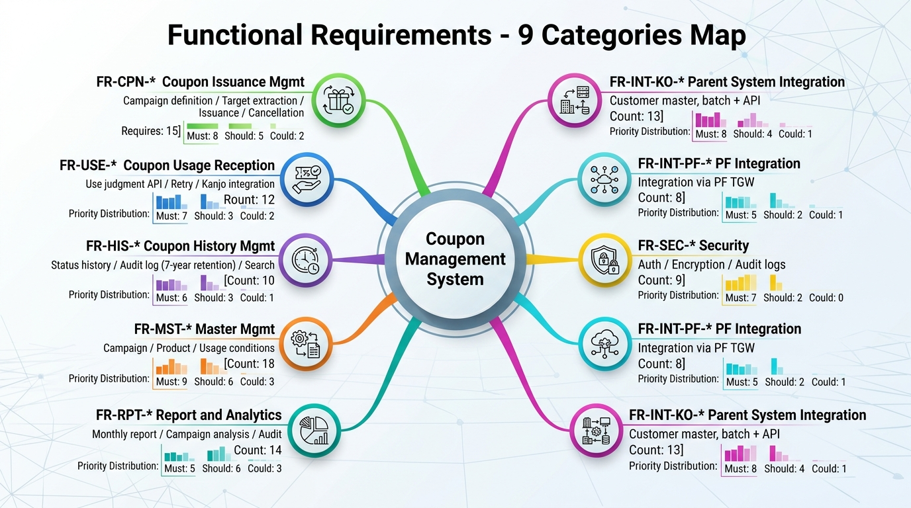

# 10-2. 機能要件一覧テンプレ

**目的**: 要件定義書 (10-1) の機能要件を独立した一覧として管理し、設計・テスト・トレーサビリティの基盤とする。

## 1. 管理項目定義

| 項目 | 説明 | 必須 |
|---|---|---|
| 要件 ID | `FR-{カテゴリ}-{連番3桁}` 形式 | ✓ |
| 要件名 | 短い要件タイトル | ✓ |
| 要件内容 | 詳細な機能説明 (Given/When/Then 形式推奨) | ✓ |
| 優先度 | Must / Should / Could (MoSCoW) | ✓ |
| 関連 NFR | 非機能要件 ID との紐付け | - |
| 関連 FISC 項目 | FISC 第 11 版項番との紐付け | - |
| 主担当 (Actor) | 利用者 / システム / 連携先 | ✓ |
| 入力 | 想定入力 | ✓ |
| 出力 | 想定出力 | ✓ |
| エラーパターン | 想定異常系 | ✓ |
| トレーサビリティ | 基本設計章番号 / テストケース ID | - |
| 状態 | Draft / Approved / Implemented / Tested / Verified | ✓ |

---

## 2. カテゴリ一覧

| カテゴリ | 略号 | 範囲 |
|---|---|---|
| クーポン発行管理 | CPN | キャンペーン定義 / 対象顧客取込 / 発行 / 取消 |
| クーポン利用受付 | USE | 利用判定 / 勘定系連携 / リトライ |
| クーポン履歴管理 | HIS | 履歴記録 / 監査ログ / 検索 |
| マスタ管理 | MST | キャンペーン / 商品 / 利用条件マスタ |
| 帳票・分析 | RPT | レポート / 分析データ |
| 運用機能 | OPS | バッチ / 監視 / 障害復旧 |
| セキュリティ | SEC | 認証認可 / 暗号化 / 監査ログ |
| 連携 (PF) | INT-PF | PF 側経由の I/F |
| 連携 (親システム) | INT-KO | 顧客名寄せとの I/F |

---

## 3. 機能要件詳細 (テンプレ + 例)

### FR-CPN-001 キャンペーン定義の登録

| 項目 | 値 |
|---|---|
| 要件 ID | FR-CPN-001 |
| 要件名 | キャンペーン定義の登録 |
| 優先度 | Must |
| Actor | 販促企画担当者 |
| Given | 販促企画担当者がマスタ管理画面にログインしている |
| When | キャンペーン情報 (名称・期間・金利優遇率・対象顧客セグメント・利用条件) を入力し登録する |
| Then | キャンペーンマスタに保存される、ステータスは「Draft」、承認者の承認後に「Active」になる |
| 入力 | キャンペーン名 (必須) / 開始日 / 終了日 / 金利優遇率 / 対象セグメント / 利用条件 |
| 出力 | キャンペーン ID (UUID) / 登録完了画面 |
| エラーパターン | (1) 必須項目欠落 → 入力エラー (2) 重複キャンペーン名 → 警告 (3) 期間矛盾 → 入力エラー (4) 承認者未指定 → エラー |
| 関連 NFR | NFR-SC-005 (個人情報) / NFR-OP-001 (Runbook) |
| 関連 FISC | (記入) |
| 状態 | Draft |

### FR-CPN-002 親システムから顧客 ID リスト取込

| 項目 | 値 |
|---|---|
| 要件 ID | FR-CPN-002 |
| 要件名 | 親システムから顧客 ID リストをバッチ取込 |
| 優先度 | Must |
| Actor | システム (日次バッチ) |
| Given | キャンペーンが「Active」状態であり、対象顧客抽出条件が定義されている |
| When | 日次バッチが起動し、親システムから顧客 ID リストを取得する |
| Then | 取得した顧客 ID をクーポン発行対象として登録する、件数 / 失敗件数を監査ログに記録 |
| 入力 | キャンペーン ID / 抽出条件 |
| 出力 | 顧客 ID リスト (S3) / 取得件数 / 失敗件数 |
| エラーパターン | (1) 親システム接続失敗 → リトライ (3 回まで) → アラート (2) データ件数 0 件 → 警告 (3) データ形式エラー → アラート + 取込中断 |
| 関連 NFR | NFR-AV-001 / NFR-PF-003 (バッチ処理ウィンドウ) |
| 関連 FISC | (記入) |
| 状態 | Draft |

### FR-USE-001 クーポン利用判定 API

| 項目 | 値 |
|---|---|
| 要件 ID | FR-USE-001 |
| 要件名 | クーポン利用可否判定 API |
| 優先度 | Must |
| Actor | 顧客 (チャネル経由) / システム |
| Given | 顧客がチャネルでクーポンを提示し、利用判定 API がリクエストを受信 |
| When | リクエスト (クーポン ID + 顧客 ID + 利用金額 + チャネル ID) を受信 |
| Then | (1) 有効期限内 (2) 未利用 (3) 顧客 ID 一致 (4) 利用金額が条件範囲内 → 利用可、結果を勘定系に連携する |
| 入力 | クーポン ID / 顧客 ID / 利用金額 / チャネル ID / タイムスタンプ |
| 出力 | 判定結果 (OK / NG + 理由コード) / 勘定系連携ステータス |
| エラーパターン | (1) クーポン ID 不存在 (2) 期限切れ (3) 既利用 (4) 顧客 ID 不一致 (5) 利用条件不適合 (6) 勘定系連携失敗 |
| 関連 NFR | NFR-PF-001 (P95 < 1 秒) / NFR-AV-001 (99.95%) |
| 関連 FISC | (記入: 取引完全性関連項目) |
| 状態 | Draft |

### FR-USE-002 二重利用防止

| 項目 | 値 |
|---|---|
| 要件 ID | FR-USE-002 |
| 要件名 | クーポン二重利用防止 (冪等性) |
| 優先度 | Must |
| Actor | システム |
| Given | クーポンが利用済みステータス、または利用処理中ロック中 |
| When | 同一クーポンに対して利用判定リクエストが来る |
| Then | 「既利用」または「処理中」エラーを返す、データベース更新は行わない |
| 入力 | クーポン ID |
| 出力 | エラーレスポンス (理由コード明記) |
| エラーパターン | (1) ロック取得失敗 → リトライ後タイムアウト (2) DB 接続失敗 → エラー |
| 関連 NFR | NFR-AV-001 / NFR-SC-001 |
| 関連 FISC | (記入: 取引完全性 / 重複検知関連) |
| 状態 | Draft |

### FR-HIS-001 ステータス履歴管理

| 項目 | 値 |
|---|---|
| 要件 ID | FR-HIS-001 |
| 要件名 | クーポンのステータス遷移を履歴管理 |
| 優先度 | Must |
| Actor | システム |
| Given | クーポンに対する任意の操作 (発行 / 利用 / 取消 / 失効) |
| When | ステータスが変化する |
| Then | 旧ステータス / 新ステータス / 操作者 / タイムスタンプ / 操作理由を履歴テーブルに記録 |
| 入力 | (内部処理) |
| 出力 | 履歴レコード |
| エラーパターン | DB 書き込み失敗 → リトライ → アラート |
| 関連 NFR | NFR-SC-004 (改ざん防止) / NFR-BK-003 (7 年保管) |
| 関連 FISC | (記入: 監査証跡関連) |
| 状態 | Draft |

### FR-HIS-002 監査ログ 7 年保管

| 項目 | 値 |
|---|---|
| 要件 ID | FR-HIS-002 |
| 要件名 | 監査ログを 7 年間改ざん不可で保管 |
| 優先度 | Must |
| Actor | システム |
| Given | 全ての操作 (発行 / 利用 / 取消 / マスタ変更 等) |
| When | 操作が記録される |
| Then | S3 (Object Lock COMPLIANCE モード) に 7 年保管、暗号化 (KMS CMK) |
| 入力 | (内部処理) |
| 出力 | S3 オブジェクト |
| エラーパターン | S3 書き込み失敗 → リトライ → DLQ → アラート |
| 関連 NFR | NFR-SC-004 / NFR-BK-003 |
| 関連 FISC | (記入: 監査証跡 / ログ保管関連) |
| 状態 | Draft |

### FR-OPS-001 日次バッチ実行

| 項目 | 値 |
|---|---|
| 要件 ID | FR-OPS-001 |
| 要件名 | 日次バッチ (顧客 ID 取込 / 集計 / クレンジング) |
| 優先度 | Must |
| Actor | システム (EventBridge スケジュール) |
| Given | 業務カレンダーで「実行日」と判定された日 |
| When | 指定時刻 (例: 0:00 JST) に EventBridge トリガー |
| Then | ECS Task としてバッチ実行、完了 / 失敗を CloudWatch + Slack 通知 |
| 入力 | (なし、スケジュール起動) |
| 出力 | 処理件数 / 失敗件数 / 実行時間 |
| エラーパターン | (1) タイムアウト (2) 親システム接続失敗 (3) DB 書き込み失敗 |
| 関連 NFR | NFR-AV-001 / NFR-PF-003 |
| 関連 FISC | (記入) |
| 状態 | Draft |

### FR-OPS-003 監視アラート通知

| 項目 | 値 |
|---|---|
| 要件 ID | FR-OPS-003 |
| 要件名 | システム監視アラートを通知 |
| 優先度 | Must |
| Actor | システム (CloudWatch Alarm) |
| Given | CloudWatch Alarm が ALARM 状態に遷移 |
| When | Alarm のメトリクス閾値超過 |
| Then | (1) SNS Topic に通知 (2) Slack #ops に通知 (3) 重要度 P1 は電話発信 (Amazon Connect or PagerDuty 等) |
| 入力 | (CloudWatch Metric) |
| 出力 | 通知メッセージ |
| エラーパターン | (1) SNS 配信失敗 → DLQ (2) Slack API エラー → リトライ |
| 関連 NFR | NFR-OP-002 (SLA) |
| 関連 FISC | (記入: 障害対応関連) |
| 状態 | Draft |

---

## 4. トレーサビリティマトリクス (テンプレ)

| 要件 ID | 基本設計章 | 詳細設計章 | テストケース ID | テスト結果 | 監査エビデンス |
|---|---|---|---|---|---|
| FR-CPN-001 | (記入) | (記入) | TC-CPN-001-* | (記入) | EV-XX-* |
| FR-CPN-002 | | | | | |
| FR-USE-001 | | | | | |
| FR-USE-002 | | | | | |
| FR-HIS-001 | | | | | |
| FR-HIS-002 | | | | | |
| FR-OPS-001 | | | | | |
| FR-OPS-003 | | | | | |
| ... | | | | | |

---

## 5. 運用ルール

- 要件起票は PM (自分) + SA で行う
- 顧客との合意は「Draft → Approved」遷移時に行う
- 状態が「Implemented」「Tested」「Verified」になる時はそれぞれのフェーズ終了時に更新
- トレーサビリティマトリクスはフェーズ Exit 時に必ず最新化

---

## 6. 出典

- 案件概要原文
- IEEE 830-1998 Recommended Practice for Software Requirements Specifications
- 既存類似案件「ANK-未割当-金融AWS共通基盤」A1 (構造参考)
