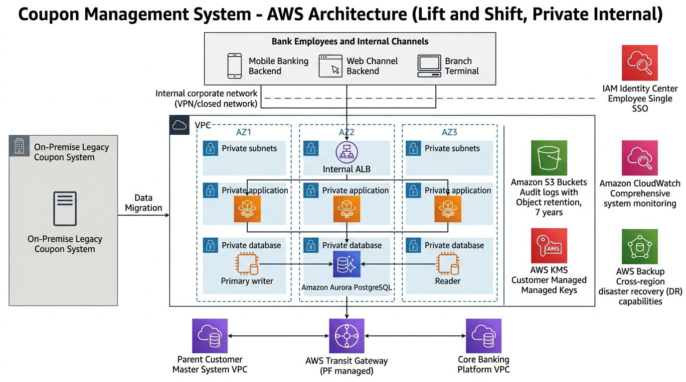
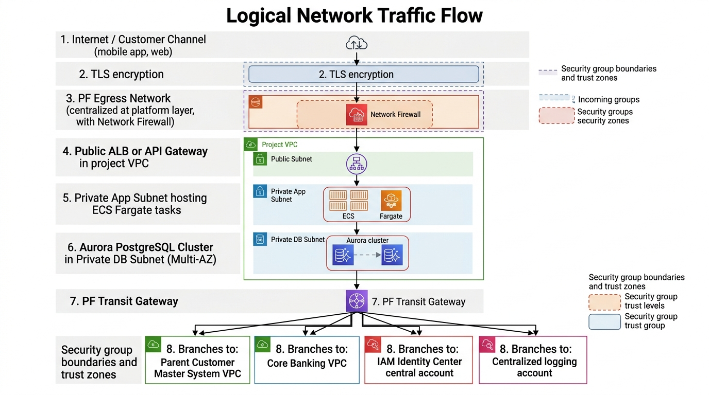
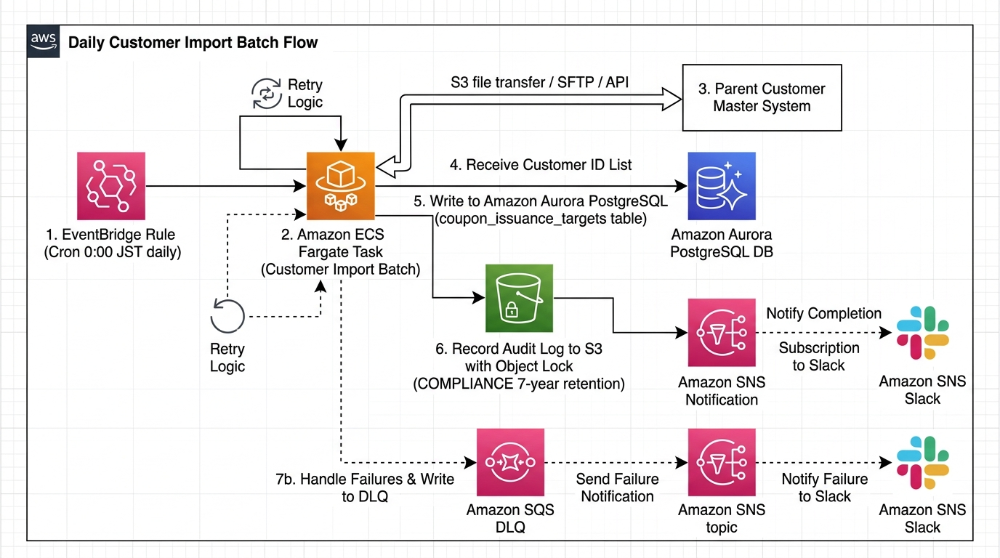
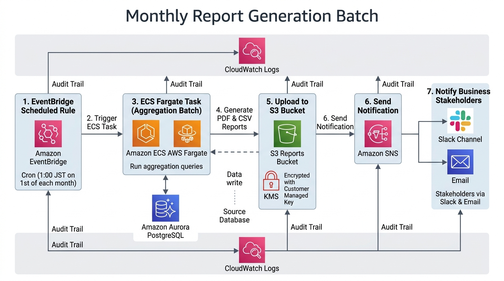
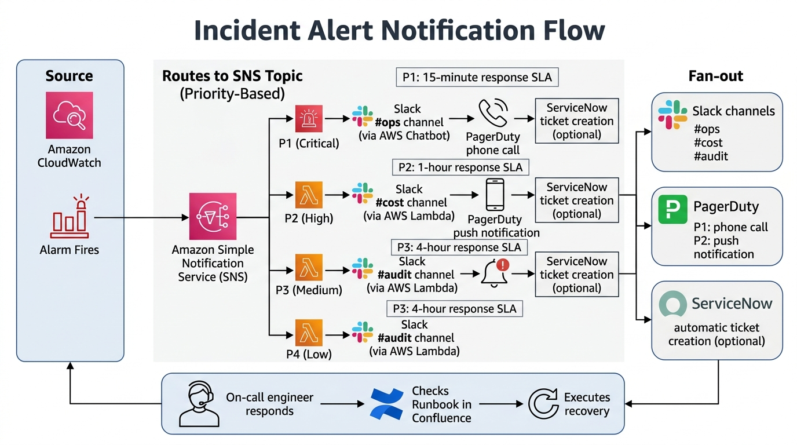

# 20-1. システム方式設計書テンプレ

## 0. 文書管理情報

| 項目 | 値 |
|---|---|
| 文書 ID | BD-001 |
| 版数 | 0.1 (Draft) |
| 作成日 | YYYY-MM-DD |
| 主担当 | SA |
| レビュー者 | PM (Yutaro Maeda) / IT 統括 |
| 承認者 | 顧客責任者 |
| 関連文書 | [10-1_要件定義書テンプレ](../10_要件定義/10-1_要件定義書テンプレ.md) |

---

## 1. システム全体像



### 1.1 システム位置付け

```
[顧客向けチャネル (バンクアプリ / Web)]
       ↕ (API / 連携)
[本システム (クーポン管理子システム)]      ←本案件で構築
       ↕                  ↕                  ↕
[親システム]    [次期クラウド共通基盤 PF]   [勘定系]
 (顧客名寄せ)   (オープン勘定系 PF 相当)
```

### 1.2 主要構成要素

| # | 構成要素 | 概要 | AWS サービス候補 |
|---|---|---|---|
| 1 | API ゲートウェイ | 顧客チャネルからのリクエスト受付 | API Gateway / ALB |
| 2 | アプリケーション (API) | クーポン利用判定 / マスタ操作 | ECS Fargate |
| 3 | アプリケーション (バッチ) | 親システム取込 / 集計 / 通知 | ECS Task + EventBridge |
| 4 | データベース | クーポン情報 / 履歴 / マスタ | Aurora PostgreSQL |
| 5 | キャッシュ | 高頻度参照データ | (要検討: ElastiCache for Redis) |
| 6 | ストレージ (構造化) | ファイル / 帳票 / 監査ログ | S3 |
| 7 | ストレージ (共有) | バッチ中間ファイル等 | EFS (要検討) |
| 8 | 認証認可 | 利用者 SSO / 内部サービス間 | IAM Identity Center / IAM |
| 9 | 鍵管理 | 暗号化キー | KMS CMK |
| 10 | 機密情報 | DB 接続 / API Key | Secrets Manager |
| 11 | 名前解決 | 内部 DNS / 公開 DNS | Route 53 |
| 12 | 監視 | メトリクス / ログ / アラート | CloudWatch + X-Ray |
| 13 | 変更管理 | 凍結期間管理 | Change Calendar |
| 14 | デプロイ | IaC / CI/CD | Terraform + GitLab CI or CodePipeline (要確定) |

### 1.3 ネットワーク全体像 (論理)



---

## 2. 主要設計判断 (ADR サマリ)

### ADR-001 コンピュート基盤に ECS Fargate を選定

**Context**: API + バッチを動かす基盤が必要。EKS / ECS Fargate / Lambda が候補。

**Decision**: **ECS Fargate** を選定。

**Consequences**:
- インフラ管理コスト削減 (Worker ノード不要)
- スケーリング自動
- Lambda より長時間処理可能 (バッチ向き)
- EKS よりシンプル (Kubernetes 運用知識不要)

**Alternatives**:
- EKS: K8s 運用工数が高い、案件規模に対し過剰
- Lambda: バッチ長時間処理 (15 分超) に向かない
- ECS on EC2: ノード運用工数発生

**出典**: AWS ECS Best Practices https://docs.aws.amazon.com/ja_jp/AmazonECS/latest/developerguide/best-practices.html

### ADR-002 DB エンジンに Aurora PostgreSQL を選定

**Context**: トランザクション処理 + 集計分析。データ量 X 千万件想定。

**Decision**: **Aurora PostgreSQL** を選定。

**Consequences**:
- Multi-AZ 自動フェイルオーバー (6 コピー × 3 AZ)
- Backup 1-35 日 + Point-in-Time Recovery
- KMS CMK 暗号化 (作成時固定)
- 性能 (P95 < 1 秒要件) 達成可能

**Alternatives**:
- RDS MySQL: Multi-AZ より復旧時間長い
- DynamoDB: 集計クエリ不向き
- Oracle: ライセンス高、商用ロックイン

**出典**: AWS Aurora https://docs.aws.amazon.com/AmazonRDS/latest/AuroraUserGuide/

### ADR-003 IaC は Terraform 単独 (CFn 併用しない)

**Context**: マルチアカウント / マルチ環境を IaC で管理。

**Decision**: **Terraform** 単独 (Provider: hashicorp/aws ~> 5.100)。

**Consequences**:
- マルチクラウド対応容易 (将来用)
- HCL の表現力高い
- AWS 以外のリソース (GitHub / Datadog 等) 統合容易

**Alternatives**:
- CloudFormation: PF 側 LZA が CFn 管理の場合に限り併用
- CDK: 学習コスト高、案件規模に対し過剰

**注意**: PF 側 LZA が CloudFormation で管理されている領域は触らない。

**出典**: HashiCorp Terraform https://developer.hashicorp.com/terraform/docs

### ADR-004 CI/CD ツール (要件定義時点では未確定)

**Context**: PF 側ガイドラインに従う必要あり。

**Decision**: **未確定 (PF 側 CI/CD ガイドライン受領後に確定)**。暫定では GitHub Actions + OIDC を想定。

**Consequences**:
- ガイドライン受領まで Terraform local apply で先行
- 確定後にパイプライン移行 (詳細設計 Exit 2027/5 までに完了)

### ADR-005 監視は CloudWatch を基盤、Splunk と連携

**Context**: 顧客既存 SOC は Splunk 想定。

**Decision**: **CloudWatch** を基盤監視、ログを Splunk に転送。

**Consequences**:
- CloudWatch Logs Subscription Filter → Kinesis Firehose → Splunk HEC
- CloudWatch Alarm → SNS → PagerDuty + Slack

**出典**: AWS CloudWatch Logs subscription https://docs.aws.amazon.com/AmazonCloudWatch/latest/logs/Subscriptions.html

---

## 3. システム機能配置

### 3.1 API レイヤー

- ALB (Internet-facing もしくは Internal、要件次第) → ECS Service (API)
- API Gateway 経由の場合は VPC Link で接続
- WAF (AWS WAF v2) 想定 (FISC / 金融庁要件)
- TLS 1.2 以上 (ACM 証明書)

### 3.2 アプリケーション

- ECS Cluster (case 別) → ECS Service (常時稼働 API) + ECS Task (バッチ単発)
- サービス分割: 利用判定 API / マスタ管理 API / 内部処理 Worker / バッチ Task
- Task Role による IAM 制御 (最小権限)
- ログは awslogs / FireLens で CloudWatch Logs に送信
- メトリクスは Container Insights で取得

### 3.3 DB レイヤー

- Aurora PostgreSQL Cluster (Multi-AZ、Writer + Reader)
- インスタンスクラス (要数値: db.r6g.large 等)
- Backup 35 日 + 月次手動 Snapshot
- KMS CMK 暗号化 (構築時固定)
- RDS Proxy 利用検討 (接続プール管理、Failover 時のフェイル整理)
- パラメータグループ (Aurora PG 16.x)

### 3.4 ストレージ

| 用途 | サービス | 設定 |
|---|---|---|
| 監査ログ | S3 (Object Lock COMPLIANCE) | KMS CMK / 7 年保管 / Cross-region replication |
| バッチ中間ファイル | S3 | KMS CMK / Lifecycle (30 日後 Glacier) |
| 帳票 | S3 | KMS CMK / Versioning ON |
| 共有ファイル (要件次第) | EFS | KMS CMK |

### 3.5 ネットワーク

- VPC / Subnet 設計は PF 側ガイドライン依存 (G-02)
- Public Subnet: ALB
- Private Subnet: ECS / Aurora
- Isolated Subnet (要件次第): バッチ専用
- NAT Gateway は PF 側中央経由想定

### 3.6 認証認可

- 内部利用者: IAM Identity Center + Entra ID 連携
- サービス間: Task Role / OIDC
- 顧客チャネル: API Gateway + API Key + (mTLS 検討)

### 3.7 監視運用

- CloudWatch Logs: アプリログ + コンテナログ
- CloudWatch Metrics: アプリ + AWS リソース
- X-Ray: トレース (利用判定 API のレイテンシ分析)
- CloudWatch Alarm: 各種閾値
- Change Calendar: 凍結期間管理
- Backup: AWS Backup (Aurora / S3 / EFS)

---

## 4. データフロー (主要シーケンス)

### 4.1 顧客取込バッチ (日次)



### 4.2 クーポン利用判定 (オンライン)

```
顧客チャネル
    → API Gateway / ALB
    → ECS Service (利用判定 API)
    → Aurora (クーポン情報参照 / 更新)
    → ECS Task (勘定系連携 Worker、非同期)
        → PF TGW → 勘定系
    → 結果返却
    → CloudWatch Logs (監査ログ)
```

### 4.3 月次レポート



### 4.4 障害アラート



---

## 5. 環境構成

| 環境 | 用途 | AWS アカウント | 規模 | 暗号化 |
|---|---|---|---|---|
| MUT | 単体動作確認 | 1 | 最小 (Multi-AZ なし) | KMS CMK |
| LT | 結合動作確認 | 1 | 中 (Multi-AZ あり) | KMS CMK |
| ST | 性能 / セキュリティ試験 | 1 | 大 (本番相当) | KMS CMK |
| 開発結合 (DEV-IT) | 親システム / PF 連携試験 | 1 (or LT 兼用) | 中 | KMS CMK |
| 本番 (PROD) | 本番稼働 | 1 | 大 | KMS CMK |
| 共通 (Shared) | ログ集約 / 監査 | (PF 側) | - | KMS CMK |

---

## 6. セキュリティ方式

詳細は [20-5_セキュリティ設計書テンプレ](20-5_セキュリティ設計書テンプレ.md) 参照。

### 6.1 認証認可
- IAM Identity Center SSO + MFA (利用者)
- Task Role + OIDC (内部サービス)
- API Gateway + API Key + (mTLS) (顧客チャネル)

### 6.2 暗号化
- 保存: KMS CMK (Aurora / S3 / EFS / Secrets Manager / CloudWatch Logs)
- 転送: TLS 1.2+ (ALB / Aurora SSL / Internal)

### 6.3 監査ログ
- CloudTrail (PF 集中)
- アプリ監査ログ → S3 (Object Lock COMPLIANCE 7 年)
- セキュリティ Finding → GuardDuty + Security Hub (PF 集中)

---

## 7. 可用性方式

詳細は [20-4_NW_インフラ基本設計書テンプレ](20-4_NW_インフラ基本設計書テンプレ.md) 参照。

- Multi-AZ 必須 (ECS / Aurora / ALB / NAT)
- Auto Scaling (ECS Service Auto Scaling)
- DR: Cross-region Backup (大阪)
- RPO < 15 分 / RTO < 4 時間 (要協議)

---

## 8. 性能方式

- ECS Service Auto Scaling (CPU / メモリ / カスタムメトリクス)
- Aurora Reader 1 台以上 (参照系トラフィック分散)
- RDS Proxy 接続プール (要検討)
- ElastiCache for Redis (キャッシュ、要検討)
- 性能試験 [50-3_性能試験計画](../50_テスト/50-3_性能試験計画.md) で SLO 検証

---

## 9. 運用方式

詳細は [20-6_運用設計書テンプレ](20-6_運用設計書テンプレ.md) / [60-2_監視運用設計書](../60_運用/60-2_監視運用設計書.md) 参照。

- 監視: CloudWatch (基盤) + Splunk (横断、要件次第)
- アラート: SNS → Slack + PagerDuty
- バックアップ: AWS Backup
- 変更管理: Change Calendar + CAB
- インシデント対応: Runbook + Postmortem

---

## 10. コスト概算 (要件定義時点の Draft)

| カテゴリ | 月額目安 (USD) | 備考 |
|---|---|---|
| ECS Fargate | XXXX | (要数値) |
| Aurora PostgreSQL | XXXX | db.r6g.large × 2 (Multi-AZ) 想定 |
| S3 (ログ + 帳票) | XXX | 7 年保管込み |
| Data Transfer | XXX | (要数値) |
| CloudWatch / Logs | XXX | (要数値) |
| KMS / Secrets Manager | XX | |
| その他 | XXX | |
| **合計** | **XXXX** (要数値) | |

> 詳細試算は AWS Pricing Calculator (https://calculator.aws/) を利用。要件定義 Exit 時に v1.0 確定。

---

## 11. Exit Criteria (基本設計完了判定)

- [ ] 顧客承認
- [ ] 6 種設計書 (本書 + アプリ機能 + データ + NW・インフラ + セキュリティ + 運用) v1.0
- [ ] 主要 ADR (5 件以上) 起票済
- [ ] 性能試験計画 Draft 完成
- [ ] 監視・運用設計 Draft 完成
- [ ] コスト試算 v1.0
- [ ] FISC 対応マッピング v0.8
- [ ] PF 側ガイドライン全件反映

---

## 12. 出典

- AWS Well-Architected Framework https://aws.amazon.com/architecture/well-architected/
- AWS Well-Architected FSI Lens https://docs.aws.amazon.com/wellarchitected/latest/financial-services-industry-lens/
- AWS ECS Best Practices https://docs.aws.amazon.com/ja_jp/AmazonECS/latest/developerguide/best-practices.html
- AWS Aurora https://docs.aws.amazon.com/AmazonRDS/latest/AuroraUserGuide/
- AWS CloudWatch Logs subscription https://docs.aws.amazon.com/AmazonCloudWatch/latest/logs/Subscriptions.html
- HashiCorp Terraform https://developer.hashicorp.com/terraform/docs
