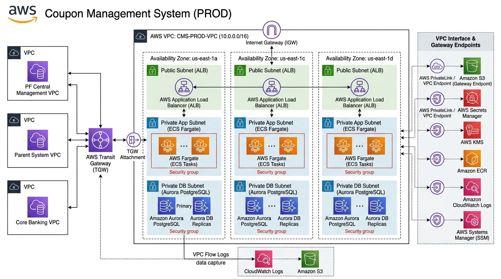

# 20-4. ネットワーク・インフラ基本設計書テンプレ

## 0. 文書管理情報

| 項目 | 値 |
|---|---|
| 文書 ID | BD-004 |
| 版数 | 0.1 (Draft) |
| 作成日 | YYYY-MM-DD |
| 主担当 | SA (NW / インフラ) |
| 関連文書 | [20-1_システム方式設計書テンプレ](20-1_システム方式設計書テンプレ.md) / [10-6_PF連携要件確認リスト](../10_要件定義/10-6_PF連携要件確認リスト.md) |

---



## 1. AWS アカウント構成

### 1.1 案件別アカウント

| アカウント名 | 環境 | 用途 | PF 側 OU 配置想定 |
|---|---|---|---|
| coupon-mut | MUT | 単体動作確認 | Sandbox |
| coupon-lt | LT | 結合動作確認 (UT 中心) | Workloads / Non-Prod |
| coupon-st | ST | 性能 / セキュリティ試験 | Workloads / Non-Prod |
| coupon-dev-it | 開発結合 | 親システム / PF 連携試験 | Workloads / Non-Prod |
| coupon-prod | PROD | 本番稼働 | Workloads / Prod |

> 共通 (ログ / セキュリティ集約 / Identity Center) は PF 側集中管理を想定。PF 側ガイドライン (G-13) 確認後に確定。

### 1.2 アカウント発行プロセス
- PF 側のアカウント発行フォーム (G-01 確認) に従う
- 初期 SCP / Permission Boundary は PF 側標準

---

## 2. VPC / サブネット設計

### 2.1 VPC 配置 (環境別)

| 環境 | VPC CIDR | リージョン | AZ 数 |
|---|---|---|---|
| MUT | (PF 側割当) | ap-northeast-1 | 2 |
| LT | (PF 側割当) | ap-northeast-1 | 3 |
| ST | (PF 側割当) | ap-northeast-1 | 3 |
| DEV-IT | (PF 側割当) | ap-northeast-1 | 3 |
| PROD | (PF 側割当) | ap-northeast-1 | 3 |
| PROD-DR | (PF 側割当) | ap-northeast-3 | 2 (要協議) |

> VPC CIDR は PF 側で重複防止管理 (G-02 確認)。サイズは /20 想定 (4096 IP / VPC)。

### 2.2 サブネット設計 (PROD 例、AZ × 3)

| サブネット | CIDR | AZ | 用途 |
|---|---|---|---|
| public-1a | /24 | ap-northeast-1a | ALB / NAT GW (PF 集中の場合は不要) |
| public-1c | /24 | ap-northeast-1c | 同上 |
| public-1d | /24 | ap-northeast-1d | 同上 |
| private-app-1a | /24 | ap-northeast-1a | ECS Fargate |
| private-app-1c | /24 | ap-northeast-1c | 同上 |
| private-app-1d | /24 | ap-northeast-1d | 同上 |
| private-db-1a | /24 | ap-northeast-1a | Aurora |
| private-db-1c | /24 | ap-northeast-1c | Aurora |
| private-db-1d | /24 | ap-northeast-1d | Aurora |
| isolated-batch-1a | /24 | ap-northeast-1a | バッチ専用 (要件次第) |
| isolated-batch-1c | /24 | ap-northeast-1c | 同上 |
| isolated-batch-1d | /24 | ap-northeast-1d | 同上 |

### 2.3 Route Table

| Route Table | 関連サブネット | デフォルトルート |
|---|---|---|
| public-rt | public-* | IGW (PF 集中の場合は不要) or PF Egress NW |
| private-app-rt | private-app-* | NAT GW (PF 集中) or PF Egress NW |
| private-db-rt | private-db-* | ローカルのみ + VPC Endpoint |
| isolated-batch-rt | isolated-batch-* | (限定的、エンドポイント経由) |

---

## 3. ネットワーク接続

### 3.1 接続トポロジ

```
[Internet / 顧客チャネル]
       ↓ TLS
[PF 集中 Egress / NW Firewall] (G-02)
       ↓
[Public ALB] ← case 別 VPC
       ↓
[Private App Subnet (ECS Fargate)]
       ↓
[Aurora (Private DB Subnet)]
       ↓
[PF TGW] ← G-02 確認
       ↕
[親システム VPC (顧客名寄せ)]
       ↕
[勘定系 VPC]
       ↕
[共有サービス (Identity Center / Log 集約)] (PF 集中)
```

### 3.2 TGW 接続
- PF 側 TGW (Transit Gateway) に接続
- TGW Route Table はPF 集中管理想定 (G-02 確認)
- 接続帯域 (Gbps) は PF 側に依存 (R-B04 リスク)

### 3.3 VPC Endpoint

| サービス | エンドポイント種別 | 用途 |
|---|---|---|
| S3 | Gateway Endpoint | ログ / 帳票アクセス |
| Secrets Manager | Interface Endpoint | DB 接続情報取得 |
| KMS | Interface Endpoint | 暗号化操作 |
| ECR | Interface Endpoint | コンテナイメージ Pull |
| CloudWatch Logs | Interface Endpoint | ログ送信 |
| SSM | Interface Endpoint | Change Calendar / SessionManager |
| STS | Interface Endpoint | Task Role assume |

> VPC Endpoint 中央管理が PF 側で行われている場合は省略 (G-02 NW-08 確認)。

---

## 4. ALB / API Gateway 設計

### 4.1 ALB

| 項目 | 値 |
|---|---|
| スキーム | Internal もしくは Internet-facing (要件次第) |
| ターゲット | ECS Service (IP モード) |
| リスナー | HTTPS:443 (TLS 1.2+, ACM 証明書) |
| WAF | AWS WAF v2 (Managed Rule + Custom) |
| アクセスログ | S3 (有効化、7 年保管) |
| ヘルスチェック | /health (アプリ実装) |
| Connection Draining | 30 秒 |

### 4.2 API Gateway (利用する場合)

| 項目 | 値 |
|---|---|
| タイプ | REST or HTTP API (要検討) |
| 認証 | API Key + (mTLS 検討) |
| スロットリング | 要設定 |
| WAF | WAF v2 統合 |
| ログ | CloudWatch Logs |
| カスタムドメイン | Route53 で管理 |

---

## 5. Security Group / NACL 設計

### 5.1 Security Group 命名規則

`sg-{案件}-{環境}-{用途}-{方向}`

例: `sg-coupon-prod-alb-ingress`, `sg-coupon-prod-ecs-egress`

### 5.2 主要 SG 一覧

| SG 名 | 方向 | ソース / 宛先 | プロトコル / ポート |
|---|---|---|---|
| sg-coupon-{env}-alb-ingress | Ingress | 0.0.0.0/0 or 顧客チャネル IP | TCP/443 |
| sg-coupon-{env}-ecs-ingress | Ingress | sg-coupon-{env}-alb | TCP/8080 |
| sg-coupon-{env}-aurora-ingress | Ingress | sg-coupon-{env}-ecs | TCP/5432 |
| sg-coupon-{env}-vpc-endpoint-ingress | Ingress | private-* CIDR | TCP/443 |

### 5.3 NACL
- デフォルト NACL (allow all) を使用
- 制限は SG で実装 (二重管理を避ける)

---

## 6. DNS / Route53

### 6.1 Public Hosted Zone

| ドメイン | 用途 |
|---|---|
| coupon.{customer-domain} | 公開 API (顧客チャネル向け、要件次第) |

### 6.2 Private Hosted Zone

| ドメイン | 用途 |
|---|---|
| coupon.internal | 内部サービス間通信 |
| alb-{env}.coupon.internal | ALB DNS |
| aurora-{env}.coupon.internal | Aurora Cluster Endpoint |

### 6.3 Resolver
- PF 側 Resolver と統合 (G-02 NW-05)
- DNSSEC 利用検討

---

## 7. 通信暗号化

| レイヤー | 暗号化方式 |
|---|---|
| 外部 → ALB | TLS 1.2+ (ACM 証明書) |
| ALB → ECS | TLS 1.2+ (内部証明書 or 自己署名 + Strict) |
| ECS → Aurora | SSL/TLS 1.2+ (Aurora SSL Mode require) |
| ECS → S3 | TLS (AWS SDK 標準) |
| ECS → Secrets Manager / KMS | TLS (VPC Endpoint 経由) |
| バッチ → 親システム | (親システム I/F 仕様による) |
| ECS → PF TGW → 勘定系 | (PF 側仕様による) |

---

## 8. Aurora 設計

### 8.1 クラスター構成

| 項目 | 値 (PROD 想定) |
|---|---|
| エンジン | Aurora PostgreSQL 16.x (latest minor) |
| インスタンスクラス | db.r6g.large (Writer + Reader) |
| Reader 数 | 1 (要件次第で追加) |
| Multi-AZ | Yes (3 AZ) |
| ストレージ | Aurora 標準 (6 copies × 3 AZ) |
| 暗号化 | KMS CMK (構築時固定、変更不可) |
| Backup 保持 | 35 日 (最大) |
| Backup Window | 19:00-20:00 JST (低負荷時間帯、要協議) |
| Maintenance Window | 月 1 回、深夜 (要協議) |
| Performance Insights | Yes (7 日無料、長期は有料) |
| Enhanced Monitoring | Yes (1 分粒度) |
| RDS Proxy | Yes (要検討、接続プール) |
| Snapshot Cross-region | Yes (大阪) |

### 8.2 パラメータグループ
- Aurora PG カスタムパラメータグループ
- ログ出力 (log_statement = 'mod', log_min_duration_statement = 1000ms 等)
- 暗号化必須 (ssl = on, rds.force_ssl = 1)

### 8.3 IAM 認証
- 内部利用者は IAM 認証 + SSL/TLS
- アプリは Secrets Manager 経由でパスワード認証 (Rotation 自動)

### 8.4 Aurora KMS 暗号化 (再掲、最重要)

- **作成時にしか暗号化指定できない** (R-E01 リスク)
- KMS CMK (顧客管理) 使用必須
- Cross-region snapshot 用に Multi-Region Key 検討
- 出典: https://aws.amazon.com/blogs/database/encrypting-amazon-aurora-using-aws-kms-and-your-own-cmk/

---

## 9. S3 設計

| バケット | 暗号化 | Versioning | Lifecycle | Object Lock |
|---|---|---|---|---|
| coupon-{env}-audit-logs | KMS CMK | ON | 7 年 → Deep Archive | COMPLIANCE 7 年 |
| coupon-{env}-batch-files | KMS CMK | OFF | 30 日後 IA → 90 日後 Glacier | - |
| coupon-{env}-reports | KMS CMK | ON | 1 年後 IA | - |
| coupon-{env}-tf-state | KMS CMK | ON | - | - |
| coupon-{env}-alb-logs | KMS CMK | OFF | 1 年後削除 | - |

### 9.1 Cross-region replication
- 監査ログバケット: 大阪リージョンに Replication (CRR)
- 暗号化: 送信先リージョンの KMS CMK

---

## 10. EFS (利用する場合)

| 項目 | 値 |
|---|---|
| パフォーマンスモード | General Purpose |
| スループットモード | Bursting (or Provisioned) |
| 暗号化 | KMS CMK |
| Backup | AWS Backup |

---

## 11. ECS Fargate 設計

### 11.1 Cluster 構成

| 環境 | Cluster 数 | Service 数 (例) |
|---|---|---|
| MUT/LT/ST/DEV-IT | 1 | 利用判定 API / マスタ API / Worker / バッチ |
| PROD | 1-2 | 同上 (本番では Service 分離検討) |

### 11.2 Service / Task 設定

| 項目 | 利用判定 API | マスタ API | Worker | バッチ |
|---|---|---|---|---|
| Launch Type | FARGATE | FARGATE | FARGATE | FARGATE (Task 単発) |
| Desired Count | 2-N (Auto Scale) | 1-N | 1-N | (Task) |
| CPU | 0.5-1 vCPU | 0.5 vCPU | 0.5-1 vCPU | 1-4 vCPU |
| Memory | 1-2 GB | 1 GB | 1-2 GB | 2-8 GB |
| Auto Scaling Metric | CPU 70% or カスタム | CPU 70% | カスタム | - |
| Network Mode | awsvpc | awsvpc | awsvpc | awsvpc |
| Subnet | private-app-* | private-app-* | private-app-* | isolated-batch-* (or private-app-*) |
| Task Role | 最小権限 | 最小権限 | 最小権限 | 最小権限 |

### 11.3 ログ
- FireLens (Fluent Bit) → CloudWatch Logs + Splunk (要件次第)
- アクセスログ: ALB アクセスログ + アプリログ

### 11.4 コンテナイメージ
- ECR Repository: `coupon-{env}-{service}`
- イメージスキャン: Inspector or Trivy
- イメージタグ: Git commit SHA + 環境タグ
- イメージ更新ポリシー: 古いイメージは 10 世代以前削除

---

## 12. 監視 / ロギング

| 項目 | サービス |
|---|---|
| メトリクス | CloudWatch Metrics (5 分粒度標準、1 分粒度カスタム) |
| ログ | CloudWatch Logs (アプリ / ALB / WAF / VPC Flow Log) |
| トレース | X-Ray (利用判定 API のレイテンシ分析) |
| ダッシュボード | CloudWatch Dashboards (環境別) |
| アラート | CloudWatch Alarm + Composite Alarm |
| 通知 | SNS → Slack + PagerDuty |
| 異常検知 | CloudWatch Anomaly Detection (要件次第) |

詳細は [60-2_監視運用設計書](../60_運用/60-2_監視運用設計書.md) 参照。

---

## 13. 変更管理 (Change Calendar)

詳細は [40-4_Change_Calendar設計](../40_構築/40-4_Change_Calendar設計.md) 参照。

| カレンダー | 状態 | 用途 |
|---|---|---|
| coupon-prod-deploy-calendar | OPEN/CLOSED | 本番デプロイ可能期間管理 |
| coupon-freeze-yearend | CLOSED | 年末年始 (12/29-1/4) |
| coupon-freeze-monthend | CLOSED | 月末月初 (顧客指定) |

---

## 14. 高可用性 / DR

### 14.1 高可用性
- ECS Service: Multi-AZ (3 AZ にタスク分散)
- Aurora: Multi-AZ (6 copies × 3 AZ、自動 Failover)
- ALB: Multi-AZ (3 AZ)
- NAT GW (PF 集中 or 案件側): Multi-AZ

### 14.2 DR (Cross-region、要協議)

| リソース | DR 方式 |
|---|---|
| Aurora | Cross-region Backup (AWS Backup) or Aurora Global Database |
| S3 監査ログ | CRR (大阪) |
| ECR | Cross-region replication |
| Secrets Manager | Cross-region replication |
| KMS | Multi-Region Key |
| Route 53 | Failover Routing Policy |

- RPO: < 15 分 (要協議)
- RTO: < 4 時間 (要協議)
- 年 1 回 DR 訓練 (総合テスト時 + 本番運用後)
- 出典: https://aws.amazon.com/solutions/guidance/disaster-recovery-using-amazon-aurora/

---

## 15. 出典

- AWS VPC ベストプラクティス https://docs.aws.amazon.com/vpc/latest/userguide/vpc-security-best-practices.html
- AWS Aurora https://docs.aws.amazon.com/AmazonRDS/latest/AuroraUserGuide/
- AWS Aurora KMS 暗号化 https://aws.amazon.com/blogs/database/encrypting-amazon-aurora-using-aws-kms-and-your-own-cmk/
- AWS Aurora DR https://aws.amazon.com/solutions/guidance/disaster-recovery-using-amazon-aurora/
- AWS ECS Fargate https://docs.aws.amazon.com/ja_jp/AmazonECS/latest/developerguide/AWS_Fargate.html
- AWS S3 Object Lock https://docs.aws.amazon.com/AmazonS3/latest/userguide/object-lock.html
