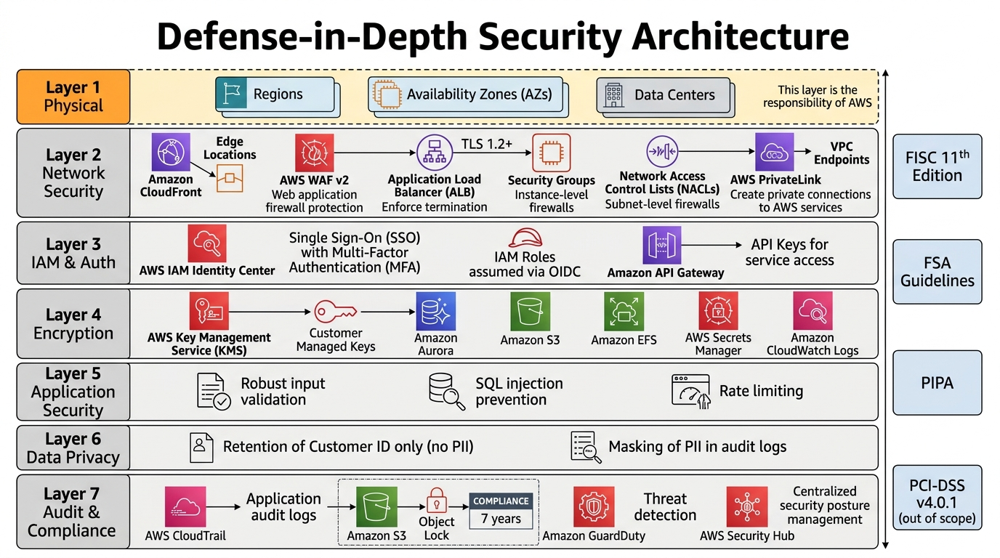

# 20-5. セキュリティ設計書テンプレ

## 0. 文書管理情報

| 項目 | 値 |
|---|---|
| 文書 ID | BD-005 |
| 版数 | 0.1 (Draft) |
| 主担当 | SA (セキュリティ) |
| レビュー者 | 顧客セキュリティ部門 / 監査部門 |
| 関連文書 | [80-1_FISC対応マッピング](../80_規制対応/80-1_FISC対応マッピング.md) |

---



## 1. セキュリティ設計原則

1. **多層防御 (Defense in Depth)**: NW / アプリ / データ / 鍵管理 / 監査の各層で対策
2. **最小権限 (Least Privilege)**: IAM ロール / SCP / Permission Boundary
3. **デフォルト拒否 (Deny by Default)**: SCP / SG / S3 Block Public Access
4. **暗号化 by Default**: 全データ保存 + 全データ転送
5. **監査ログ必須**: CloudTrail + アプリ監査ログを 7 年保管
6. **シークレット非保持**: コード / Git / 環境変数に機密情報を持たない
7. **規制準拠**: FISC 第 11 版 / 金融庁ガイドライン / 個人情報保護法

---

## 2. 認証認可

### 2.1 利用者認証

| 利用者種別 | 認証方式 | MFA | パスワードポリシー |
|---|---|---|---|
| 運用者 / 開発者 (内部) | IAM Identity Center + Entra ID SSO | 必須 | Entra ID 側 |
| 緊急対応 (Break Glass) | Root + ハードウェア MFA | 必須 | (記入) |
| サービスアカウント | IAM Role (OIDC / Task Role) | - | - |
| 顧客チャネル | API Key + (mTLS 検討) | - | - |

### 2.2 Identity Center 設計 (PF 側集中想定)

詳細は PF 側ガイドライン (G-03) 確認後に確定。

#### Permission Set 想定

| Permission Set | 用途 | 主な権限 |
|---|---|---|
| CouponAdmin | 案件管理者 (PM / 元請 SA) | AdministratorAccess (本案件 OU 配下のみ) |
| CouponDeveloper | 開発者 | PowerUserAccess + IAM 制限 |
| CouponReadOnly | 監査 / 閲覧 | ReadOnlyAccess + 監査ログ閲覧 |
| CouponOperator | 運用担当 | 監視 / 障害対応に必要な権限 |
| CouponDBA | DBA | Aurora / Secrets Manager に必要な権限 |
| CouponBreakGlass | 緊急対応 | AdministratorAccess (使用時のみ有効化) |

### 2.3 サービス間認証

| シナリオ | 認証方式 |
|---|---|
| ECS Task → AWS API | Task Role (sts:AssumeRole) |
| ECS Task → Aurora | Secrets Manager + IAM 認証併用 |
| ECS Task → S3 / KMS | Task Role |
| CI/CD → AWS | OIDC + IAM Role (アクセスキー保管禁止) |
| 親システム → 本システム | (親システム I/F 仕様による) |
| 本システム → PF / 勘定系 | (PF 仕様による) |

### 2.4 API 認証 (顧客チャネル → 本システム)

- API Gateway + API Key
- (要検討) mTLS for 高セキュリティ要件
- WAF v2 (Managed Rule + Rate Limit + IP Allowlist)
- CloudFront 経由検討 (DDoS 対策)

---

## 3. 暗号化

### 3.1 保存時暗号化 (Encryption at Rest)

| データ | 暗号化方式 | 鍵 |
|---|---|---|
| Aurora データ | AES-256 | KMS CMK (構築時固定、変更不可) |
| Aurora Backup / Snapshot | AES-256 | KMS CMK |
| S3 オブジェクト | SSE-KMS | KMS CMK |
| EFS データ | AES-256 | KMS CMK |
| EBS (任意) | AES-256 | KMS CMK |
| Secrets Manager | AES-256 | KMS CMK |
| CloudWatch Logs | AES-256 | KMS CMK (要設定) |
| SNS Topic | AES-256 | KMS CMK (要設定) |
| SQS Queue | AES-256 | KMS CMK (要設定) |
| ECR イメージ | AES-256 | AWS Managed Key or KMS CMK |

### 3.2 転送時暗号化 (Encryption in Transit)

| 通信 | プロトコル | 証明書 |
|---|---|---|
| 顧客 → ALB | TLS 1.2+ | ACM (Public) |
| ALB → ECS | TLS 1.2+ | ACM (Private) or 自己署名 |
| ECS → Aurora | TLS 1.2+ | Aurora SSL (rds.force_ssl=1) |
| ECS → S3 / KMS / Secrets Manager (VPCE) | TLS | AWS 標準 |
| 親システム ↔ 本システム | (親 I/F による) | (親 I/F による) |

### 3.3 KMS Key 設計

| Key 用途 | Key Type | Multi-Region | Rotation | アクセス |
|---|---|---|---|---|
| Aurora 用 | Symmetric | Yes (DR 用) | 年次自動 | Aurora Service + 案件 IAM |
| S3 用 (audit logs) | Symmetric | Yes (CRR 用) | 年次自動 | S3 + 案件 IAM + 監査閲覧者 |
| Secrets Manager 用 | Symmetric | No | 年次自動 | Secrets Manager + 案件 IAM |
| CloudWatch Logs 用 | Symmetric | No | 年次自動 | CloudWatch Logs |

### 3.4 鍵管理ルール
- 全 KMS Key は **顧客管理 (Customer Managed Key)**
- 鍵削除待機期間: 30 日 (最大)
- 鍵削除は 4-eyes (PM + IT 統括の 2 名承認)
- Key Policy で 全 Principal の最小権限を明示
- Grant は最小限、有効期限付き

---

## 4. ネットワークセキュリティ

### 4.1 多層防御

```
[Internet]
    ↓
[CloudFront / WAF v2 (Optional)]
    ↓
[ALB (TLS + WAF v2)]
    ↓
[Public Subnet]
    ↓ SG (port 443)
[Private App Subnet (ECS)]
    ↓ SG (port 5432)
[Private DB Subnet (Aurora)]
```

### 4.2 WAF v2 ルール

| ルール | 用途 |
|---|---|
| AWSManagedRulesCommonRuleSet | 一般的攻撃 (OWASP Top 10) |
| AWSManagedRulesKnownBadInputsRuleSet | 既知の悪意ある入力 |
| AWSManagedRulesAmazonIpReputationList | 悪意ある IP |
| AWSManagedRulesSQLiRuleSet | SQL Injection |
| Rate-based Rule | リクエストレート制限 (Custom) |
| IP Allowlist | 顧客チャネル IP のみ許可 (Custom) |

### 4.3 SG / NACL
- SG (Stateful) で実装、NACL は Default のまま
- SG 命名規則: `sg-{案件}-{環境}-{用途}-{方向}`
- 公開ポートは 443 のみ (内部は最小限)

### 4.4 VPC Flow Log
- 全 VPC で有効化
- CloudWatch Logs + S3 に出力
- 異常通信検知 (Athena クエリ)

---

## 5. 監査ログ

### 5.1 取得対象

| ログ種別 | 取得元 | 保管先 | 保管期間 |
|---|---|---|---|
| API 呼び出しログ | CloudTrail (Multi-region, Org Trail) | PF 集中 S3 | 7-10 年 |
| リソース設定変更 | AWS Config | PF 集中 | 7 年 |
| 脅威検知 | GuardDuty | PF 集中 | 90 日 (Active) + 7 年 (S3) |
| コンプライアンス検知 | Security Hub | PF 集中 | 90 日 (Active) + 7 年 (S3) |
| ネットワーク通信 | VPC Flow Logs | 案件 S3 + 集中 | 90 日 (CloudWatch) + 7 年 (S3) |
| ALB アクセス | ALB アクセスログ | 案件 S3 | 7 年 |
| WAF イベント | WAF Logs | 案件 S3 + Splunk | 7 年 |
| アプリ監査ログ | アプリ → S3 (Object Lock COMPLIANCE) | 案件 S3 | 7 年 (改ざん不可) |
| アプリログ | FireLens → CloudWatch Logs + Splunk | CloudWatch Logs + Splunk | CW 30 日 / Splunk 1-7 年 |
| KMS 利用ログ | CloudTrail (KMS イベント) | PF 集中 | 7-10 年 |
| Identity Center 利用ログ | CloudTrail | PF 集中 | 7-10 年 |

### 5.2 アプリ監査ログの内容
- イベント時刻 (UTC + JST)
- イベント種別 (発行 / 利用 / 取消 / 失効 / マスタ変更)
- 操作者 (利用者 ID / システム ID)
- 操作対象 (クーポン ID / キャンペーン ID)
- 操作前後の状態
- リクエスト元 IP / User Agent
- 結果 (成功 / 失敗 + 理由コード)
- 関連トランザクション ID (相関分析用)

### 5.3 改ざん防止
- S3 Object Lock COMPLIANCE モード (一度書き込んだら削除不可)
- 法的削除要求 (個情法削除要請等) は別途プロセス
- KMS CMK で暗号化、Key Rotation

---

## 6. 機密情報管理

### 6.1 Secrets Manager

| Secret | 内容 | Rotation |
|---|---|---|
| coupon-{env}-aurora-master | Aurora Master 認証情報 | 90 日 自動 |
| coupon-{env}-aurora-app | Aurora アプリユーザ認証情報 | 90 日 自動 |
| coupon-{env}-external-api-keys | 外部 API キー (親システム / PF 等) | 手動 (要件次第) |

### 6.2 環境変数 / コード
- 機密情報を環境変数に直接埋め込まない
- ECS Task Definition は Secrets Manager 参照 (secretsmanager:GetSecretValue)
- Git リポジトリには機密情報を含めない (gitleaks / git-secrets スキャン)

### 6.3 Parameter Store
- 機密でない設定値: SSM Parameter Store
- 機密値: Secrets Manager
- 両者の使い分けを明確化

---

## 7. 個人情報保護

### 7.1 本システムが保持する個人情報

| データ | 本システムで保持 | 親システムで保持 |
|---|---|---|
| 顧客 ID | ✓ | ✓ |
| 氏名 / 住所 / 電話番号 / メール | ✗ (不要) | ✓ |
| 銀行口座情報 | ✗ (不要) | ✓ (勘定系) |
| クーポン履歴 | ✓ | ✗ |

> 本システムは **顧客 ID のみ** 保持し、氏名・住所等の個人情報は親システムに任せる設計。

### 7.2 個人情報保護法対応

| 要件 | 対応 |
|---|---|
| 個人情報の利用目的特定 | 顧客への明示 (PF 側 / 親システム側に依存) |
| 適正取得 | 親システムから取得 (顧客 ID のみ) |
| 第三者提供制限 | 勘定系への金利優遇情報連携は本人同意ベース (案件外) |
| 安全管理措置 | 暗号化 / アクセス制御 / 監査ログ |
| 利用者開示請求 | 顧客 ID 単位での照会 (親システム経由) |
| 削除請求 | 顧客 ID 単位での削除 (法的要件考慮、別プロセス) |

### 7.3 マスキング
- 監査ログ / アプリログで個人情報がうっかり出力されないようマスキング処理
- 開発・テスト環境では本番データを使わない (匿名化データ利用)

---

## 8. インシデント対応

### 8.1 想定インシデント

| カテゴリ | 例 | 対応 |
|---|---|---|
| データ漏洩 | S3 公開 / Aurora 不正アクセス | GuardDuty / SecurityHub 検知 → 即時封鎖 → 影響範囲特定 → 監査部門通知 |
| 認証情報漏洩 | アクセスキー漏洩 / Secrets 漏洩 | キー無効化 → Rotation → 監査ログ確認 |
| マルウェア感染 | コンテナ侵害 | コンテナ停止 / 隔離 → イメージ再ビルド |
| DDoS | API への大量リクエスト | WAF Rate Limit → CloudFront → AWS Shield Advanced |
| 内部不正 | 不正アクセス / データ変更 | CloudTrail で操作確認 → 監査部門通知 |

### 8.2 Runbook
- 各インシデントカテゴリに対応した Runbook を Confluence に整備
- 既存類似案件 E3 (インシデント対応 Playbook) 20 種を参考

### 8.3 通知ルート
- 検知 (GuardDuty / Security Hub) → SNS → Slack + PagerDuty + ServiceNow
- 重要度 P1 → 顧客責任者 + 監査部門 + CIO に 15 分以内通知

---

## 9. 規制対応

### 9.1 FISC 第 11 版

詳細マッピングは [80-1_FISC対応マッピング](../80_規制対応/80-1_FISC対応マッピング.md) 参照。

主要対応領域:
- 統制 (アクセス管理 / 認証 / 暗号化)
- 監査 (ログ / 証跡 / 改ざん防止)
- 障害対策 (可用性 / DR)
- 業務継続 (BCP)
- クラウドサービス固有事項 (PF 側との責任分界)

### 9.2 金融庁ガイドライン

詳細は [80-2_金融庁ガイドライン対応](../80_規制対応/80-2_金融庁ガイドライン対応.md) 参照。

### 9.3 PCI DSS v4.0.1

- **本システムはカード会員データを扱わない設計** とする (Out of Scope)
- 顧客 ID のみ保持、決済情報は勘定系で処理
- 適用範囲を要件定義中に確定

### 9.4 個人情報保護法

§ 7 参照。

---

## 10. セキュリティ試験計画

- 静的解析 (CI で必須): tflint / tfsec / Checkov
- 動的解析: OWASP ZAP 等 (ST 環境で実施、要件次第)
- ペネトレーションテスト: 外部委託 (本番リリース前に実施、AWS Customer Pen Test ポリシー準拠)
- 脆弱性スキャン: Inspector (継続)

### 10.1 AWS Pen Test ポリシー
- 一部の動作 (DNS 攻撃 / DoS 等) は禁止
- 事前申請が必要なテスト種別あり
- 出典: https://aws.amazon.com/security/penetration-testing/

---

## 11. Exit Criteria

- [ ] FISC 対応マッピング v1.0
- [ ] 金融庁ガイドライン対応 v1.0
- [ ] 個人情報保護法対応 v1.0
- [ ] PCI DSS 適用範囲確定
- [ ] 監査部門レビュー OK
- [ ] セキュリティ試験計画 Draft

---

## 12. 出典

- AWS Well-Architected Security Pillar https://docs.aws.amazon.com/wellarchitected/latest/security-pillar/welcome.html
- AWS FISC リファレンス第 2 版 https://aws.amazon.com/jp/blogs/news/financereferencearchitecture-fisc11-update/
- AWS Aurora KMS https://aws.amazon.com/blogs/database/encrypting-amazon-aurora-using-aws-kms-and-your-own-cmk/
- AWS PCI DSS on ECS https://d1.awsstatic.com/whitepapers/ja_JP/compliance/architecting-on-amazon-ecs-for-pci-dss-compliance.pdf
- AWS Security Hub PCI DSS https://docs.aws.amazon.com/ja_jp/securityhub/latest/userguide/pci-standard.html
- AWS Customer Pen Test ポリシー https://aws.amazon.com/security/penetration-testing/
- 個人情報保護委員会 https://www.ppc.go.jp/
