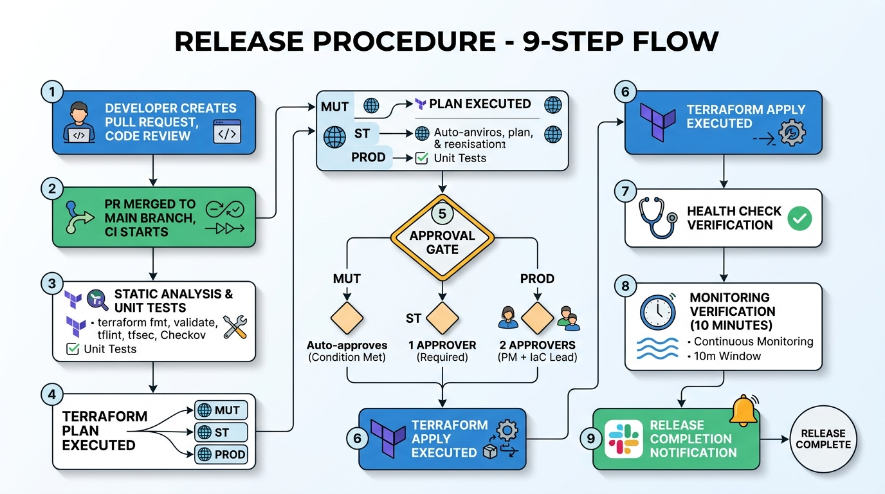

# 20-6. 運用設計書テンプレ

## 0. 文書管理情報

| 項目 | 値 |
|---|---|
| 文書 ID | BD-006 |
| 版数 | 0.1 (Draft) |
| 主担当 | SA (運用) + PM |
| レビュー者 | 顧客運用部門 |

---

## 1. 運用体制

### 1.1 体制概要 (Cutover 後想定)

| 区分 | 主担当 | サブ | 備考 |
|---|---|---|---|
| Tier 1 (一次対応) | 顧客運用部門 | (記入) | 監視・初動 |
| Tier 2 (二次対応) | 案件チーム (Hyper Care 期間) → 別契約運用 | (記入) | 復旧 |
| Tier 3 (専門対応) | SA / IaC | AWS Support | 設計・コード変更 |
| インシデント指揮 | PM (Hyper Care) → 顧客 IT 統括 | 元請 PL | エスカレーション統制 |

### 1.2 オンコール (要件次第)
- 24x365 オンコールは別契約想定
- Hyper Care 期間 (90 日想定) は案件チームが Tier 2-3 対応

---

## 2. 監視運用

詳細は [60-2_監視運用設計書](../60_運用/60-2_監視運用設計書.md) 参照。

### 2.1 監視対象一覧 (サマリ)

| カテゴリ | 監視対象 | 主要メトリクス |
|---|---|---|
| アプリ | 利用判定 API レイテンシ / エラー率 | P95 < 1 秒, エラー率 < 1% |
| アプリ | バッチ完了 / 失敗 | 完了通知 / 失敗アラート |
| AWS インフラ | ECS / Aurora / ALB / S3 | CPU / メモリ / コネクション数 |
| セキュリティ | GuardDuty / SecurityHub / WAF | Finding 件数 |
| コスト | Cost Anomaly | 30% 増で通知 |
| 規制 | Config Rule 適合性 | 100% |

### 2.2 アラート閾値・通知ルート

| アラート | 重要度 | 通知先 |
|---|---|---|
| API エラー率 > 5% (5 分継続) | P1 | Slack + PagerDuty (電話) |
| Aurora CPU > 90% (10 分継続) | P2 | Slack |
| ECS タスク連続失敗 | P2 | Slack + PagerDuty |
| バッチ失敗 | P2 | Slack |
| GuardDuty High Severity | P1 | Slack + PagerDuty + 監査部門 |
| WAF 攻撃ブロック急増 | P2 | Slack |
| コスト異常 | P3 | Slack |

---

## 3. 変更管理

### 3.1 変更分類

| 分類 | 例 | 承認 |
|---|---|---|
| 標準変更 (Pre-Approved) | パッチ適用 / 定型運用作業 | 事前承認済 |
| 通常変更 | アプリリリース / 設計変更 | CAB (変更前) |
| 緊急変更 | 障害対応 / セキュリティパッチ | CIO (事後承認) |

### 3.2 CAB (Change Advisory Board)
- 週次開催 (構築〜運用)
- 詳細は [PM向け/06_会議体運営テンプレ](../../PM向け/06_会議体運営テンプレ.md) § 3.5

### 3.3 Change Calendar
- 凍結期間管理 (年末年始 / 月末月初 / 顧客指定)
- 詳細は [40-4_Change_Calendar設計](../40_構築/40-4_Change_Calendar設計.md)

### 3.4 ロールバック計画
- 全変更にロールバック計画必須
- ロールバック手順は事前検証 (ST 環境)

---

## 4. リリース運用

### 4.1 リリースサイクル

| 環境 | リリース頻度 | 承認 |
|---|---|---|
| MUT | コミットごと自動 | 不要 |
| LT | 日次自動 | 不要 |
| ST | 週次 | PM 承認 |
| PROD | 月次 (or 定期) | PM + IT 統括 |

### 4.2 リリース手順



### 4.3 デプロイ方式
- ECS Rolling Update (Service 単位)
- Blue/Green (高負荷時間帯回避、ALB Weighted Routing 検討)
- Canary (要件次第)

---

## 5. バックアップ運用

### 5.1 バックアップ取得

| 対象 | 方式 | 保管 |
|---|---|---|
| Aurora | 自動 Backup (35 日) + 月次手動 Snapshot | Aurora 標準 + AWS Backup |
| Aurora (Cross-region) | AWS Backup Cross-region | 大阪リージョン |
| S3 (監査ログ) | Cross-region Replication | 大阪リージョン |
| Secrets Manager | Cross-region Replication | 大阪リージョン |
| Terraform State | S3 Versioning + Cross-region replication | 大阪リージョン |

### 5.2 リストア検証
- 四半期に 1 回、リストア検証実施
- ST 環境で本番 Snapshot からリストア → 動作確認

---

## 6. DR (Disaster Recovery)

### 6.1 DR シナリオ

| シナリオ | 対応 |
|---|---|
| AZ 障害 | Multi-AZ で自動継続 |
| リージョン障害 | 大阪リージョンへフェイルオーバー (要協議) |
| データ破損 | Point-in-Time Recovery (Aurora 35 日) |
| サイバー攻撃 | バックアップから復元 + 監査 |

### 6.2 DR 訓練
- 年 1 回以上実施
- 総合テストで初回実施 (2028/2)
- 本番運用後は年次 (監査要件)

### 6.3 RPO / RTO

| 項目 | 目標 | 実現 |
|---|---|---|
| RPO | < 15 分 | Aurora 5 分間隔 Snapshot + Cross-region replication |
| RTO | < 4 時間 | Cross-region Restore + Route 53 Failover |

> Aurora Global Database を採用すれば RPO 数秒 / RTO 1 分以下が可能だが、コスト高。要件次第。

---

## 7. 障害対応

### 7.1 障害分類

| 重要度 | 影響 | 一次応答 SLA | 復旧目標 |
|---|---|---|---|
| P1 (Critical) | 全機能停止 / データ破損 | 15 分 | 4 時間 |
| P2 (High) | 主要機能停止 / 性能劣化 | 1 時間 | 1 営業日 |
| P3 (Medium) | 一部機能制限 | 4 時間 | 1 週間 |
| P4 (Low) | 影響なし / 軽微 | 1 営業日 | 月次対応 |

### 7.2 障害対応フロー

```
[検知 (CloudWatch Alarm / 利用者報告)]
    ↓
[一次対応者起動 (15 分以内 for P1)]
    ↓
[影響範囲特定]
    ↓
[暫定対応 (回避策 / ロールバック)]
    ↓
[復旧]
    ↓
[Postmortem (48-72h 以内)]
    ↓
[再発防止策の実施]
```

### 7.3 Postmortem
- 全 P1 / 主要 P2 で実施
- Blameless (個人責任を問わない)
- Confluence に保管、四半期で集計

### 7.4 Runbook

詳細な障害パターン別 Runbook は Confluence に整備。代表 10 パターン:

1. ECS Service タスク連続起動失敗
2. Aurora Failover 中の接続切断
3. ALB ヘルスチェック失敗
4. KMS Key アクセス拒否
5. Secrets Manager Rotation 失敗
6. CloudWatch Alarm 大量発火
7. S3 アクセス拒否
8. WAF 誤ブロック
9. バッチ長時間 hang
10. 親システム連携バッチエラー

---

## 8. キャパシティ管理

### 8.1 監視メトリクス
- ECS Task 数 / vCPU 利用率
- Aurora 接続数 / CPU / IOPS / ストレージ
- S3 ストレージ容量
- ネットワーク帯域

### 8.2 拡張ガイドライン
- 80% 達成で警告、90% でアクション
- スケジューラ的に Auto Scaling
- 手動拡張は CAB 経由

---

## 9. ログ管理

### 9.1 ログ保管期間

| ログ種別 | CloudWatch 保管 | S3 保管 |
|---|---|---|
| アプリログ | 30 日 | 7 年 (圧縮アーカイブ) |
| アプリ監査ログ | - | 7 年 (Object Lock COMPLIANCE) |
| CloudTrail | 90 日 | 7-10 年 (PF 集中) |
| Config | - | 7 年 (PF 集中) |
| VPC Flow Log | 90 日 | 7 年 |
| ALB アクセスログ | - | 7 年 |
| WAF Log | 30 日 | 7 年 (Splunk + S3) |

### 9.2 ログ検索
- CloudWatch Logs Insights (短期、30 日以内)
- Athena + S3 (長期、過去 7 年)
- Splunk (要件次第)

---

## 10. コスト管理運用

### 10.1 月次コストレポート
- Cost Explorer + Cost Anomaly Detection
- タグ別集計 (Cost Allocation Tag)
- 顧客への報告 (月次)

### 10.2 異常コスト対応
- Cost Anomaly Detection アラート → Slack
- 24h 以内に原因特定 + 対策
- 必要に応じ顧客責任者へエスカレ

---

## 11. ドキュメント運用

### 11.1 保管場所
- 設計書 / Runbook: Confluence
- 監査エビデンス: S3 (Object Lock)
- コード / IaC: GitHub (or GitLab)

### 11.2 命名規則
- `{案件}_{文書ID}_{文書名}_v{版}_{YYYYMMDD}`
- 例: `coupon_BD-001_系統設計書_v1.0_20270430.md`

### 11.3 版管理
- Major.Minor 形式 (v1.0, v1.1, v2.0)
- Draft → Approved → Implemented → Archived

---

## 12. 引き継ぎ (Hyper Care → 定常運用)

### 12.1 Hyper Care 期間 (Cutover 後 90 日想定)
- 案件チームが Tier 2-3 を維持
- 顧客運用部門が Tier 1 を実施
- 週次振り返り会議

### 12.2 引き継ぎ成果物
- 全 Runbook 完成
- 全 Postmortem 振り返り完了
- 監査エビデンス取得手順確立
- DR 訓練 1 回実施済

### 12.3 引き継ぎ判定
- Hyper Care 期間中の重大障害 0 件 (or 全て Postmortem 済)
- Runbook 全件完成
- 運用部門が Tier 1 業務を独立実施できる

---

## 13. Exit Criteria (運用設計)

- [ ] 運用要件全件カバー
- [ ] Runbook 全パターン (代表 10+) 整備
- [ ] 監視アラート設定完了 (Terraform IaC 化)
- [ ] バックアップ計画確定
- [ ] DR 訓練計画策定
- [ ] Hyper Care 引き継ぎ計画策定

---

## 14. 出典

- AWS Well-Architected Operational Excellence Pillar https://docs.aws.amazon.com/wellarchitected/latest/operational-excellence-pillar/welcome.html
- ITIL 4 (運用ベストプラクティス参考)
- AWS Backup https://docs.aws.amazon.com/aws-backup/
- AWS Aurora Backup https://docs.aws.amazon.com/AmazonRDS/latest/AuroraUserGuide/Aurora.Managing.Backups.html
- AWS Cost Anomaly Detection https://docs.aws.amazon.com/cost-management/latest/userguide/getting-started-ad.html
