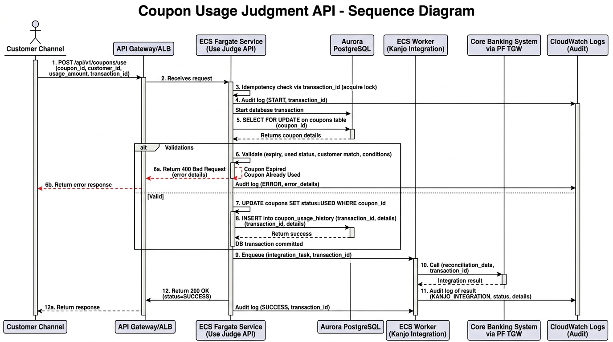
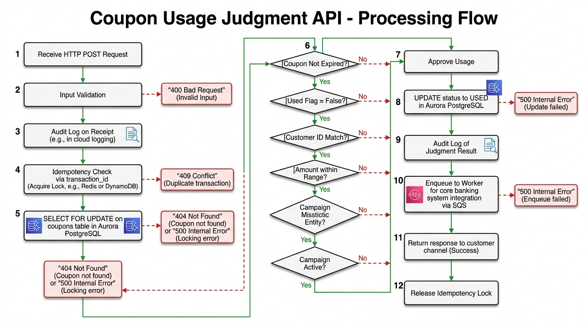

# 30-1. 詳細設計書テンプレ

## 0. 文書管理情報

| 項目 | 値 |
|---|---|
| 文書 ID | DD-001 |
| 版数 | 0.1 (Draft) |
| 主担当 | SA (詳細設計) |
| 関連文書 | 基本設計書 (20-*) / パラメータシート (30-2_) |

---

## 1. 目的

基本設計で確定した方式・機能を、Terraform で実装可能なレベルまで分解する。

**判断軸**:
- 基本設計: 「**何を作るか + 方式**」
- 詳細設計: 「**どう作るか + パラメータ**」

詳細設計 Exit (2027/5) では **全パラメータが確定** している状態とする。

---

## 2. 詳細設計の構成 (機能別 / リソース別)

### A. 機能詳細設計 (アプリ機能ごと)

| # | 章 | 内容 |
|---|---|---|
| A.1 | 機能概要 | 機能 ID / 名前 / 概要 |
| A.2 | 利用者・関係者 | Actor |
| A.3 | 入力 | 入力項目 (型 / 必須 / バリデーション) |
| A.4 | 処理フロー | シーケンス図 / フローチャート |
| A.5 | 出力 | 出力項目 (型 / 形式) |
| A.6 | エラーパターン | 異常系処理 |
| A.7 | データアクセス | 参照・更新テーブル / SQL |
| A.8 | 外部 I/F | 親システム / PF / 勘定系 |
| A.9 | 監査ログ | 取得内容 |
| A.10 | 性能要件 | レイテンシ / スループット |
| A.11 | セキュリティ | 認証認可 / 暗号化 / マスキング |
| A.12 | テストケース | UT / IT / ST シナリオ |

### B. リソース詳細設計 (AWS リソースごと)

| # | 章 | 内容 |
|---|---|---|
| B.1 | リソース概要 | リソース種別 / 命名 |
| B.2 | 配置 | アカウント / リージョン / VPC / Subnet |
| B.3 | パラメータ | リソース別パラメータシート (30-2 配下) |
| B.4 | 依存関係 | 他リソースとの依存 |
| B.5 | IAM | アクセス制御 |
| B.6 | タグ | Cost Allocation / 命名 |
| B.7 | 監視 | CloudWatch Alarm / Metric |
| B.8 | バックアップ | Backup 設定 |
| B.9 | Terraform Module | モジュール名 / variables / outputs |

---

## 3. 機能詳細設計サンプル — FR-USE-001 クーポン利用判定 API

### A.1 機能概要
- 機能 ID: FR-USE-001
- 機能名: クーポン利用判定 API
- 概要: 顧客がチャネル経由で提示したクーポンが利用可能か判定し、結果を返却、勘定系へ連携する

### A.2 利用者・関係者
- Actor: 顧客 (チャネル経由) / 内部 Worker (勘定系連携)
- 連携先: 親システム (顧客 ID 検証用、要件次第) / PF / 勘定系

### A.3 入力 (HTTP POST /api/v1/coupons/use)

| 項目 | 型 | 必須 | バリデーション | 備考 |
|---|---|---|---|---|
| coupon_id | UUID v4 | ✓ | UUID 形式 | クーポン ID |
| customer_id | string(20) | ✓ | 英数字、20 桁 | 親システム発行 |
| usage_amount | decimal(12,2) | ✓ | 0 < x | 利用金額 (円) |
| channel_id | string(20) | ✓ | 列挙値 (APP/WEB/...) | チャネル種別 |
| transaction_id | UUID v4 | ✓ | UUID 形式 | チャネル側トランザクション ID (冪等性キー) |
| client_ip | string | ✓ | IPv4 / IPv6 | 顧客 IP (記録用) |
| user_agent | string | - | - | User Agent |
| timestamp | RFC3339 | ✓ | ISO 8601 | リクエスト時刻 |

### A.4 処理フロー





### A.5 出力 (HTTP Response)

```json
{
  "result": "OK" | "NG",
  "reason_code": "string (NG 時のみ)",
  "transaction_id": "UUID",
  "kanjo_reference_id": "string (連携 ID、非同期)",
  "processed_at": "RFC3339"
}
```

### A.6 エラーパターン

| パターン | HTTP | reason_code | 対応 |
|---|---|---|---|
| 入力バリデーションエラー | 400 | VALIDATION_ERROR | 4xx 返却 |
| クーポン不存在 | 404 | COUPON_NOT_FOUND | 4xx 返却 |
| 期限切れ | 422 | EXPIRED | 4xx 返却 |
| 既利用 | 422 | ALREADY_USED | 4xx 返却 |
| 顧客 ID 不一致 | 422 | CUSTOMER_MISMATCH | 4xx 返却 |
| 利用条件不適合 | 422 | CONDITION_NOT_MET | 4xx 返却 |
| 内部エラー (DB) | 500 | INTERNAL_ERROR | 5xx 返却 + リトライ可 |
| 勘定系連携失敗 | 502 (応答時) or 非同期通知 | KANJO_ERROR | キュー再投入 |

### A.7 データアクセス

#### 参照テーブル
- coupons (PK: coupon_id) — クーポン情報
- campaigns (PK: campaign_id) — キャンペーン定義
- usage_conditions (PK: condition_id) — 利用条件

#### 更新テーブル
- coupons (UPDATE status, used_at, transaction_id)
- coupon_usage_history (INSERT)

#### 主要 SQL

```sql
-- 取得 (SELECT FOR UPDATE)
SELECT * FROM coupons
WHERE coupon_id = :coupon_id
FOR UPDATE NOWAIT;

-- 更新
UPDATE coupons
SET status = 'USED',
    used_at = :now,
    transaction_id = :transaction_id
WHERE coupon_id = :coupon_id
  AND status = 'ACTIVE';

-- 履歴記録
INSERT INTO coupon_usage_history (
    history_id, coupon_id, customer_id, usage_amount,
    channel_id, transaction_id, result, reason_code,
    processed_at, client_ip
) VALUES (...);
```

### A.8 外部 I/F
- 勘定系連携: PF TGW → 勘定系 API or キュー (PF 仕様による)
- 親システム I/F: 不使用 (顧客 ID は既に渡されている前提)

### A.9 監査ログ

| 取得タイミング | 内容 |
|---|---|
| リクエスト受信時 | 全リクエストパラメータ (個人情報マスキング済) + 受信時刻 |
| 判定後 | 判定結果 + reason_code |
| 勘定系連携時 | 連携リクエスト / 連携結果 |

> 監査ログは S3 (Object Lock COMPLIANCE) に 7 年保管。改ざん不可。

### A.10 性能要件
- レイテンシ: P95 < 1 秒 (NFR-PF-001)
- スループット: 通常 XX req/sec、ピーク YY req/sec (NFR-PF-004/005)
- DB クエリレイテンシ: P95 < 100 ms

### A.11 セキュリティ
- 認証: API Gateway + API Key + (mTLS 検討)
- 暗号化: TLS 1.2+
- 個人情報: 顧客 ID のみ保持 (氏名・住所等は親システム)
- ログマスキング: client_ip は記録、user_agent は記録、個人特定情報は不要

### A.12 テストケース (UT)

| TC ID | シナリオ | 期待結果 |
|---|---|---|
| TC-USE-001-01 | 正常: 有効クーポンで利用 | 200 OK, kanjo_reference_id 返却 |
| TC-USE-001-02 | 異常: クーポン不存在 | 404 COUPON_NOT_FOUND |
| TC-USE-001-03 | 異常: 期限切れ | 422 EXPIRED |
| TC-USE-001-04 | 異常: 既利用 | 422 ALREADY_USED |
| TC-USE-001-05 | 異常: 顧客 ID 不一致 | 422 CUSTOMER_MISMATCH |
| TC-USE-001-06 | 異常: 利用条件不適合 | 422 CONDITION_NOT_MET |
| TC-USE-001-07 | 同時実行: 同一クーポン 2 並列 | 1 件成功、1 件 ALREADY_USED |
| TC-USE-001-08 | 冪等性: 同一 transaction_id 再送 | 既存結果返却 |
| TC-USE-001-09 | DB 接続失敗 | 500 + リトライ可 |
| TC-USE-001-10 | 勘定系連携失敗 | 非同期通知 |

---

## 4. リソース詳細設計サンプル — Aurora Cluster

### B.1 リソース概要
- リソース種別: aws_rds_cluster + aws_rds_cluster_instance
- 命名: `coupon-{env}-aurora-cluster`

### B.2 配置
- リージョン: ap-northeast-1
- AZ: 3 (ap-northeast-1a/1c/1d)
- VPC: coupon-{env}-vpc
- Subnet: private-db-1a/1c/1d (DB Subnet Group)

### B.3 パラメータ
詳細は [30-2_インフラパラメータ一覧](30-2_インフラパラメータ一覧.md) の Aurora セクション、および [パラメータシート/aurora.md](パラメータシート/aurora.md) 参照。

### B.4 依存関係
- DB Subnet Group → Private DB Subnet × 3
- Cluster Parameter Group
- DB Instance Parameter Group
- KMS Key (CMK)
- Security Group (sg-coupon-{env}-aurora)
- Secrets Manager (Master / App Secret)
- RDS Proxy (要件次第)

### B.5 IAM
- aws_iam_role: coupon-{env}-aurora-monitoring-role (Enhanced Monitoring 用)
- aws_iam_role: coupon-{env}-aurora-backup-role (AWS Backup 用)

### B.6 タグ
- Project: coupon
- Environment: {env}
- Owner: coupon-team
- CostCenter: (要記入)
- DataClassification: confidential

### B.7 監視

| Alarm | 閾値 | 重要度 |
|---|---|---|
| Aurora CPU > 80% (15 分継続) | 80% | P2 |
| Aurora Connections > 80% (5 分継続) | 80% (Max Connection) | P2 |
| Aurora ReadIOPS / WriteIOPS 急増 | Anomaly Detection | P3 |
| Aurora Failover 発生 | 1 回 | P1 |
| Aurora Storage > 80% | 80% | P3 |

### B.8 バックアップ
- 自動 Backup: 35 日 (Aurora 標準)
- AWS Backup: 月次 + Cross-region (大阪)
- Backup Vault: dedicated

### B.9 Terraform Module
- Module: `modules/aurora/`
- variables: env, cluster_name, instance_class, instance_count, kms_key_arn, ...
- outputs: cluster_endpoint, reader_endpoint, port, secret_arn, security_group_id

---

## 5. 詳細設計レビュー観点

### 5.1 機能詳細設計レビュー観点
- [ ] 全機能要件 (FR-*) がカバーされているか
- [ ] 入力バリデーションが網羅されているか
- [ ] エラーパターンが網羅されているか
- [ ] SQL クエリのパフォーマンス考慮 (Index、N+1 問題)
- [ ] 冪等性が確保されているか
- [ ] 監査ログ取得が必要箇所で行われているか
- [ ] 個人情報マスキングが行われているか
- [ ] テストケースが UT カバレッジ目標を達成可能か

### 5.2 リソース詳細設計レビュー観点
- [ ] 全パラメータが確定しているか (「要数値」が残っていないか)
- [ ] 暗号化設定が KMS CMK か (R-E01 リスク)
- [ ] Backup 設定が NFR-BK-* を満たすか
- [ ] 監視 (Alarm) 設定が NFR-OP-* を満たすか
- [ ] IAM が最小権限か
- [ ] タグが Cost Allocation 命名規則に準拠か
- [ ] Terraform Module 化されているか

---

## 6. Exit Criteria

- [ ] 全機能要件 (FR-*) の詳細設計完了
- [ ] 全リソースのパラメータシート確定
- [ ] Terraform モジュール構造確定
- [ ] CI/CD パイプライン仕様確定
- [ ] Change Calendar 設計 (凍結期間) 確定
- [ ] 全 ADR 確定済
- [ ] 顧客 / 元請レビュー OK

---

## 7. 出典

- AWS Aurora https://docs.aws.amazon.com/AmazonRDS/latest/AuroraUserGuide/
- AWS ECS Best Practices https://docs.aws.amazon.com/ja_jp/AmazonECS/latest/developerguide/best-practices.html
- 12 Factor App https://12factor.net/
- IEEE 1016-2009 (Software Design Description)
