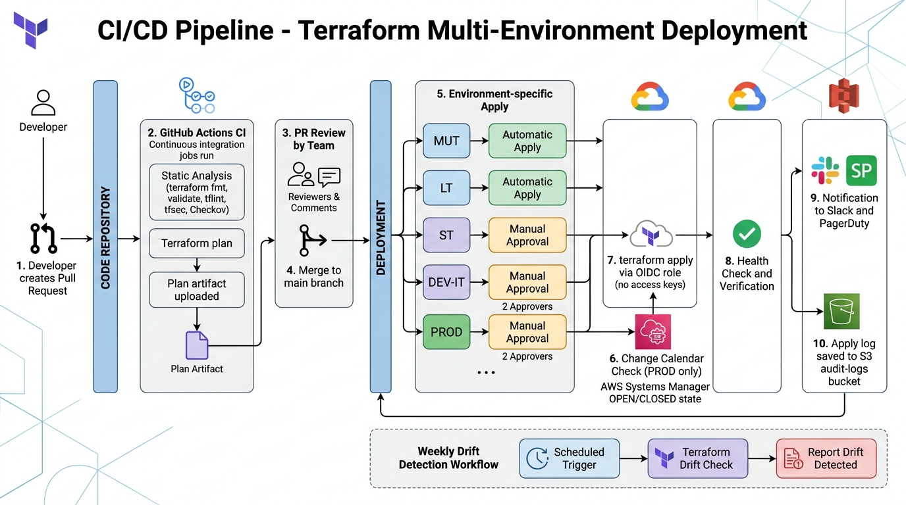

# 40-3. CI/CD パイプライン定義

**目的**: Terraform IaC + アプリケーションを安全に環境別デプロイするパイプライン仕様を定義する。  
**注意**: PF 側 CI/CD ガイドライン (G-06) 受領後に確定。本書は要件定義時点の Draft (暫定)。

---



## 1. CI/CD ツール選定 (確定後反映)

### 1.1 候補と判断軸

| ツール | 長所 | 短所 |
|---|---|---|
| GitHub Actions | OIDC 簡潔、Runner ホスト容易 | プライベートリポジトリの場合コスト |
| GitLab CI | オンプレ運用容易、AWS OIDC 対応 | Runner 管理が必要 |
| AWS CodePipeline + CodeBuild | AWS ネイティブ、cross-account 容易 | PR ベース運用が弱い |
| Jenkins | 柔軟、既存資産 | 管理工数高 |

> **本案件は PF 側ガイドライン受領後に確定**。要件定義 Exit (2026/12) までに ISS-007 で決定。

### 1.2 暫定方針 (確定までのつなぎ)
- Terraform: ローカル apply (構築 MUT のみ、IaC 担当が手動)
- アプリ: ローカルビルド + ECR Push 手動

---

## 2. 暫定パイプライン構成 (GitHub Actions ベース、確定後修正)

### 2.1 全体フロー

```
[PR 作成]
    ↓
[CI: 静的解析 + テスト + Plan] (自動)
    ↓
[PR レビュー (人手)]
    ↓
[マージ to main]
    ↓
[CD: 環境別 Apply] (MUT 自動 / LT 自動 / ST 承認 / DEV-IT 承認 / PROD 承認 2 名)
```

### 2.2 ブランチ戦略

| ブランチ | 役割 | 自動 apply |
|---|---|---|
| feature/* | 開発用 | なし (PR 作成で plan のみ) |
| main | 統合 | MUT / LT 自動、ST/DEV-IT/PROD は手動承認 |
| release/* | リリース候補 | (不使用、main 直接) |

> ブランチ戦略は単純 (trunk based) を採用。リリース管理は環境別承認とタグで管理。

---

## 3. CI ワークフロー (PR 作成時、`.github/workflows/terraform-plan.yml` 想定)

```yaml
name: Terraform Plan

on:
  pull_request:
    paths:
      - 'terraform/**'
      - '.github/workflows/terraform-*.yml'

permissions:
  id-token: write   # OIDC 必須
  contents: read
  pull-requests: write

jobs:
  plan:
    runs-on: ubuntu-latest
    strategy:
      fail-fast: false
      matrix:
        env: [mut, lt, st, dev-it, prod]
    
    steps:
      - uses: actions/checkout@v4
      
      - name: Setup Terraform
        uses: hashicorp/setup-terraform@v3
        with:
          terraform_version: "1.10.x"
      
      - name: Configure AWS Credentials (OIDC)
        uses: aws-actions/configure-aws-credentials@v4
        with:
          role-to-assume: arn:aws:iam::${{ secrets[format('AWS_ACCOUNT_{0}', matrix.env)] }}:role/coupon-${{ matrix.env }}-cicd-plan-role
          aws-region: ap-northeast-1
      
      - name: Terraform Format Check
        run: terraform -chdir=terraform/environments/${{ matrix.env }} fmt -check -recursive
      
      - name: Terraform Init
        run: terraform -chdir=terraform/environments/${{ matrix.env }} init
      
      - name: Terraform Validate
        run: terraform -chdir=terraform/environments/${{ matrix.env }} validate
      
      - name: tflint
        uses: terraform-linters/setup-tflint@v4
      - run: tflint --init && tflint --recursive
      
      - name: tfsec
        uses: aquasecurity/tfsec-action@v1.0.3
      
      - name: Checkov
        uses: bridgecrewio/checkov-action@master
        with:
          directory: terraform/environments/${{ matrix.env }}
          framework: terraform
      
      - name: Terraform Plan
        id: plan
        run: terraform -chdir=terraform/environments/${{ matrix.env }} plan -out=tfplan -no-color
      
      - name: Upload Plan
        uses: actions/upload-artifact@v4
        with:
          name: tfplan-${{ matrix.env }}
          path: terraform/environments/${{ matrix.env }}/tfplan
          retention-days: 30
      
      - name: PR Comment with Plan
        uses: actions/github-script@v7
        with:
          script: |
            // (省略: plan 結果を PR にコメント投稿)
```

### 3.1 静的解析必須
- `terraform fmt`
- `terraform validate`
- `tflint` (AWS specific rules)
- `tfsec` (security)
- `Checkov` (policy)

### 3.2 出力
- PR コメントに plan 結果を投稿
- Plan artifact を 30 日保管 (監査エビデンス)

---

## 4. CD ワークフロー (環境別 apply、`.github/workflows/terraform-apply.yml` 想定)

```yaml
name: Terraform Apply

on:
  workflow_dispatch:
    inputs:
      env:
        description: 'Target Environment'
        required: true
        type: choice
        options: [mut, lt, st, dev-it, prod]
  push:
    branches: [main]
    paths:
      - 'terraform/**'

permissions:
  id-token: write
  contents: read

jobs:
  determine-env:
    runs-on: ubuntu-latest
    outputs:
      envs: ${{ steps.set.outputs.envs }}
    steps:
      - id: set
        run: |
          if [[ "${{ github.event_name }}" == "workflow_dispatch" ]]; then
            echo "envs=[\"${{ inputs.env }}\"]" >> $GITHUB_OUTPUT
          else
            echo "envs=[\"mut\", \"lt\"]" >> $GITHUB_OUTPUT
          fi

  check-change-calendar:
    runs-on: ubuntu-latest
    needs: determine-env
    strategy:
      matrix:
        env: ${{ fromJSON(needs.determine-env.outputs.envs) }}
    steps:
      - name: Configure AWS Credentials
        uses: aws-actions/configure-aws-credentials@v4
        with:
          role-to-assume: arn:aws:iam::${{ secrets[format('AWS_ACCOUNT_{0}', matrix.env)] }}:role/coupon-${{ matrix.env }}-cicd-apply-role
          aws-region: ap-northeast-1
      
      - name: Check Change Calendar (PROD only)
        if: matrix.env == 'prod'
        run: |
          STATE=$(aws ssm get-calendar-state \
            --calendar-names "arn:aws:ssm:ap-northeast-1::document/coupon-prod-deploy-calendar" \
            --query 'State' --output text)
          if [[ "$STATE" != "OPEN" ]]; then
            echo "::error::Change Calendar is $STATE. Deploy not allowed."
            exit 1
          fi
  
  apply:
    runs-on: ubuntu-latest
    needs: check-change-calendar
    strategy:
      matrix:
        env: ${{ fromJSON(needs.determine-env.outputs.envs) }}
    environment:
      name: ${{ matrix.env }}
      # GitHub Environment で承認者を設定 (PROD/ST/DEV-IT)
    
    steps:
      - uses: actions/checkout@v4
      
      - name: Setup Terraform
        uses: hashicorp/setup-terraform@v3
        with:
          terraform_version: "1.10.x"
      
      - name: Configure AWS Credentials (OIDC)
        uses: aws-actions/configure-aws-credentials@v4
        with:
          role-to-assume: arn:aws:iam::${{ secrets[format('AWS_ACCOUNT_{0}', matrix.env)] }}:role/coupon-${{ matrix.env }}-cicd-apply-role
          aws-region: ap-northeast-1
      
      - name: Terraform Init
        run: terraform -chdir=terraform/environments/${{ matrix.env }} init
      
      - name: Terraform Apply
        run: terraform -chdir=terraform/environments/${{ matrix.env }} apply -auto-approve
      
      - name: Save Apply Log
        if: always()
        run: |
          aws s3 cp /tmp/apply.log s3://coupon-${{ matrix.env }}-audit-logs/cicd-logs/$(date +%Y%m%d)/apply-${{ github.run_id }}.log
      
      - name: Notify Slack
        if: always()
        uses: rtCamp/action-slack-notify@v2
        env:
          SLACK_WEBHOOK: ${{ secrets.SLACK_WEBHOOK_OPS }}
          SLACK_TITLE: 'Terraform Apply ${{ matrix.env }}'
          SLACK_MESSAGE: 'Status: ${{ job.status }}'
```

### 4.1 承認ゲート (GitHub Environments)

| 環境 | 承認者 | wait-timer |
|---|---|---|
| MUT | なし (自動) | - |
| LT | なし (自動) | - |
| ST | PM | - |
| DEV-IT | PM | - |
| PROD | PM + IaC リード (2 名) | 24 時間 |

### 4.2 Change Calendar 連携 (PROD)
- apply 前に `aws ssm get-calendar-state` で OPEN/CLOSED を確認
- CLOSED なら apply を中止

---

## 5. アプリケーション CI/CD

### 5.1 ビルド + テスト
```yaml
name: App Build

on:
  pull_request:
    paths: ['app/**']
  push:
    branches: [main]

jobs:
  build-test:
    runs-on: ubuntu-latest
    steps:
      - uses: actions/checkout@v4
      
      - name: Setup Language (e.g., Java/Node.js)
        # (省略)
      
      - name: Unit Test
        run: ./scripts/test-unit.sh
      
      - name: Coverage Report
        # (省略)
      
      - name: Build Container Image
        run: docker build -t coupon-app:${{ github.sha }} .
      
      - name: Image Vulnerability Scan
        uses: aquasecurity/trivy-action@master
        with:
          image-ref: 'coupon-app:${{ github.sha }}'
          severity: 'CRITICAL,HIGH'
```

### 5.2 ECR Push + ECS Deploy

```yaml
name: App Deploy

on:
  workflow_dispatch:
    inputs:
      env:
        type: choice
        options: [mut, lt, st, dev-it, prod]

permissions:
  id-token: write
  contents: read

jobs:
  deploy:
    runs-on: ubuntu-latest
    environment: ${{ inputs.env }}
    steps:
      - uses: actions/checkout@v4
      
      - name: Configure AWS Credentials
        uses: aws-actions/configure-aws-credentials@v4
        with:
          role-to-assume: arn:aws:iam::${{ secrets[format('AWS_ACCOUNT_{0}', inputs.env)] }}:role/coupon-${{ inputs.env }}-cicd-deploy-role
          aws-region: ap-northeast-1
      
      - name: Login to ECR
        uses: aws-actions/amazon-ecr-login@v2
      
      - name: Build and Push
        run: |
          docker build -t $ECR_REGISTRY/coupon-app:${{ github.sha }} .
          docker push $ECR_REGISTRY/coupon-app:${{ github.sha }}
      
      - name: Update ECS Service
        run: |
          aws ecs update-service \
            --cluster coupon-${{ inputs.env }}-cluster \
            --service coupon-${{ inputs.env }}-use-judge-api \
            --force-new-deployment
      
      - name: Wait for Deployment
        run: |
          aws ecs wait services-stable \
            --cluster coupon-${{ inputs.env }}-cluster \
            --services coupon-${{ inputs.env }}-use-judge-api
```

---

## 6. ロールバック

### 6.1 Terraform ロールバック
- 直前 commit に revert PR を作成 → 通常の apply フロー
- State 直接編集禁止
- 緊急時のみ `terraform apply -refresh-only` で State 整合

### 6.2 ECS ロールバック
- ECS Service の Task Definition Revision を 1 つ前に戻す
- `aws ecs update-service --task-definition coupon-prod-use-judge-api:N-1`
- ロールバック後の動作確認必須

---

## 7. OIDC 設定 (アクセスキー保管禁止、必須要件)

### 7.1 GitHub OIDC Provider 登録
```hcl
resource "aws_iam_openid_connect_provider" "github" {
  url             = "https://token.actions.githubusercontent.com"
  client_id_list  = ["sts.amazonaws.com"]
  thumbprint_list = ["6938fd4d98bab03faadb97b34396831e3780aea1"]
}
```

### 7.2 環境別 IAM Role
```hcl
resource "aws_iam_role" "cicd_plan" {
  name = "coupon-${var.env}-cicd-plan-role"
  
  assume_role_policy = jsonencode({
    Version = "2012-10-17"
    Statement = [{
      Effect = "Allow"
      Principal = {
        Federated = aws_iam_openid_connect_provider.github.arn
      }
      Action = "sts:AssumeRoleWithWebIdentity"
      Condition = {
        StringEquals = {
          "token.actions.githubusercontent.com:aud" = "sts.amazonaws.com"
        }
        StringLike = {
          "token.actions.githubusercontent.com:sub" = "repo:{org}/{repo}:pull_request"
        }
      }
    }]
  })
}
```

### 7.3 ポリシー
- plan-role: ReadOnly (plan のみ)
- apply-role: 書き込み権限 (環境別最小権限)
- deploy-role: ECR Push, ECS UpdateService 等

---

## 8. 監視・アラート

### 8.1 CI 失敗通知
- Slack #ops に GitHub Actions 失敗を通知
- 連続失敗 (3 回) で PagerDuty

### 8.2 Drift Detection
- 週次で全環境の `terraform plan` を実行
- 差分 (Drift) があれば Slack 通知

---

## 9. 監査エビデンス

### 9.1 取得項目
- Plan artifact (PR の plan ログ、30 日保管)
- Apply ログ (CI/CD 実行ログ、365 日保管)
- 承認記録 (GitHub Environment 承認履歴)
- Change Calendar 状態 (apply 時の OPEN/CLOSED)

### 9.2 S3 保管
- bucket: `coupon-{env}-audit-logs`
- prefix: `cicd-logs/{YYYY}/{MM}/{DD}/`
- Object Lock COMPLIANCE 7 年

---

## 10. Exit Criteria

- [ ] PF 側 CI/CD ガイドライン受領 + 反映
- [ ] OIDC 設定完了 (全環境)
- [ ] CI ワークフロー稼働 (静的解析全件)
- [ ] CD ワークフロー稼働 (環境別承認)
- [ ] Change Calendar 連携稼働 (PROD)
- [ ] Drift Detection ジョブ稼働
- [ ] ロールバック手順検証完了

---

## 11. 出典

- GitHub Actions OIDC https://docs.github.com/en/actions/deployment/security-hardening-your-deployments/about-security-hardening-with-openid-connect
- AWS Actions configure-aws-credentials https://github.com/aws-actions/configure-aws-credentials
- AWS Systems Manager Change Calendar API https://docs.aws.amazon.com/systems-manager/latest/userguide/change-calendar-getstate.html
- HashiCorp setup-terraform https://github.com/hashicorp/setup-terraform
- tfsec / Checkov / tflint (前述)
