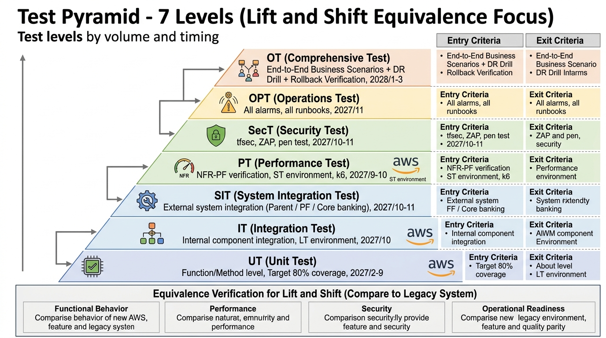

# 50-1. テスト計画書テンプレ

## 0. 文書管理情報

| 項目 | 値 |
|---|---|
| 文書 ID | TST-001 |
| 主担当 | QA リーダー + PM |
| 関連文書 | 基本設計書 / 詳細設計書 / 性能試験計画 |

---

## 1. テスト全体方針

### 1.1 テストレベル

| レベル | 略号 | 範囲 | 主担当 | 実施期間 |
|---|---|---|---|---|
| 単体試験 | UT | 関数 / メソッド / クラス | 開発者 | 構築フェーズ中 (2027/2-9) |
| 結合試験 (内部) | IT | コンポーネント間 | 開発 + QA | 2027/10 |
| システム結合試験 | SIT | 親 / PF / 勘定系連携 | QA | 2027/10-11 |
| 性能試験 | PT | NFR-PF 検証 | QA | 2027/9-10 |
| セキュリティ試験 | SecT | NFR-SC 検証 | QA + セキュリティ | 2027/10-11 |
| 運用試験 | OPT | NFR-OP 検証 | QA + 運用 | 2027/11 |
| 本番結合試験 | PIT | 本番環境動作確認 | QA | 2028/1 |
| 総合テスト | OT | 業務シナリオ全体 | QA + 顧客 | 2028/1-3 |
| DR 訓練 | DR | 災害復旧シナリオ | 全員 | 2028/2 |

### 1.2 テスト戦略

- **シフトレフト**: 早期に問題発見 (UT カバレッジ高、IT 自動化)
- **自動化優先**: UT/IT は CI で自動実行、回帰テスト効率化
- **本番相当 ST 環境**: 性能 / セキュリティ試験は ST 環境 (本番相当) で実施
- **エビデンス取得**: FISC / 金融庁監査要件を意識、全試験でエビデンス取得

---

## 2. UT (単体試験)

### 2.1 範囲
- 各クラス / メソッド / 関数
- 業務ロジック (利用判定 / 取消判定 / マスタ操作)
- データアクセス層 (Repository)
- 例外ハンドリング

### 2.2 カバレッジ目標
- ラインカバレッジ: 80% 以上
- 分岐カバレッジ: 75% 以上
- 業務ロジックは 95% 以上

### 2.3 実施方法
- CI で自動実行 (PR / マージ時)
- カバレッジレポート PR コメント投稿
- 失敗時は CI ブロック

### 2.4 ツール
- 言語別 (JUnit / Jest / pytest 等)
- カバレッジ: JaCoCo / Istanbul / coverage.py

---

## 3. IT (結合試験 - 内部)

### 3.1 範囲
- API 単位 (REST エンドポイント全件)
- DB 操作 (CRUD)
- 内部メッセージング (SQS 等)
- ECS Task 間連携

### 3.2 シナリオ例

| TC ID | シナリオ | 期待結果 |
|---|---|---|
| IT-USE-001 | 利用判定 API + Aurora 更新 | 200 OK, DB に履歴記録 |
| IT-CPN-001 | キャンペーン登録 → 承認 → Active | 状態遷移完了 |
| IT-BAT-001 | 日次取込バッチ + Aurora 更新 | 取込件数一致 |
| IT-ERR-001 | API → DB 接続失敗 → リトライ | 500 + リトライ |

### 3.3 環境
- LT 環境
- 親システム / PF はモック (Stub)

### 3.4 自動化
- CI で自動実行
- E2E 自動テストフレームワーク (Cypress / Playwright / curl + jq 等)

---

## 4. SIT (システム結合試験)

### 4.1 範囲
- 親システム連携 (顧客 ID 取込)
- PF 経由勘定系連携 (利用結果)
- 認証基盤 (IAM Identity Center) との SSO
- 既存 SOC / Splunk 連携 (要件次第)

### 4.2 主要シナリオ

| TC ID | シナリオ | 連携先 | 確認内容 |
|---|---|---|---|
| SIT-001 | 日次取込バッチ実行 | 親システム | 件数 / 内容 / エラー処理 |
| SIT-002 | 利用判定 + 勘定系連携 | PF / 勘定系 | 連携 ID / レスポンス |
| SIT-003 | 親システム障害時のフォールバック | 親システム | 暫定運用パス動作 |
| SIT-004 | PF 障害時の挙動 | PF / 勘定系 | キュー再投入 / 通知 |
| SIT-005 | SSO ログイン | Identity Center | 各 Permission Set 動作 |

### 4.3 環境
- DEV-IT 環境 (実親システム / 実 PF テスト環境と接続)

### 4.4 親システム / PF 側との調整
- テスト環境利用予約 (2027/6-9 まで予約完了)
- データクレンジング手順合意
- 試験結果共有方法合意

---

## 5. 性能試験 (PT)

詳細は [50-3_性能試験計画](50-3_性能試験計画.md) 参照。

### 5.1 試験対象
- 利用判定 API レイテンシ (NFR-PF-001 P95 < 1 秒)
- 通常時スループット (NFR-PF-004)
- ピーク時スループット (NFR-PF-005, キャンペーン開始想定)
- バッチ処理ウィンドウ (NFR-PF-003)

### 5.2 ツール
- k6 / JMeter / Locust / Artillery
- 環境: ST (本番相当)

---

## 6. セキュリティ試験 (SecT)

### 6.1 試験項目

| カテゴリ | 内容 | 実施方法 |
|---|---|---|
| 認証 | SSO / API Key / mTLS 動作 | 機能試験 |
| 認可 | IAM 最小権限 | Policy Simulator + 実機 |
| 暗号化 | 保存 / 転送暗号化 | tfsec / Checkov + 実機確認 |
| 監査ログ | CloudTrail / アプリログ取得 | 監査エビデンス確認 |
| WAF | 攻撃ブロック | ZAP / 手動 |
| 脆弱性スキャン | コンテナ / 依存ライブラリ | Trivy / Inspector |
| ペネトレーションテスト | 外部委託 | 外部委託 |

### 6.2 試験基準
- High / Critical 脆弱性 0
- 全 IAM Role が最小権限
- 全データ暗号化済
- 監査ログ取得確認

---

## 7. 運用試験 (OPT)

### 7.1 試験項目

| カテゴリ | 内容 |
|---|---|
| 監視 | 全 Alarm 発火 → 通知到達 |
| バッチ | 全バッチ正常終了 / 失敗時通知 |
| バックアップ | 取得 + リストア検証 |
| 障害復旧 | Failover 動作 / 自動復旧 |
| 変更管理 | CAB → Change Calendar → apply |
| Runbook | 全手順を実行可能か |

### 7.2 全 Alarm 試験
- 各 Alarm を意図的に閾値超え → 通知到達 + Slack 受信確認

---

## 8. 本番結合試験 (PIT)

### 8.1 範囲
- 本番環境構築完了後の動作確認
- 本番初期データ投入確認
- 本番監視動作確認
- 本番 SSO ログイン確認

### 8.2 注意
- 本番試験は **顧客チャネルからの試験用トラフィックのみ**
- 実顧客への影響なし (Cutover 前)
- 本番 Aurora にテストデータを残さない (試験後クリーンアップ)

---

## 9. 総合テスト (OT)

### 9.1 範囲
- 全業務シナリオの End-to-End 試験
- 切替リハーサル
- 切り戻しリハーサル
- DR 訓練

### 9.2 業務シナリオ例

| シナリオ | 内容 |
|---|---|
| OT-CPN-001 | キャンペーン定義 → 対象顧客抽出 → 発行 → 通知 → 利用 → 勘定系連携 → 履歴 |
| OT-OPS-001 | 月末バッチ実行 → 集計レポート出力 → 監査エビデンス取得 |
| OT-ERR-001 | 親システム障害発生 → フォールバック → 復旧 |
| OT-DR-001 | 大阪リージョン Failover → 動作確認 → Failback |
| OT-CUT-001 | Cutover 手順全工程 |
| OT-RB-001 | 切り戻し手順全工程 |

### 9.3 顧客レビュー
- 各シナリオを顧客と一緒に確認
- 顧客の Go/No-Go 判定

---

## 10. テスト管理

### 10.1 テストケース管理
- ツール: Jira / TestRail / Confluence 等 (顧客環境による)
- ID 体系: `TC-{レベル}-{機能}-{連番}`
- ステータス: Draft / Approved / In Progress / Passed / Failed / Blocked

### 10.2 不具合管理
- ツール: Jira / ServiceNow 等
- 重要度: Critical / High / Medium / Low
- 状態: Open / In Progress / Fixed / Verified / Closed / Reopened
- 修正期限 (SLA): Critical 24h / High 1 営業日 / Medium 1 週間 / Low 2 週間

### 10.3 トレーサビリティ
- 全要件 (FR-*) に対するテストケースが存在 (10-2 トレサ表で管理)
- 全テストケースに実行結果あり

---

## 11. テスト Exit Criteria

| テストレベル | Exit Criteria |
|---|---|
| UT | カバレッジ目標達成 / 全 PASS |
| IT | 全シナリオ PASS / 重要不具合 0 |
| SIT | 全連携シナリオ PASS / 重要不具合 0 |
| PT | NFR-PF 全件達成 / SLO クリア |
| SecT | High / Critical 脆弱性 0 / 監査人 OK |
| OPT | 全 Alarm 動作 / 全 Runbook 確認 |
| PIT | 本番動作確認 / 監視動作確認 |
| OT | 全業務シナリオ PASS / 顧客 Go 判定 |
| DR 訓練 | Failover / Failback 成功 |

---

## 12. テスト工程スケジュール

| 月 | テストレベル |
|---|---|
| 2027/2-9 | UT |
| 2027/9-10 | PT (ST 環境) |
| 2027/10 | IT (LT 環境) |
| 2027/10-11 | SIT (DEV-IT 環境) |
| 2027/10-11 | SecT (ST 環境) |
| 2027/11 | OPT (ST 環境) |
| 2028/1 | PIT (PROD 環境) |
| 2028/1-3 | OT (PROD 環境) |
| 2028/2 | DR 訓練 (PROD ↔ DR) |

---

## 13. 出典

- IEEE 829-2008 (Software and System Test Documentation)
- ISTQB Foundation Level Syllabus
- IPA 非機能要求グレード
- AWS Pen Test ポリシー https://aws.amazon.com/security/penetration-testing/
