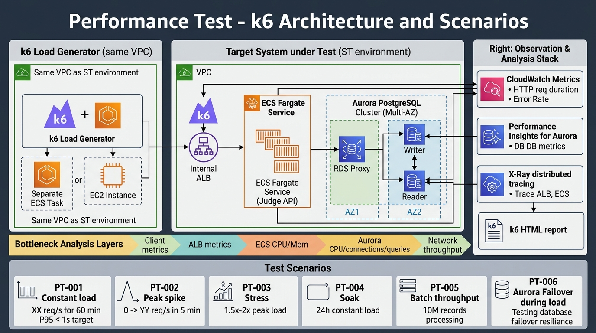

# 50-3. 性能試験計画

## 0. 文書管理情報

| 項目 | 値 |
|---|---|
| 文書 ID | TST-003 |
| 主担当 | QA + SA |
| 関連文書 | [10-3_非機能要件整理シート](../10_要件定義/10-3_非機能要件整理シート.md) (NFR-PF-*) |

---

## 1. 試験目的

非機能要件 (NFR-PF) の目標値達成を ST 環境 (本番相当) で検証する。

### 1.1 主要目標値

| 要件 ID | 項目 | 目標値 |
|---|---|---|
| NFR-PF-001 | クーポン利用判定 API レイテンシ | P95 < 1 秒 |
| NFR-PF-002 | マスタ管理画面操作 | < 3 秒 |
| NFR-PF-003 | バッチ処理ウィンドウ | X 時間以内 (要数値) |
| NFR-PF-004 | 通常時 API スループット | XX req/sec (要数値) |
| NFR-PF-005 | ピーク時 API スループット | YY req/sec (要数値) |
| NFR-PF-006 | バッチ処理スループット | ZZ 件/秒 (要数値) |

---

## 2. 試験環境

- **環境**: ST (本番相当規模)
- **AWS リージョン**: ap-northeast-1
- **隔離**: 試験中は他チームの利用を制限 (CAB 経由予約)
- **モニタリング**: CloudWatch + Container Insights + Performance Insights

### 2.1 リソース構成 (ST = PROD 相当)

| リソース | 数量 |
|---|---|
| ECS Service (利用判定 API) | 2-10 Task (Auto Scale 有効) |
| Aurora | Writer + Reader 1 台 (Multi-AZ) |
| ALB | 1 |
| 試験負荷生成 (k6 / JMeter) | 別 ECS Task / EC2 |

### 2.2 データ準備
- マスタデータ: 本番想定件数
- クーポン: 100 万件 / 1000 万件 / 1 億件のシナリオ
- 顧客 ID: 100 万件想定

---

## 3. 試験ツール




### 3.1 候補
| ツール | 長所 | 短所 |
|---|---|---|
| k6 | スクリプト柔軟、CLI 簡潔 | UI 弱い |
| JMeter | UI 強い、エコシステム豊富 | スクリプト記述やや冗長 |
| Locust | Python 直感的 | 大量並列に弱い |
| Artillery | YAML 簡潔 | 大規模シナリオ弱い |

> **候補: k6** (CI 統合容易、HTML レポート、Distributed mode)

### 3.2 設定例 (k6)

```javascript
// k6 script example: coupon-use-judge.js
import http from 'k6/http';
import { check } from 'k6';
import { Counter, Rate, Trend } from 'k6/metrics';

const errors = new Counter('errors');
const errorRate = new Rate('error_rate');
const latency = new Trend('latency');

export const options = {
  scenarios: {
    constant_load: {
      executor: 'constant-arrival-rate',
      rate: 100,        // 100 req/sec
      timeUnit: '1s',
      duration: '10m',
      preAllocatedVUs: 100,
      maxVUs: 500,
    },
  },
  thresholds: {
    'http_req_duration{status:200}': ['p(95)<1000'],
    'http_req_failed': ['rate<0.01'],
  },
};

export default function () {
  const url = `${__ENV.API_URL}/api/v1/coupons/use`;
  const payload = JSON.stringify({
    coupon_id: __ENV.COUPON_ID,
    customer_id: __ENV.CUSTOMER_ID,
    usage_amount: 1000,
    channel_id: 'APP',
    transaction_id: `${Date.now()}-${Math.random()}`,
    client_ip: '127.0.0.1',
    timestamp: new Date().toISOString(),
  });
  const headers = {
    'Content-Type': 'application/json',
    'x-api-key': __ENV.API_KEY,
  };
  
  const res = http.post(url, payload, { headers });
  
  check(res, {
    'status is 200': (r) => r.status === 200,
  }) || errors.add(1);
  
  errorRate.add(res.status !== 200);
  latency.add(res.timings.duration);
}
```

出典: k6 公式ドキュメント https://grafana.com/docs/k6/latest/

---

## 4. 試験シナリオ

### 4.1 PT-001: 通常負荷 (定常)

| 項目 | 値 |
|---|---|
| 目的 | 通常時 SLO の達成確認 |
| 負荷 | XX req/sec (NFR-PF-004) |
| 時間 | 1 時間 |
| 判定 | P95 < 1 秒, エラー率 < 1% |

### 4.2 PT-002: ピーク負荷 (スパイク)

| 項目 | 値 |
|---|---|
| 目的 | キャンペーン開始時の急増対応 |
| 負荷 | 0 → YY req/sec (5 分で急増)、その後 30 分継続 |
| 判定 | Auto Scaling 適切に発動、P95 < 2 秒 (ピーク時許容)、エラー率 < 5% |

### 4.3 PT-003: 限界負荷 (ストレス)

| 項目 | 値 |
|---|---|
| 目的 | 限界スループット特定 |
| 負荷 | YY × 1.5 → 2.0 倍 |
| 判定 | システム破綻ポイント、Graceful Degradation |

### 4.4 PT-004: 持久試験 (ソーク)

| 項目 | 値 |
|---|---|
| 目的 | メモリリーク / リソース漏れ検知 |
| 負荷 | 定常負荷 24 時間継続 |
| 判定 | メトリクスが時間経過で劣化しないこと |

### 4.5 PT-005: バッチ処理試験

| 項目 | 値 |
|---|---|
| 目的 | NFR-PF-003 達成確認 |
| シナリオ | 顧客取込バッチ (1000 万件 / 5000 万件) |
| 判定 | ウィンドウ内完了 |

### 4.6 PT-006: DB 障害復旧時の挙動

| 項目 | 値 |
|---|---|
| 目的 | Aurora Failover 時の API 挙動 |
| シナリオ | 試験中に Aurora Failover 発生 |
| 判定 | 30 秒以内に再接続、エラー率短時間 < 10%、その後復旧 |

---

## 5. ボトルネック分析手順

### 5.1 観測項目

| レイヤー | メトリクス | ツール |
|---|---|---|
| クライアント | 応答時間 / エラー率 | k6 |
| ALB | レスポンスタイム / 5xx | CloudWatch |
| ECS | CPU / メモリ / Task 数 | CloudWatch + Container Insights |
| Aurora | CPU / 接続数 / レイテンシ / クエリ | Performance Insights |
| RDS Proxy | 接続プール / Wait | CloudWatch |
| ネットワーク | TGW スループット | CloudWatch |

### 5.2 分析フロー
```
1. SLO 違反検出
2. 各レイヤーメトリクス確認
3. ボトルネック特定 (CPU / メモリ / 接続 / ネットワーク)
4. 対策 (Auto Scaling 調整 / DB クエリ最適化 / SQL Index / キャッシュ追加)
5. 再試験
```

---

## 6. 試験結果報告フォーマット

```markdown
# 性能試験結果報告 PT-NNN

## 試験概要
- 試験日: YYYY-MM-DD
- 試験者: (記入)
- 環境: ST
- ツール: k6 vN.N

## 試験条件
- シナリオ: PT-001 (通常負荷)
- 負荷: XX req/sec
- 時間: 60 分

## 結果サマリ
- P50: NN ms
- P90: NN ms
- P95: NN ms
- P99: NN ms
- エラー率: N.NN%
- スループット (実測): NN req/sec

## 判定
- NFR-PF-001 (P95 < 1 秒): PASS / FAIL
- NFR-PF-004 (通常時スループット): PASS / FAIL
- エラー率 < 1%: PASS / FAIL

## ボトルネック
- (記入: 該当なら)

## 対策と次回試験
- (記入)
```

---

## 7. AWS Pen Test ポリシー / 性能試験ガイドライン

- 大規模負荷試験は AWS Account Team に事前通知推奨 (要件次第)
- DDoS シミュレーションは原則禁止
- 試験中の AWS Support ケース起票準備

出典: https://aws.amazon.com/security/penetration-testing/

---

## 8. スケジュール

| 月 | 内容 |
|---|---|
| 2027-09 | 試験ツール準備 + データ準備 |
| 2027-10 (前半) | PT-001 通常 / PT-005 バッチ |
| 2027-10 (後半) | PT-002 ピーク / PT-003 限界 / PT-006 障害復旧 |
| 2027-11 | PT-004 持久 (24h) |
| 2027-11 (末) | 性能試験報告書 v1.0 |

---

## 9. Exit Criteria

- [ ] NFR-PF-* 全件 SLO 達成
- [ ] エラー率 < 1% (通常負荷時)
- [ ] Auto Scaling 期待動作確認
- [ ] バッチ処理ウィンドウ達成
- [ ] 障害復旧時の動作確認
- [ ] ボトルネック特定 + 改善案
- [ ] 顧客レビュー OK

---

## 10. 出典

- k6 公式ドキュメント https://grafana.com/docs/k6/latest/
- AWS Performance Best Practices https://docs.aws.amazon.com/wellarchitected/latest/performance-efficiency-pillar/welcome.html
- AWS Aurora Performance Insights https://docs.aws.amazon.com/AmazonRDS/latest/AuroraUserGuide/USER_PerfInsights.html
- AWS Pen Test ポリシー https://aws.amazon.com/security/penetration-testing/
