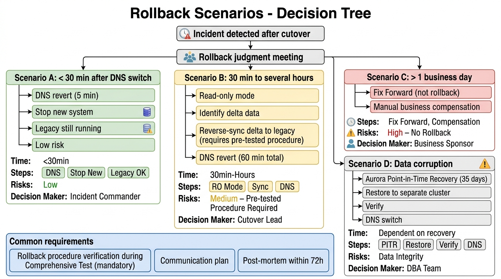

# 70-3. 切り戻し手順書 (Rollback Plan)

## 0. 文書管理情報

| 項目 | 値 |
|---|---|
| 文書 ID | MIG-003 |
| 主担当 | PM + 構築リード |
| 関連文書 | [70-1_本番移行計画書](70-1_本番移行計画書.md) |

> **必須**: 総合テスト中に切り戻し手順を最低 1 回検証する。検証なしでの Cutover 判定は No-Go。

---

## 1. 切り戻し判定基準

### 1.1 切り戻し条件 (1 項目該当で判定会議)
- Cutover 開始後 X 時間以内に重要不具合が発生し、復旧見込みが立たない
- データ不整合が確認され、業務影響が大きい
- 性能劣化が著しく、SLO 違反が継続
- 親システム / PF / 勘定系連携が継続的に失敗
- セキュリティインシデントが発生
- 顧客判断で「業務継続不可」とされた

### 1.2 切り戻し判定会議
- Cutover 開始後の任意のタイミングで PM 招集
- 参加: PM + 顧客責任者 + IT 統括 + 元請 PL + 監査
- 判定: Go (継続) / Rollback (切り戻し)

### 1.3 切り戻し意思決定権限
- **最終意思決定**: 顧客責任者 (主管部門責任者)
- PM は手順実行責任者

---

## 2. 切り戻しシナリオ別手順




### 2.1 シナリオ A: DNS 切替直後 (新システム稼働 < 30 分)

#### 状況
- DNS 切替後すぐに重大不具合判明
- データ整合性は問題なし (新システム稼働時間が短い)
- 既存システム (停止前) に戻すことが可能

#### 手順

| # | 時刻 | アクション | 担当 | 確認 |
|---|---|---|---|---|
| A-1 | T+0 | 切り戻し判定 | 顧客責任者 + PM | 議事録 |
| A-2 | T+5min | DNS 切替戻し (Route 53) | 構築 | TTL 確認 |
| A-3 | T+10min | 既存システム稼働確認 | 既存運用 | OK |
| A-4 | T+15min | 顧客チャネルアクセス確認 | QA | OK |
| A-5 | T+30min | 新システム停止 (ECS Service Desired=0) | 構築 | OK |
| A-6 | T+45min | 関係者通知 | PM | 全員 Ack |
| A-7 | T+60min | Postmortem 計画 (48-72h 以内) | PM | スケジュール確定 |

#### 留意点
- DNS TTL を事前に短縮 (60 秒) しておけば切替は数分以内
- 新システムで処理中のリクエストがあれば、レスポンス完了まで待つ

### 2.2 シナリオ B: 新システム稼働 30 分〜数時間後

#### 状況
- 一定量のデータが新システムに記録されている
- データ整合性確認が必要
- 既存システムへの逆同期 (新→旧) が必要な可能性

#### 手順

| # | 時刻 | アクション | 担当 | 確認 |
|---|---|---|---|---|
| B-1 | T+0 | 切り戻し判定 | 顧客責任者 + PM | 議事録 |
| B-2 | T+5min | 新システム書き込み停止 (Read Only Mode) | 構築 | OK |
| B-3 | T+10min | 新システムの差分データ確認 | DBA + QA | 件数特定 |
| B-4 | T+30min | 差分データを既存システムに逆同期 (要事前手順) | DBA | OK |
| B-5 | T+60min | DNS 切替戻し | 構築 | TTL 確認 |
| B-6 | T+90min | 既存システム稼働確認 + 整合性確認 | QA | OK |
| B-7 | T+120min | 顧客チャネルアクセス再開 | 顧客チャネル | OK |
| B-8 | T+150min | 関係者通知 | PM | 全員 Ack |
| B-9 | T+180min | Postmortem 計画 | PM | スケジュール確定 |

#### 留意点
- **差分データ逆同期手順は事前に作成・検証必須** (Cutover 前のリハーサルで)
- 逆同期できない場合は「業務手動補完」シナリオへ
- 顧客に差分情報を必ず開示

### 2.3 シナリオ C: 新システム稼働 1 営業日以上

#### 状況
- 大量のデータが新システムに記録
- 既存システムへの逆同期が現実的でない
- 「業務継続のため新システムを修正」が現実的な選択肢

#### 手順
- **基本方針**: 切り戻しではなく Fix Forward (修正前進)
- 切り戻しは事実上不可
- 例外的に切り戻し必要なら、データ整合性確保のため業務手動対応

### 2.4 シナリオ D: データ破損

#### 状況
- データ整合性に重大な問題
- リカバリ必要

#### 手順
- Aurora Point-in-Time Recovery (35 日以内の任意時点)
- 復元先は別 Cluster (検証後切替)
- バックアップから別 Cluster 復元 → 整合性確認 → DNS 切替

#### コマンド例 (Aurora Cluster 復元)

```bash
# Point-in-time recovery 
aws rds restore-db-cluster-to-point-in-time \
  --db-cluster-identifier coupon-prod-aurora-restore \
  --source-db-cluster-identifier coupon-prod-aurora-cluster \
  --restore-to-time "2028-03-30T05:00:00Z" \
  --use-latest-restorable-time false \
  --kms-key-id alias/coupon-prod-aurora
```

出典: https://docs.aws.amazon.com/AmazonRDS/latest/AuroraUserGuide/USER_RestoreFromBackup.html

---

## 3. 切り戻し手順検証 (総合テスト時)

### 3.1 検証項目

| # | 検証内容 | 期待結果 |
|---|---|---|
| V-1 | DNS 切替戻し手順 | TTL 60 秒以内に既存に戻る |
| V-2 | 新システム停止手順 | 60 秒以内に停止 |
| V-3 | 既存システム稼働確認 | OK |
| V-4 | Aurora Point-in-Time Recovery | 30 分以内に別 Cluster 復元 |
| V-5 | 差分データ逆同期 | 100% 整合 |
| V-6 | 通知ルート | 全関係者にリーチ |

### 3.2 検証スケジュール
- 2028/02 末 (総合テスト中、Cutover 前最低 1 ヶ月前)
- ST 環境で実施

### 3.3 検証 Exit Criteria
- 全手順が想定時間内に完了
- データ整合性 100%
- 顧客 / 監査部門レビュー OK

---

## 4. 切り戻し当日タイムライン (例: シナリオ B 想定)

> 仮設定。実 Cutover 計画策定時に確定。

```
T+0:00 切り戻し判定会議 (15 分)
T+0:15 判定: Rollback
T+0:20 War Room メンバー全員集合
T+0:30 新システム書き込み停止 (Read Only Mode)
T+0:45 差分データ件数特定
T+1:00 差分データ逆同期開始
T+2:00 逆同期完了確認
T+2:15 DNS 切替戻し (Route 53)
T+2:30 既存システム稼働確認
T+2:45 顧客チャネルアクセス確認
T+3:00 関係者通知 (顧客・PF・親システム・運用部門)
T+3:30 中間レビュー
T+24:00 Postmortem 開始
T+72:00 Postmortem 完了 + 再 Cutover 計画
```

---

## 5. コミュニケーション

### 5.1 切り戻し開始時の通知

| 通知先 | 通知方法 |
|---|---|
| 顧客責任者 | Slack + 電話 |
| 顧客 IT 統括 | Slack |
| 顧客運用部門 | Slack |
| 監査部門 | Slack + Mail |
| PF 側 | Slack + Mail |
| 親システム側 | Slack + Mail |
| 元請 PL | Slack + 電話 |
| 自社マネージャ | Slack |
| チームメンバー | Slack #cutover-warroom |

### 5.2 顧客顧客への通知 (該当時)
- バンクアプリ / Web 上のお知らせ表示 (要件次第)
- 「クーポン機能の一時停止」または「メンテナンス」表記

### 5.3 メディア対応
- 顧客広報部門が主管 (PM は対応しない)
- 元請 PL と連動

---

## 6. Postmortem (切り戻し後)

### 6.1 期間
- Postmortem 開始: 切り戻し完了後 24 時間以内
- Postmortem 完了: 切り戻し完了後 72 時間以内

### 6.2 内容
- 切り戻しに至った原因 (Root Cause)
- 検知タイミング / 対応タイミング
- 切り戻し手順の評価 (時間 / 整合性)
- 業務影響 (件数 / 金額 / 顧客影響)
- 再発防止策
- 再 Cutover 計画

### 6.3 顧客レビュー
- Postmortem 完了後、顧客責任者 + 監査部門に報告
- 顧客承認後に再 Cutover 計画着手

---

## 7. 再 Cutover

### 7.1 再 Cutover 判定基準
- Postmortem の再発防止策が実装済
- 同症状を再現するテストが PASS
- 顧客承認

### 7.2 再 Cutover スケジュール
- Postmortem 完了 + 修正完了 + 検証完了 後
- 通常 2-4 週間後

---

## 8. 切り戻し関連リスク

| リスク | 影響 | 対策 |
|---|---|---|
| 切り戻し手順未検証 | 高 | 総合テスト中に必ず検証 |
| 差分データ逆同期失敗 | 高 | 事前に手順検証 + バックアップから復元 |
| DNS TTL 長すぎ | 中 | Cutover 前に 60 秒に短縮 |
| 既存システム停止状態の長期化 | 中 | 既存システム再開手順確認 |
| 切り戻し判定の遅延 | 中 | 判定基準を事前に書面化 |

---

## 9. Exit Criteria

- [ ] 各シナリオの手順検証完了
- [ ] Aurora Point-in-Time Recovery 動作確認
- [ ] DNS 切替戻し動作確認
- [ ] 差分データ逆同期手順検証
- [ ] 通知ルート全件確認
- [ ] 顧客承認 (切り戻し手順)

---

## 10. 出典

- AWS Aurora Point-in-Time Recovery https://docs.aws.amazon.com/AmazonRDS/latest/AuroraUserGuide/USER_RestoreFromBackup.html
- AWS Route 53 Failover Routing https://docs.aws.amazon.com/Route53/latest/DeveloperGuide/routing-policy-failover.html
- ITIL 4 (Service Transition / Release Management)
- 既存類似案件「ANK-未割当-金融AWS共通基盤」B4 (構造参考)
