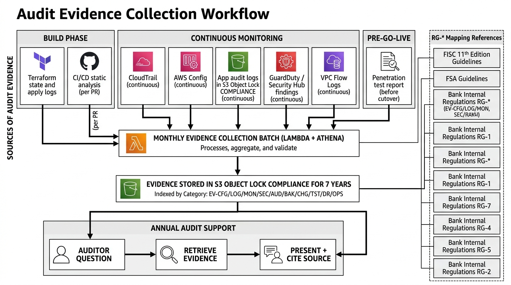

# 80-3. 監査エビデンス一覧

**目的**: 監査時に必要となるエビデンスを一覧化し、取得方法 / 取得タイミング / 保管場所を明確化する。  
**運用**: 構築フェーズ中から計画的に取得。総合テスト中に最終チェック。

---

## 1. エビデンス分類




| ID 接頭辞 | カテゴリ |
|---|---|
| EV-CFG | 設定 (Terraform / AWS Console) |
| EV-LOG | ログ (CloudTrail / アプリ / VPC Flow 等) |
| EV-MON | 監視 (Alarm / Dashboard) |
| EV-SEC | セキュリティ (GuardDuty / SecurityHub / WAF) |
| EV-AUD | 監査 (Config / KMS 利用 / IAM 変更) |
| EV-BAK | バックアップ (Aurora / S3 / AWS Backup) |
| EV-CHG | 変更管理 (CAB 議事録 / Change Calendar) |
| EV-TST | テスト結果 (UT/IT/SIT/PT/SecT/OPT/OT) |
| EV-DR  | DR (訓練結果) |
| EV-OPS | 運用 (Runbook / Postmortem) |

---

## 2. エビデンス一覧

### 2.1 設定エビデンス (EV-CFG)

| ID | エビデンス | 取得方法 | 取得タイミング | 保管場所 | 状態 |
|---|---|---|---|---|---|
| EV-CFG-001 | Terraform State (全環境) | `terraform show -json` + Git Tag | 各 apply 後 | S3 (tf-state バケット) | (要記入) |
| EV-CFG-002 | CI/CD 静的解析レポート | tflint / tfsec / Checkov 出力 | PR ごと | S3 (audit-logs) | (要記入) |
| EV-CFG-003 | apply ログ | CI/CD 実行ログ | 各 apply ごと | S3 (audit-logs) 365 日 | (要記入) |
| EV-CFG-004 | KMS Key Policy / Key 設定 | `aws kms describe-key` / Console | 構築完了時 + 変更時 | S3 | (要記入) |
| EV-CFG-005 | S3 Object Lock 設定 | `aws s3api get-object-lock-configuration` | 構築完了時 + 変更時 | S3 | (要記入) |
| EV-CFG-006 | IAM Policy / Permission Set 設定 | `aws iam list-*` / Console | 構築完了時 + 変更時 | S3 | (要記入) |
| EV-CFG-007 | Aurora 暗号化設定 | `aws rds describe-db-clusters` | 構築完了時 | S3 | (要記入) |
| EV-CFG-008 | SG / NACL 設定 | `aws ec2 describe-security-groups` | 構築完了時 + 変更時 | S3 | (要記入) |
| EV-CFG-009 | WAF ルール設定 | `aws wafv2 get-web-acl` | 構築完了時 + 変更時 | S3 | (要記入) |
| EV-CFG-010 | Change Calendar 設定 | `aws ssm get-document` | 構築完了時 + 変更時 | S3 | (要記入) |

### 2.2 ログエビデンス (EV-LOG)

| ID | エビデンス | 取得方法 | 取得タイミング | 保管場所 | 保管期間 |
|---|---|---|---|---|---|
| EV-LOG-001 | CloudTrail (全 API 呼出) | CloudTrail (PF 集中) | 継続取得 | S3 (PF 集中) | 7-10 年 |
| EV-LOG-002 | アプリ監査ログ | FireLens → S3 (Object Lock) | 継続取得 | S3 (案件 audit-logs) | 7 年 |
| EV-LOG-003 | アプリログ | FireLens → CloudWatch Logs + S3 | 継続取得 | CW Logs 30 日 + S3 7 年 | 7 年 |
| EV-LOG-004 | ALB アクセスログ | ALB (自動) | 継続取得 | S3 (alb-access-logs) | 7 年 |
| EV-LOG-005 | VPC Flow Logs | VPC Flow Log | 継続取得 | CW Logs 90 日 + S3 7 年 | 7 年 |
| EV-LOG-006 | WAF Logs | WAF (自動) | 継続取得 | S3 (waf-logs) | 7 年 |
| EV-LOG-007 | Aurora PostgreSQL ログ | Aurora → CW Logs | 継続取得 | CW Logs | 30 日 |
| EV-LOG-008 | KMS 利用ログ | CloudTrail (KMS イベント) | 継続取得 | S3 (PF 集中) | 7-10 年 |
| EV-LOG-009 | Identity Center / SSO ログ | CloudTrail | 継続取得 | S3 (PF 集中) | 7-10 年 |

### 2.3 監視エビデンス (EV-MON)

| ID | エビデンス | 取得方法 | 取得タイミング | 保管場所 |
|---|---|---|---|---|
| EV-MON-001 | CloudWatch Alarm 設定 | `aws cloudwatch describe-alarms` | 構築完了時 + 変更時 | S3 |
| EV-MON-002 | CloudWatch Dashboard 定義 | `aws cloudwatch get-dashboard` | 構築完了時 + 変更時 | S3 |
| EV-MON-003 | Composite Alarm 設定 | (前述) | 同上 | S3 |
| EV-MON-004 | Alarm 発火 → 通知到達確認 | 試験記録 + Slack ログ | 運用試験時 | S3 |
| EV-MON-005 | 月次 SLO 達成レポート | CloudWatch Metrics + 集計 | 月次 | S3 |

### 2.4 セキュリティエビデンス (EV-SEC)

| ID | エビデンス | 取得方法 | 取得タイミング | 保管場所 |
|---|---|---|---|---|
| EV-SEC-001 | GuardDuty Finding | GuardDuty (PF 集中) | 継続取得 | S3 (PF 集中) |
| EV-SEC-002 | Security Hub Finding | Security Hub (PF 集中) | 継続取得 | S3 (PF 集中) |
| EV-SEC-003 | Inspector スキャン結果 | Inspector (継続) | 継続取得 | S3 |
| EV-SEC-004 | Trivy / コンテナ脆弱性スキャン結果 | CI/CD ログ | PR / Build ごと | S3 |
| EV-SEC-005 | ペネトレーションテスト報告書 | 外部委託 | Cutover 前 | S3 (Restricted) |
| EV-SEC-006 | OWASP ZAP スキャン結果 | ZAP (ST 環境) | セキュリティ試験時 | S3 |
| EV-SEC-007 | WAF ブロック実績 | WAF Logs 集計 | 月次 | S3 |

### 2.5 監査エビデンス (EV-AUD)

| ID | エビデンス | 取得方法 | 取得タイミング | 保管場所 |
|---|---|---|---|---|
| EV-AUD-001 | Config Rule 適合性 | Config (PF 集中) | 継続取得 | S3 (PF 集中) |
| EV-AUD-002 | Conformance Pack 結果 | Security Hub | 継続取得 | S3 (PF 集中) |
| EV-AUD-003 | IAM Policy 変更履歴 | CloudTrail | 継続取得 | S3 (PF 集中) |
| EV-AUD-004 | KMS Key Rotation ログ | CloudTrail + KMS | 継続取得 | S3 (PF 集中) |
| EV-AUD-005 | Break Glass 使用ログ | CloudTrail + 手順書記録 | Break Glass 使用時 | S3 (Restricted) |
| EV-AUD-006 | Secrets Manager Rotation ログ | CloudTrail | 継続取得 | S3 (PF 集中) |

### 2.6 バックアップエビデンス (EV-BAK)

| ID | エビデンス | 取得方法 | 取得タイミング | 保管場所 |
|---|---|---|---|---|
| EV-BAK-001 | AWS Backup Plan 設定 | `aws backup describe-backup-plan` | 構築完了時 + 変更時 | S3 |
| EV-BAK-002 | Aurora 自動 Backup 設定 | `aws rds describe-db-clusters` | 構築完了時 | S3 |
| EV-BAK-003 | Backup 取得履歴 | AWS Backup ジョブログ | 継続取得 | S3 |
| EV-BAK-004 | Cross-region Replication 取得履歴 | CloudWatch Metrics | 継続取得 | S3 |
| EV-BAK-005 | リストア検証結果 | 四半期検証ログ | 四半期 | S3 |

### 2.7 変更管理エビデンス (EV-CHG)

| ID | エビデンス | 取得方法 | 取得タイミング | 保管場所 |
|---|---|---|---|---|
| EV-CHG-001 | CAB 議事録 | Confluence | 毎週 | Confluence |
| EV-CHG-002 | Change Calendar 状態履歴 | CloudTrail (SSM イベント) | 継続取得 | S3 (PF 集中) |
| EV-CHG-003 | 変更承認記録 | GitHub Environment 承認履歴 | apply ごと | S3 |
| EV-CHG-004 | 緊急変更事後承認記録 | Confluence | 緊急変更ごと | Confluence + S3 |

### 2.8 テスト結果エビデンス (EV-TST)

| ID | エビデンス | 取得方法 | 取得タイミング | 保管場所 |
|---|---|---|---|---|
| EV-TST-001 | UT 結果 + カバレッジ | CI 出力 | 構築フェーズ中 | S3 |
| EV-TST-002 | IT 結果 | 試験記録 | 結合試験時 | Confluence + S3 |
| EV-TST-003 | SIT 結果 | 試験記録 | 結合試験時 | Confluence + S3 |
| EV-TST-004 | 性能試験結果 | k6 レポート + 解析 | 性能試験時 | S3 |
| EV-TST-005 | セキュリティ試験結果 | ZAP / Inspector | セキュリティ試験時 | S3 |
| EV-TST-006 | 運用試験結果 | 試験記録 | 運用試験時 | Confluence + S3 |
| EV-TST-007 | 総合テスト結果 (OT 全シナリオ) | 試験記録 | 総合テスト時 | Confluence + S3 |

### 2.9 DR エビデンス (EV-DR)

| ID | エビデンス | 取得方法 | 取得タイミング | 保管場所 |
|---|---|---|---|---|
| EV-DR-001 | DR 訓練計画書 | Confluence | 訓練前 | Confluence + S3 |
| EV-DR-002 | DR 訓練実施記録 | 試験記録 | 訓練実施時 | Confluence + S3 |
| EV-DR-003 | DR 訓練結果報告書 | 試験記録 | 訓練完了時 | Confluence + S3 |
| EV-DR-004 | RPO / RTO 実測値 | 訓練ログ | 訓練ごと | S3 |

### 2.10 運用エビデンス (EV-OPS)

| ID | エビデンス | 取得方法 | 取得タイミング | 保管場所 |
|---|---|---|---|---|
| EV-OPS-001 | Runbook (全件) | Confluence | 構築〜運用 | Confluence + S3 |
| EV-OPS-002 | Postmortem 報告書 | Confluence | 障害ごと | Confluence + S3 |
| EV-OPS-003 | 月次運用レポート | 集計 | 月次 | Confluence + S3 |
| EV-OPS-004 | アラート対応記録 | ServiceNow / Slack | アラートごと | (顧客環境) |

---

## 3. 取得スケジュール

| フェーズ | 取得対象 |
|---|---|
| 要件定義 | エビデンス取得計画書 (本書 v1.0) |
| 基本設計 | エビデンス取得方法詳細 (各リソース) |
| 詳細設計 | エビデンス取得スクリプト準備 |
| 構築 (MUT) | 設定エビデンス (Terraform / Console) |
| 構築・UT (LT/ST) | 静的解析 / UT 結果 / アラート設定 |
| 運用機能開発 | 監視・アラート設定 / Runbook |
| 結合試験 | IT / SIT / 性能 / セキュリティ結果 |
| 構築・結合 (本番) | 本番設定エビデンス / 本番 IT 結果 |
| 総合テスト | OT 結果 / DR 訓練結果 / 切り戻し手順検証 |
| Hyper Care | 運用エビデンス (継続取得) |

---

## 4. 監査エビデンス取得自動化

### 4.1 月次バッチ
```python
# Lambda 関数: 月次エビデンス収集
# - CloudWatch Metrics 集計 (SLO レポート)
# - 設定状態スナップショット (aws describe-*)
# - WAF ブロック実績集計
# - GuardDuty / SecurityHub Finding 集計
# - Cost 月次レポート
# 出力: S3 + 監査部門通知
```

### 4.2 年次バッチ
- 年次監査向けの大規模エビデンス取得
- Athena クエリで CloudTrail / VPC Flow / アプリ監査ログを集計

---

## 5. 監査人質問対応

### 5.1 想定質問例
- 「KMS Key の rotation はどうなっている?」 → EV-CFG-004 + EV-AUD-004 提示
- 「データ暗号化はどう実装されている?」 → EV-CFG-007 + 設計書提示
- 「変更管理プロセスは?」 → EV-CHG-001 + CAB 議事録 + Change Calendar
- 「障害対応はどう行われている?」 → EV-OPS-001 + Postmortem 提示

### 5.2 質問対応マニュアル (要件定義中に作成)
- 想定質問と回答 + エビデンス参照リンク
- 顧客監査部門と協議の上、Cutover 前に整備

---

## 6. エビデンス保管場所

### 6.1 主要保管場所

| 場所 | 用途 | 保管期間 |
|---|---|---|
| S3 (案件 audit-logs, Object Lock COMPLIANCE) | 案件側エビデンス | 7 年 |
| S3 (PF 集中) | CloudTrail / Config / GuardDuty / SecurityHub | 7-10 年 |
| Confluence | Runbook / Postmortem / CAB 議事録 / テスト記録 | 永続 (顧客環境) |

### 6.2 アクセス権限

| 対象 | 権限 |
|---|---|
| PM (Yutaro) | Read |
| 監査部門 | Read |
| 構築チーム | Write (取得処理) |
| その他 | Deny |

---

## 7. Exit Criteria

- [ ] エビデンス全項目の取得方法確定
- [ ] 取得自動化スクリプト整備 (月次バッチ)
- [ ] エビデンス保管場所整備
- [ ] アクセス権限設定
- [ ] 監査人質問対応マニュアル v1.0
- [ ] 顧客監査部門承認

---

## 8. 出典

- AWS Compliance プログラム https://aws.amazon.com/compliance/
- AWS Artifact https://aws.amazon.com/artifact/
- AWS CloudTrail https://docs.aws.amazon.com/awscloudtrail/
- AWS Config https://docs.aws.amazon.com/config/
- AWS GuardDuty https://docs.aws.amazon.com/guardduty/
- AWS Security Hub https://docs.aws.amazon.com/securityhub/
- FISC 第 11 版 https://www.fisc.or.jp/publication/book/005831.php
