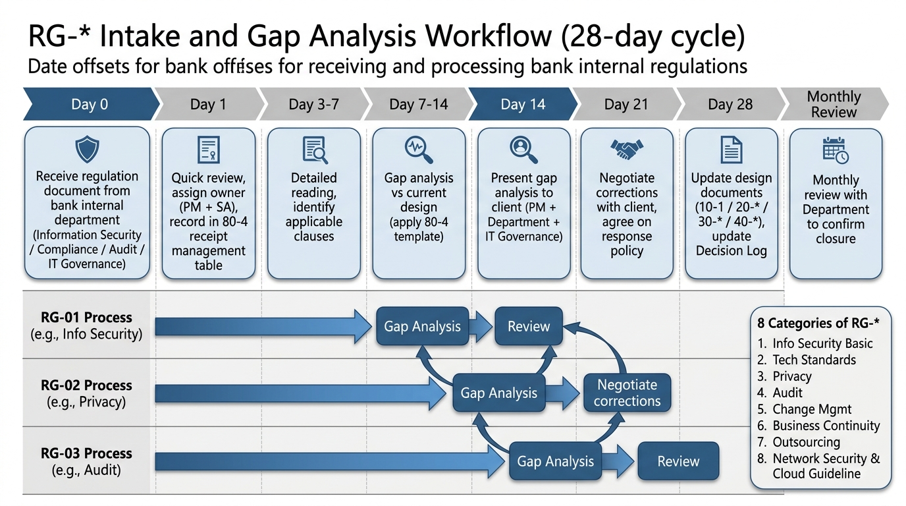

# 80-4. 会社独自要件マッピング

**目的**: 大手金融機関の **行内独自セキュリティ・統制要件** を一覧化し、本システム設計との対応をマッピングする。  
**前提**: 行内独自要件は **参画時点では未受領** (社外秘)。Day-1〜30 で監査部門・セキュリティ部門からヒアリング・資料受領 → 本書を埋める。FISC 第 11 版 (`80-1`) や 金融庁ガイドライン (`80-2`) とは別に管理する。

---

## 1. 行内独自要件の典型カテゴリ (Day-1 で確認するヒアリング項目)

> 以下は **大手金融機関に一般的な独自統制カテゴリ**。Day-1〜30 で実際の規程を受領 → 各項目を埋める。

### 1.1 情報セキュリティ規程

| カテゴリ | 想定要件 | 本案件設計での対応 (要記入) | 状態 |
|---|---|---|---|
| データ分類 | 機密度 4 階層 (極秘・機密・社外秘・社内一般)、本システムは XX 階層 | (要記入) | Open |
| 暗号化アルゴリズム | AES-256 必須、楕円曲線 P-256 以上、TLS 1.2 以上、SHA-256 以上 | KMS CMK (AES-256) + ALB TLS 1.2+ | Open |
| 鍵管理 | 鍵ローテーション 年次自動、鍵削除 4-eyes、鍵分割保管 | KMS 年次ローテーション、4-eyes 削除 | Open |
| アクセス制御 | 最小権限、職務分掌、特権 ID は時間限定 | IAM Permission Set + Break Glass JIT | Open |
| 認証 | MFA 必須 (利用者全員)、Break Glass はハードウェア MFA | IAM Identity Center MFA + Break Glass HW MFA | Open |
| パスワード | 長さ / 文字種 / 履歴 / 変更頻度の規程 | Identity Center + Entra ID 側で対応 | Open |

### 1.2 監査・ログ統制

| カテゴリ | 想定要件 | 本案件設計での対応 (要記入) | 状態 |
|---|---|---|---|
| 監査ログ保管 | 7-10 年 (規程による)、改ざん不可 | S3 Object Lock COMPLIANCE 7 年 | Open |
| ログ取得項目 | アクセス記録、変更記録、ジョブ記録、認証記録 | CloudTrail + アプリ監査ログ + Aurora ログ + Identity Center ログ | Open |
| ログレビュー | 月次レビュー、年次集計、外部監査時開示 | 月次バッチ集計 + Athena クエリ | Open |
| ログ分離 | 監査ログは別アカウント保管 (運用権限と分離) | PF 集中ログアカウント + 案件側 audit S3 | Open |
| 改ざん検知 | ハッシュ計算、ログ完全性検証 | S3 Object Lock + KMS で署名検証 | Open |

### 1.3 変更管理統制

| カテゴリ | 想定要件 | 本案件設計での対応 (要記入) | 状態 |
|---|---|---|---|
| 変更承認 | CAB 必須、緊急変更は CIO 事後承認 | CAB 週次 + Change Calendar | Open |
| 凍結期間 | 年末年始、月末月初、決算期、システム更改前後 | Change Calendar 4 種 (deploy / freeze-yearend / freeze-monthend / freeze-campaign) | Open |
| 変更ログ | 全変更の記録、誰がいつ何を変えたか | CloudTrail + Git commit history | Open |
| 4-eyes | 本番変更は 2 名以上承認 | GitHub Environment Required reviewers (PROD 2 名) | Open |
| ロールバック | 全変更にロールバック計画必須 | CI/CD revert PR フロー | Open |

### 1.4 ネットワーク統制

| カテゴリ | 想定要件 | 本案件設計での対応 (要記入) | 状態 |
|---|---|---|---|
| 外部接続禁止 | インターネット直接アクセス禁止、Egress NW Firewall 経由 | PF 集中 NW Firewall 経由想定 | Open |
| VPN / 閉域網 | 行内 VPN 経由のみアクセス可、特定 IP からのみ | PF VPN + 行内 IP Allowlist | Open |
| SG / NACL | 全 SG ルールに目的明示、レビュー必須 | Terraform コメント + SG 命名規則 | Open |
| 通信暗号化 | 全通信 TLS 1.2 以上 | ALB TLS + Aurora SSL + 内部 mTLS 検討 | Open |
| 不正アクセス検知 | IDS/IPS、SIEM 統合 | GuardDuty + Security Hub + Splunk 連携 | Open |

### 1.5 個人情報・機微情報

| カテゴリ | 想定要件 | 本案件設計での対応 (要記入) | 状態 |
|---|---|---|---|
| 個人情報定義 | 行内独自定義 (顧客 ID も該当する場合あり) | 顧客 ID のみ保持、氏名等は親システム | Open |
| マスキング | ログ・帳票での個人情報マスキング必須 | アプリ層でマスキング処理 | Open |
| アクセス記録 | 個人情報アクセスは全件記録 | アプリ監査ログ + CloudTrail | Open |
| 暗号化レベル | 個人情報は別 KMS Key で暗号化、鍵アクセスは限定 | 個別 KMS CMK | Open |
| 削除要求対応 | 利用者からの削除要求対応プロセス | 親システム経由 (本システムは ID のみ) | Open |

### 1.6 業務継続 / 災害対策

| カテゴリ | 想定要件 | 本案件設計での対応 (要記入) | 状態 |
|---|---|---|---|
| BCP | 行内 BCP に準拠 (○時間以内復旧) | RPO < 15 分 / RTO < 4 時間 (要協議) | Open |
| DR サイト | 別リージョン (大阪) または別 DC 必須 | 大阪リージョン (要協議) | Open |
| DR 訓練 | 年 1 回以上 | 年次 DR 訓練 | Open |
| データバックアップ | 7 世代以上、Cross-region 推奨 | Aurora 35 日 + AWS Backup Cross-region | Open |
| 業務停止許容時間 | 機能別の停止許容時間 (RTO) | 機能別 RTO 整理が必要 | Open |

### 1.7 開発・運用統制

| カテゴリ | 想定要件 | 本案件設計での対応 (要記入) | 状態 |
|---|---|---|---|
| ソースコード管理 | 行内 GitLab 必須、外部 GitHub 利用 NG | 行内 GitLab で構築 | Open |
| デプロイ承認 | 本番デプロイは部長承認必須 | CAB → 部長承認 → CI/CD apply | Open |
| 環境分離 | 開発 / 検証 / 本番の物理アカウント分離 | MUT / LT / ST / DEV-IT / PROD の AWS アカウント分離 | Open |
| データ分離 | 本番データは非本番環境にコピー禁止 | 匿名化テストデータのみ利用 | Open |
| 運用ジョブ | 全ジョブの記録、失敗時通知 | EventBridge + CloudWatch Alarm | Open |

### 1.8 委託管理 (外部委託先統制)

| カテゴリ | 想定要件 | 本案件設計での対応 (要記入) | 状態 |
|---|---|---|---|
| 委託先評価 | 委託先のセキュリティ評価実施 | AWS / 元請 SIer / BP 委託先評価 | Open |
| 契約条項 | NDA、SLA、監査受入条項 | 元請契約 + 自社契約 | Open |
| アクセス記録 | 委託先アクセスは全件記録 | CloudTrail + 入館記録 | Open |
| 監査 | 委託先への定期監査 | 監査部門による年次レビュー | Open |
| 緊急時連絡 | 委託先緊急連絡網 | 連絡網 (緊急) を 24/7 維持 | Open |

---

## 2. 行内規程・ガイドライン受領管理




### 2.1 受領管理表

| # | 規程 / ガイドライン名 | 版 | 受領日 | 受領元 | 影響範囲 | Status |
|---|---|---|---|---|---|---|
| RG-01 | 情報セキュリティ基本規程 | (記入) | (未受領) | 情報セキュリティ部 | 全体 | Open |
| RG-02 | 情報セキュリティ詳細規程 (技術基準) | (記入) | (未受領) | 情報セキュリティ部 | 技術 | Open |
| RG-03 | 個人情報保護規程 | (記入) | (未受領) | コンプライアンス部 | データ | Open |
| RG-04 | システム監査規程 | (記入) | (未受領) | 監査部 | 監査 | Open |
| RG-05 | 変更管理規程 | (記入) | (未受領) | IT 統括部 | 運用 | Open |
| RG-06 | 業務継続規程 | (記入) | (未受領) | リスク管理部 | BCP | Open |
| RG-07 | 委託管理規程 | (記入) | (未受領) | コンプライアンス部 | 商務 | Open |
| RG-08 | ネットワークセキュリティ基準 | (記入) | (未受領) | NW 部 | NW | Open |
| RG-09 | クラウド利用ガイドライン | (記入) | (未受領) | IT 統括部 | クラウド全般 | Open |
| RG-10 | (その他、ヒアリング後追加) | (記入) | (未受領) | (記入) | (記入) | Open |

### 2.2 受領期限・優先度

| 規程 | 必要時期 | 優先度 |
|---|---|---|
| RG-01 / RG-02 | 要件定義 Day-7 | 最 |
| RG-04 / RG-09 | 要件定義 Day-14 | 最 |
| RG-03 / RG-08 | 要件定義 Day-30 | 高 |
| RG-05 / RG-06 / RG-07 | 基本設計開始まで | 高 |
| RG-10 以降 | 詳細設計開始まで | 中 |

---

## 3. 独自要件 vs FISC vs 金融庁ガイドラインの責任分界

| レイヤー | 主管 | 主な対応文書 |
|---|---|---|
| FISC 第 11 版 | FISC | `80-1_FISC対応マッピング.md` |
| 金融庁ガイドライン (監督指針 / サイバーセキュリティ等) | 金融庁 | `80-2_金融庁ガイドライン対応.md` |
| 個人情報保護法 | 政府 | `20-5 § 7 個人情報保護` |
| PCI DSS v4.0.1 (該当時) | PCI SSC | (本案件は対象外想定) |
| **行内独自規程 (RG-*)** | **行内各部門** | **本文書 (`80-4`)** |

> 重複する要件は、より厳しい方を優先 (行内独自 > 金融庁 > FISC > 一般法令)。

---

## 4. ギャップ分析テンプレ

各 RG- 受領後に以下のフォーマットでギャップ分析を行う:

```markdown
## RG-NN ギャップ分析

### 該当規程の要点
- (記入)

### 本案件設計との整合性
| 規程項目 | 本案件設計 | ギャップ | 対応方針 |
|---|---|---|---|
| ... | ... | あり/なし | (記入) |

### ギャップ解消アクション
| # | アクション | 担当 | 期限 |
|---|---|---|---|

### 監査部門承認状況
- レビュー日: YYYY-MM-DD
- 承認状況: 承認 / 条件付き承認 / 差し戻し
- 残課題: (記入)
```

---

## 5. 行内独自統制への対応スケジュール

| 期間 | アクション |
|---|---|
| Day-1〜7 | RG-01〜02 受領、概要把握 |
| Day-7〜14 | RG-04 / 09 受領、概要把握 + 監査部門との月次会議設定 |
| Day-14〜30 | RG-03 / 08 受領、影響分析開始 |
| Day-30〜60 | RG-05 / 06 / 07 受領、ギャップ分析開始 |
| Day-60〜90 | RG-10 以降受領、ギャップ分析完了 |
| 要件定義 Exit (Day-180) | 全 RG- 整理完了、要件定義書 §6.2 規制制約に反映 |
| 基本設計 (Day-210〜360) | 全 RG- への設計対応反映 |
| 構築〜運用 | 監査部門による継続レビュー |

---

## 6. 監査部門との関係構築

### 6.1 月次同期会議 (Day-30〜)
- アジェンダ: RG- 受領状況 + 影響分析 + ギャップ + 対応案
- 出席: PM (自分) + 監査部門責任者 + (該当時) 情報セキュリティ部・コンプライアンス部

### 6.2 監査レビュー
- 要件定義 Exit 時、基本設計 Exit 時、構築 Exit 時、本番リリース前
- 各タイミングで本書 § 1 表の Status を更新

### 6.3 監査人質問対応
- 想定質問: 「行内規程 RG-XX のこの項目はどう対応していますか」
- 回答テンプレ: 「本案件は RG-XX § Y.Z に従い、設計上 A を実装、運用上 B を実施しています。エビデンスは EV-CFG-NN を参照」
- 詳細は `業務用/80_規制対応/80-3_監査エビデンス一覧.md` 連動

---

## 7. 「未受領」のリスク管理

### 7.1 受領遅延時の影響
- 要件定義中に RG- 全件受領できないと、基本設計で独自要件未反映の設計を出すリスク
- 監査部門レビューで突然 NG を出されると手戻り発生

### 7.2 緩和策
- Day-30 までに **未受領を顧客責任者に明示的に依頼** (リスクとして共有)
- 受領遅延が見えたら **代替案** (パブリック規程参考 + 行内パターン推測) で先行
- 受領後に差分があれば速やかに反映

---

## 8. Exit Criteria

- [ ] 全 RG- 受領 (一覧の Status が全て Closed)
- [ ] ギャップ分析完了 (各 RG- のギャップ表が埋まっている)
- [ ] 監査部門承認 (各 RG- への対応方針合意済)
- [ ] 要件定義書 §6.2 規制制約への反映完了
- [ ] 基本設計各章への反映完了
- [ ] エビデンス取得方法確定 (`80-3` 連動)

---

## 9. 出典

- 一般的な大手金融機関の情報セキュリティ規程構成 (FISC 安対基準・金融庁監督指針の構造参考)
- FISC 安全対策基準 第 11 版: https://www.fisc.or.jp/publication/book/005831.php
- 金融庁 サイバーセキュリティガイドライン: https://www.fsa.go.jp/
- 既存類似案件「ANK-未割当-金融AWS共通基盤」F4 業界規制補完 (構造参考)
