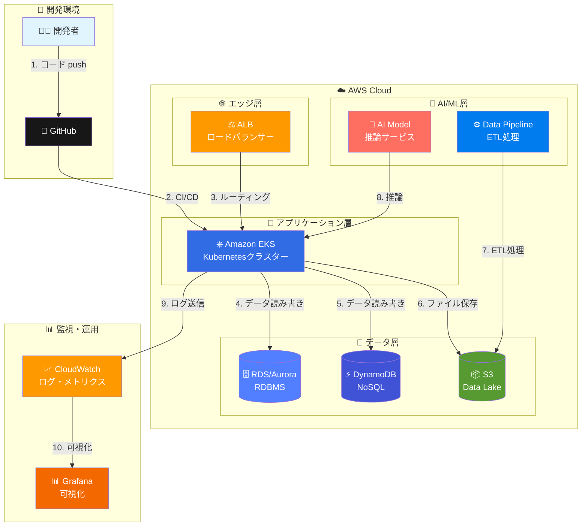
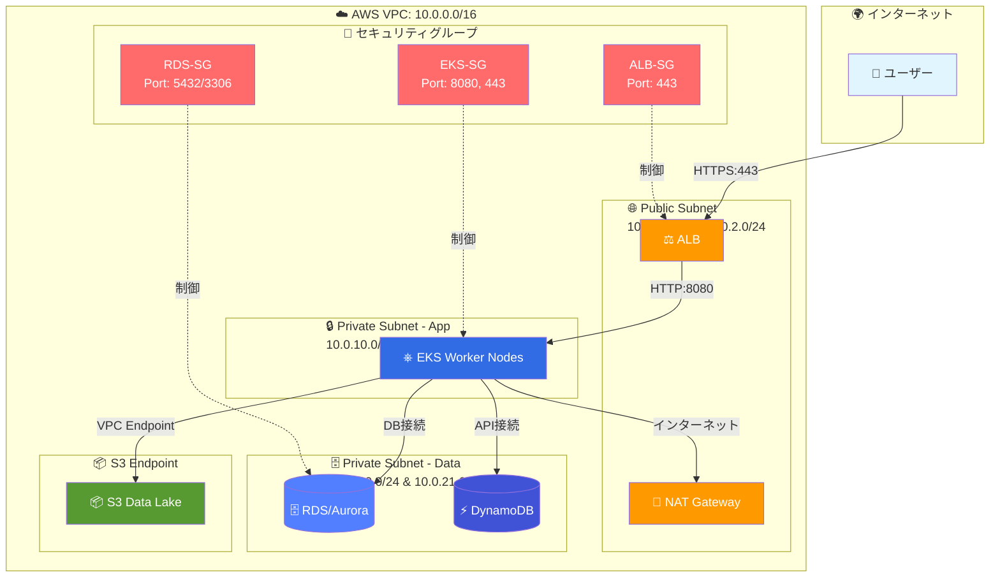
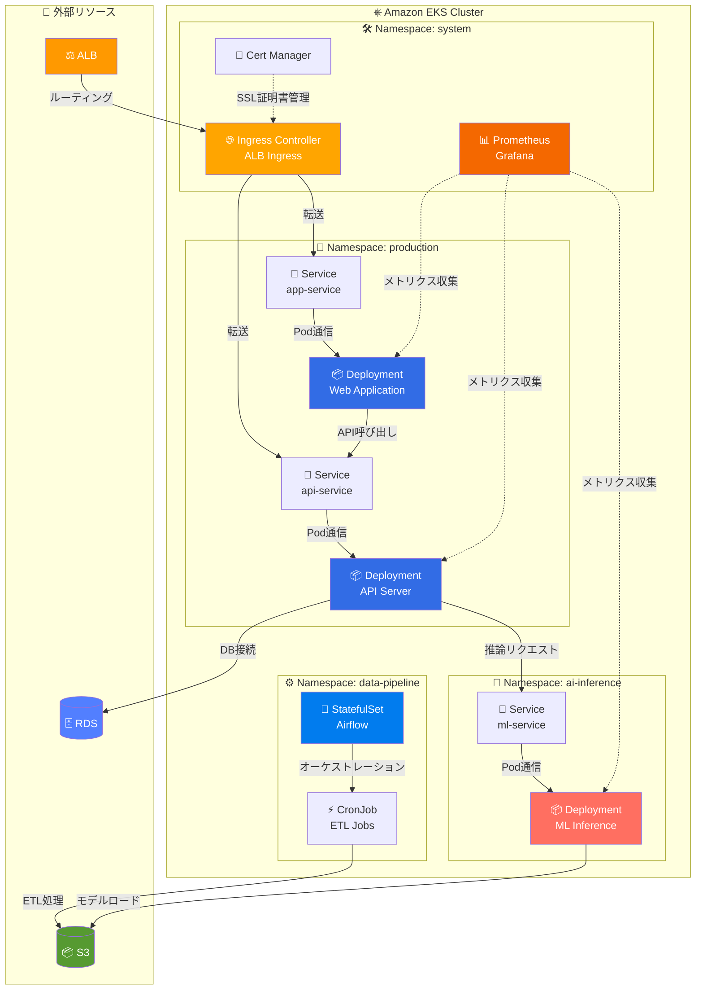
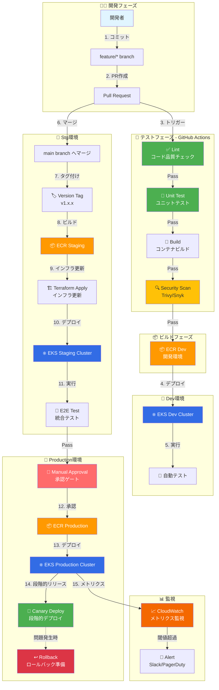
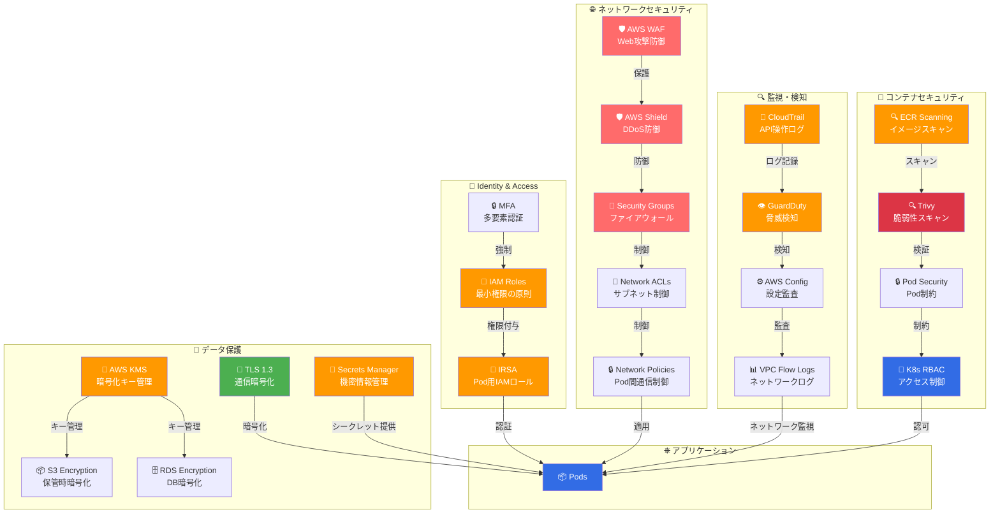

# AIアプリケーション インフラ構成図

## 📋 目次
- [1. 全体像（システムアーキテクチャ）](#1-全体像システムアーキテクチャ)
- [2. ネットワーク構成](#2-ネットワーク構成)
- [3. アプリケーション構成（EKS）](#3-アプリケーション構成eks)
- [4. データフロー](#4-データフロー)
- [5. CI/CDパイプライン](#5-cicdパイプライン)
- [6. セキュリティアーキテクチャ](#6-セキュリティアーキテクチャ)

---

## 1. 全体像（システムアーキテクチャ）

**概要**: 主要コンポーネントとその関係性を示すシンプルな全体図

**重要ポイント**:
- ✅ マルチAZ構成で高可用性を実現
- ✅ EKSでコンテナオーケストレーション
- ✅ データレイクにS3を使用
- ✅ AI/MLパイプラインを統合

---

## 2. ネットワーク構成

**概要**: VPC、サブネット、セキュリティグループの構成

**セキュリティ設定**:

| リソース | 送信元 | プロトコル/ポート | 説明 |
|---------|-------|----------------|------|
| ALB | 0.0.0.0/0 | HTTPS/443 | インターネットから受信 |
| EKS Nodes | ALB-SG | HTTP/8080 | ALBからのみ受信 |
| RDS | EKS-SG | TCP/5432 or 3306 | EKSからのみ接続 |
| DynamoDB | EKS-SG | HTTPS/443 | VPC Endpoint経由 |

---

## 3. アプリケーション構成（EKS）

**概要**: Kubernetesクラスター内のアプリケーション構成

**Kubernetesリソース構成**:

| Namespace | リソース | レプリカ数 | リソース要求 | 説明 |
|-----------|----------|-----------|-------------|------|
| production | app-deployment | 3 | CPU: 500m, Mem: 1Gi | Webアプリケーション |
| production | api-deployment | 3 | CPU: 1, Mem: 2Gi | APIサーバー |
| ai-inference | ml-deployment | 2 | CPU: 2, Mem: 4Gi | AI推論サービス |
| data-pipeline | airflow-statefulset | 1 | CPU: 1, Mem: 2Gi | ワークフローオーケストレーション |

---

## 4. データフロー

**概要**: データの流れを時系列で表現

```mermaid
graph LR
    subgraph "📥 データソース"
        IOT[🌡️ IoTデバイス<br/>センサーデータ]
        API_EXT[🌐 外部API<br/>公共データ]
        USER[👤 ユーザー<br/>アプリデータ]
    end

    subgraph "🔄 データ取り込み"
        KINESIS[📊 Kinesis<br/>ストリーム処理]
        S3_RAW[📦 S3 Raw Bucket<br/>生データ]
    end

    subgraph "⚙️ データ処理"
        AIRFLOW[🔄 Airflow<br/>オーケストレーション]

        ETL1[⚡ Extract Job<br/>データ収集]
        ETL2[⚡ Transform Job<br/>データ変換]
        ETL3[⚡ Load Job<br/>データロード]

        QUALITY[✅ Quality Check<br/>検証]
    end

    subgraph "💾 データストレージ"
        S3_PROC[📦 S3 Processed<br/>加工済みデータ]
        FEATURE[🎯 Feature Store<br/>DynamoDB]
        DWH[(📊 Data Warehouse<br/>Redshift/Aurora)]
    end

    subgraph "🤖 AI/ML"
        TRAIN[🎓 Model Training<br/>学習パイプライン]
        MODEL_REG[📚 Model Registry<br/>モデル管理]
        INFERENCE[🧠 Inference Service<br/>推論API]
    end

    subgraph "📱 アプリケーション"
        APP[📱 Web/Mobile App]
    end

    IOT -->|リアルタイム| KINESIS
    API_EXT -->|バッチ| S3_RAW
    USER -->|バッチ| S3_RAW

    KINESIS -->|トリガー| AIRFLOW
    S3_RAW -->|トリガー| AIRFLOW

    AIRFLOW -->|1. 実行| ETL1
    ETL1 -->|2. 生データ| ETL2
    ETL2 -->|3. 変換データ| QUALITY
    QUALITY -->|4. 検証OK| ETL3
    ETL3 -->|5. 格納| S3_PROC
    ETL3 -->|6. 特徴量| FEATURE
    ETL3 -->|7. 集計| DWH

    S3_PROC -->|学習データ| TRAIN
    FEATURE -->|特徴量| TRAIN
    TRAIN -->|モデル保存| MODEL_REG
    MODEL_REG -->|モデルデプロイ| INFERENCE

    FEATURE -->|リアルタイム特徴量| INFERENCE
    INFERENCE -->|推論結果| APP
    DWH -->|分析データ| APP

    style IOT fill:#FFB6C1
    style KINESIS fill:#FF9900,color:#fff
    style AIRFLOW fill:#017CEE,color:#fff
    style ETL1 fill:#4CAF50,color:#fff
    style ETL2 fill:#4CAF50,color:#fff
    style ETL3 fill:#4CAF50,color:#fff
    style QUALITY fill:#FFC107
    style S3_PROC fill:#569A31,color:#fff
    style FEATURE fill:#4053D6,color:#fff
    style TRAIN fill:#FF6F61,color:#fff
    style INFERENCE fill:#FF6F61,color:#fff
    style APP fill:#326CE5,color:#fff
```

**データフロー段階**:

1. **取り込み**: IoTデバイス → Kinesis / 外部API → S3
2. **処理**: Airflow → ETL Jobs → Quality Check
3. **格納**: S3 Processed / Feature Store / Data Warehouse
4. **AI/ML**: 学習 → モデル登録 → 推論
5. **活用**: アプリケーションで利用

---

## 5. CI/CDパイプライン

**概要**: 開発からデプロイまでの自動化フロー

**デプロイ戦略**:

| 環境 | デプロイ方式 | 承認 | ロールバック |
|-----|------------|------|------------|
| Dev | 自動デプロイ | 不要 | 自動 |
| Staging | 自動デプロイ | 不要 | 自動 |
| Production | Canary Deploy | 必要 | 手動/自動 |

**Canary Deploy設定**:
1. 10% のトラフィックを新バージョンに
2. 10分間監視（エラー率、レイテンシ）
3. 問題なければ50% → 100%へ段階的に増加
4. エラー検知時は自動ロールバック

---

## 6. セキュリティアーキテクチャ

**概要**: 多層防御のセキュリティ構成

**セキュリティ対策一覧**:

| レイヤー | 対策 | 実装 |
|---------|------|------|
| エッジ | DDoS防御 | AWS Shield Standard/Advanced |
| ネットワーク | ファイアウォール | Security Groups, NACLs |
| アプリケーション | Web攻撃防御 | AWS WAF (OWASP Top 10) |
| データ | 暗号化 | TLS 1.3, KMS, S3/RDS暗号化 |
| アイデンティティ | 認証・認可 | IAM, IRSA, RBAC, MFA |
| コンテナ | 脆弱性管理 | ECR Scanning, Trivy, PSA |
| 監視 | 脅威検知 | GuardDuty, CloudTrail, Config |

---

## 📊 技術スタック一覧

### インフラストラクチャ
- **コンテナオーケストレーション**: Amazon EKS (Kubernetes)
- **コンピューティング**: EKS Managed Node Groups (t3.large, c5.xlarge)
- **ネットワーク**: VPC, ALB, NAT Gateway, VPC Endpoints
- **ストレージ**: S3, EBS, EFS

### データ基盤
- **RDBMS**: Amazon RDS/Aurora (PostgreSQL/MySQL)
- **NoSQL**: DynamoDB
- **Data Lake**: Amazon S3
- **Data Warehouse**: Redshift (オプション)
- **ストリーム処理**: Amazon Kinesis

### AI/ML
- **パイプライン**: Airflow on EKS / Kubeflow
- **モデル学習**: SageMaker / EKS GPU Nodes
- **推論**: EKS Inference Service
- **Feature Store**: DynamoDB / SageMaker Feature Store

### CI/CD
- **ソース管理**: GitHub
- **CI/CD**: GitHub Actions
- **コンテナレジストリ**: Amazon ECR
- **IaC**: Terraform

### 監視・ログ
- **メトリクス**: CloudWatch, Prometheus
- **可視化**: Grafana, CloudWatch Dashboards
- **ログ**: CloudWatch Logs, Fluent Bit
- **トレーシング**: AWS X-Ray

### セキュリティ
- **認証・認可**: IAM, IRSA, OIDC
- **シークレット管理**: AWS Secrets Manager
- **暗号化**: KMS, TLS 1.3
- **脅威検知**: GuardDuty, Security Hub
- **脆弱性管理**: ECR Scanning, Trivy

---

## 🎯 面接での説明ポイント

### 1. アーキテクチャ選定理由
**Q: なぜEKSを選択したのか?**
- ✅ コンテナ化による一貫した開発・本番環境
- ✅ マイクロサービスアーキテクチャに適している
- ✅ Auto Scalingによる柔軟なスケーリング
- ✅ AWS管理のコントロールプレーンで運用負荷削減

### 2. 高可用性の実現
**Q: システムの可用性をどう確保しているか?**
- ✅ マルチAZ構成（最低2つのAZ）
- ✅ ALBでのヘルスチェックと自動フェイルオーバー
- ✅ RDS Multi-AZ構成
- ✅ Podレプリカ数3以上で配置

### 3. セキュリティ対策
**Q: セキュリティはどう実装しているか?**
- ✅ 多層防御アーキテクチャ
- ✅ 最小権限の原則（IAM, IRSA, RBAC）
- ✅ データ暗号化（通信・保管時）
- ✅ 継続的な脆弱性管理

### 4. コスト最適化
**Q: コスト削減の工夫は?**
- ✅ Spot Instancesの活用（Dev/Staging環境）
- ✅ Auto Scalingで必要最小限のリソース
- ✅ S3ライフサイクルポリシーでストレージ最適化
- ✅ リザーブドインスタンスの活用（Production）

### 5. 運用・監視
**Q: 障害検知と対応は?**
- ✅ CloudWatch/Prometheusでメトリクス監視
- ✅ アラート設定とSlack/PagerDuty連携
- ✅ X-Rayで分散トレーシング
- ✅ Canary Deployで段階的リリース

---

## 📝 まとめ

このインフラ構成は以下の特徴を持ちます:

1. **スケーラビリティ**: EKSとAuto Scalingで需要に応じた自動スケール
2. **高可用性**: マルチAZ構成とロードバランシングで99.95%以上の可用性
3. **セキュリティ**: 多層防御と暗号化でデータ保護
4. **運用効率**: CI/CDとIaCで自動化とコード管理
5. **AI/ML統合**: データパイプラインと推論サービスのシームレスな統合

**最適な用途**: IoT、AI/MLアプリケーション、大規模データ処理
