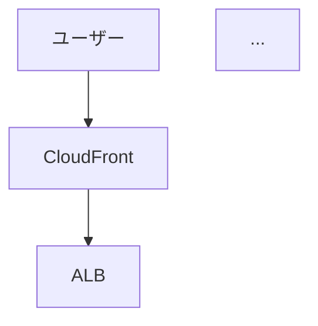

# GenSpark 構成図作成用プロンプト集

## 使い方

1. Terraformコードを読み込ませる
2. 以下のプロンプトテンプレートを使用
3. 必要に応じてカスタマイズ

---

## 1. システム構成図（技術者向け）

```
以下のTerraformコードを分析し、AWSシステム構成図を作成してください。

【要件】
- draw.io または Mermaid 形式で出力
- AWSアイコンを使用
- ネットワーク境界（VPC、サブネット）を明示
- セキュリティグループの関係を矢印で表現
- 各コンポーネントに以下を記載:
  - リソース名
  - IPアドレス/CIDR（該当する場合）
  - インスタンスタイプ（EC2の場合）

【Terraformコード】
（ここにmain.tfの内容を貼り付け）

【出力形式】
1. 図（draw.io XML または Mermaid コード）
2. コンポーネント一覧表
3. 通信フロー説明
```

---

## 2. 経営者向け概要図

```
以下のTerraformコードから、非技術者でも理解できるシステム概要図を作成してください。

【要件】
- 専門用語を避け、役割ベースで説明
- 以下の要素を含める:
  - ユーザーからのアクセス経路
  - データの流れ
  - セキュリティの境界
- 色分け:
  - 青: ユーザーがアクセスする部分
  - 緑: データ処理部分
  - 赤: セキュリティ境界

【Terraformコード】
（ここにmain.tfの内容を貼り付け）

【出力形式】
- シンプルなブロック図（PowerPoint向け）
- 各ブロックの1行説明
```

---

## 3. コスト見積もり用リソース一覧

```
以下のTerraformコードから、AWSコスト見積もり用のリソース一覧を作成してください。

【要件】
- 各リソースの:
  - サービス名
  - リソースタイプ/サイズ
  - 数量
  - 月額概算（東京リージョン）
- 合計月額コスト
- コスト最適化の提案

【Terraformコード】
（ここにmain.tfの内容を貼り付け）

【出力形式】
| サービス | タイプ | 数量 | 月額(USD) |
|----------|--------|------|-----------|
```

---

## 4. セキュリティ構成図

```
以下のTerraformコードから、セキュリティ構成図を作成してください。

【要件】
- ネットワーク境界の明示
- セキュリティグループのルール
- 暗号化設定
- アクセス制御の流れ
- 以下を含める:
  - インターネットからのアクセス経路
  - 内部通信の許可/拒否
  - データ暗号化ポイント

【Terraformコード】
（ここにmain.tfの内容を貼り付け）

【出力形式】
1. セキュリティ境界図
2. セキュリティグループルール表
3. 脆弱性チェックリスト
```

---

## 5. Mermaid形式でのフロー図

```
以下のTerraformコードから、Mermaid形式でシステムフロー図を作成してください。

【要件】
- ユーザーリクエストの流れを図示
- 各コンポーネント間の通信プロトコル/ポートを記載
- 障害時のフェイルオーバー経路も表示

【Terraformコード】
（ここにmain.tfの内容を貼り付け）

【出力形式】


---

## 6. PowerPoint向けスライド構成

```
以下のTerraformコードの内容を、PowerPointプレゼンテーション用に構成してください。

【スライド構成】
1. 表紙
2. システム概要（1枚で全体像）
3. アーキテクチャ詳細
4. セキュリティ対策
5. 可用性・DR
6. コスト概算
7. 今後の拡張性

【各スライドに含めるもの】
- タイトル
- 図または表
- 箇条書き3-5点
- 発表者用ノート

【Terraformコード】
（ここにmain.tfの内容を貼り付け）

【対象者】
- 技術に詳しくない経営層
- 投資判断を行う意思決定者
```

---

## 7. 実際のTerraformコード（コピペ用）

### terraform-aws-infra/environments/dev/main.tf
```
（実際のコードをここに貼り付け）
```

### ansible-middleware-demo/terraform/main.tf
```
（実際のコードをここに貼り付け）
```

---

## Tips

### 正確な図を生成させるコツ

1. **コード全体を渡す**: 部分的だと関係性が把握できない
2. **出力形式を指定**: draw.io, Mermaid, PlantUMLなど
3. **対象者を明示**: 技術者向け/経営者向けで詳細度を変える
4. **追加の指示**: 「AWSアイコンを使用」「日本語で」など

### よくある問題と対処

| 問題 | 対処 |
|------|------|
| 図が複雑すぎる | レイヤーを分けて複数枚に |
| アイコンが違う | AWS公式アイコンセットを指定 |
| 関係性が不明確 | 矢印に説明を追加するよう指示 |

---

## 参考: AWS公式アイコン

- [AWS Architecture Icons](https://aws.amazon.com/architecture/icons/)
- draw.io には AWS アイコンが組み込み済み
