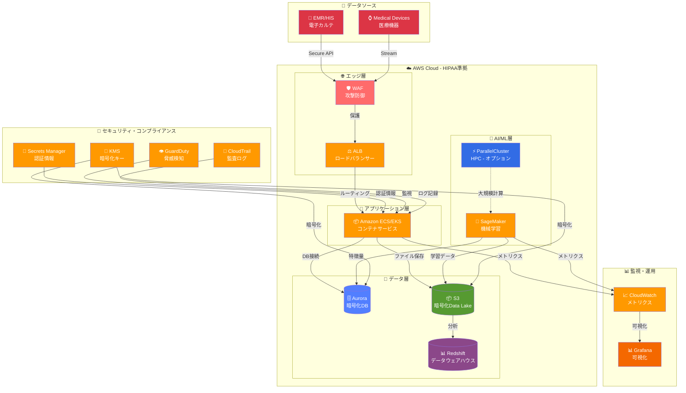
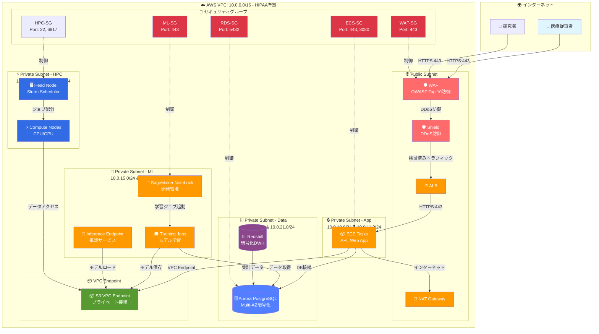
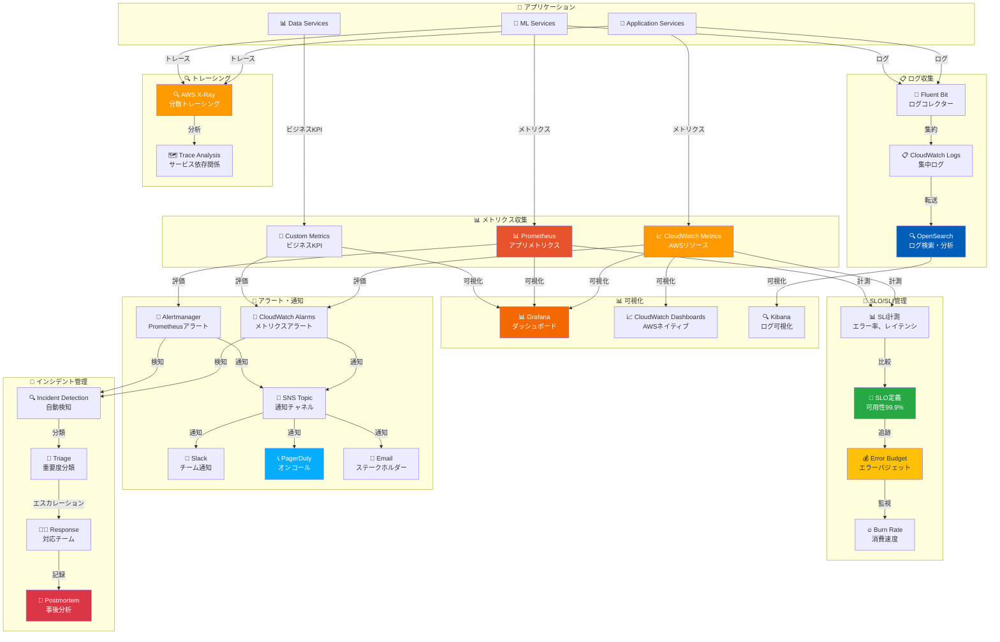

# 医療業界向けクラウドインフラ インフラ構成図

## 📋 目次
- [1. 全体像（システムアーキテクチャ）](#1-全体像システムアーキテクチャ)
- [2. ネットワーク構成](#2-ネットワーク構成)
- [3. MLOpsパイプライン](#3-mlopsパイプライン)
- [4. データフロー](#4-データフロー)
- [5. セキュリティ・コンプライアンス](#5-セキュリティコンプライアンス)
- [6. 監視・運用（SRE）](#6-監視運用sre)

---

## 1. 全体像（システムアーキテクチャ）

**概要**: 医療データを安全に処理するクラウドアーキテクチャ

**重要ポイント**:
- ✅ HIPAA準拠のセキュアなアーキテクチャ
- ✅ 全データ暗号化（通信時・保管時）
- ✅ SageMakerでMLOpsパイプライン
- ✅ HPC環境でハイパフォーマンス計算（オプション）

---

## 2. ネットワーク構成

**概要**: HIPAA準拠のVPC設計

**セキュリティ設定（最小権限）**:

| リソース | 送信元 | プロトコル/ポート | 説明 |
|---------|-------|----------------|------|
| WAF | 0.0.0.0/0 | HTTPS/443 | インターネット（OWASP防御） |
| ALB | WAF-SG | HTTPS/443 | WAFからのみ |
| ECS Tasks | ALB-SG | HTTPS/443 | ALBからのみ |
| RDS | ECS-SG, ML-SG | TCP/5432 | アプリ・MLからのみ |
| S3 | VPC Endpoint | HTTPS/443 | プライベート接続のみ |

---

## 3. MLOpsパイプライン

**概要**: SageMakerを中心としたMLOps構成

```mermaid
graph LR
    subgraph "📥 データ準備"
        RAW[📦 S3 Raw Data<br/>生データ]
        WRANGLER[🔧 Data Wrangler<br/>データクリーニング]
        VALIDATION[✅ Validation<br/>Great Expectations]
    end

    subgraph "🔬 特徴量エンジニアリング"
        FEATURE_ENG[⚙️ Feature Engineering<br/>特徴量作成]
        FEATURE_STORE[🎯 Feature Store<br/>SageMaker Feature Store]
        OFFLINE[💾 Offline Store<br/>学習用: S3]
        ONLINE[⚡ Online Store<br/>推論用: DynamoDB]
    end

    subgraph "🎓 モデル開発"
        NOTEBOOK[📓 SageMaker Studio<br/>Jupyter Notebook]
        EXPERIMENT[🧪 Experiments<br/>実験管理]
        TUNING[🎯 AutoML<br/>ハイパーパラメータ最適化]
    end

    subgraph "🏋️ モデル学習"
        TRAINING[🎓 Training Jobs<br/>分散学習]
        GPU[⚡ GPU Instances<br/>P3/P4/G4dn]
        MODEL_ARTIFACT[📦 Model Artifacts<br/>S3保存]
    end

    subgraph "📊 モデル評価"
        EVAL[📊 Model Evaluation<br/>メトリクス評価]
        VALIDATE[✅ Validation<br/>交差検証]
        APPROVAL[👤 Approval Gate<br/>承認]
    end

    subgraph "📚 モデル登録"
        REGISTRY[📚 Model Registry<br/>SageMaker/MLflow]
        VERSION[🏷️ Versioning<br/>v1.0.0]
    end

    subgraph "🚀 デプロイ"
        CANARY[🐤 Canary Deploy<br/>段階的リリース]
        A_B[⚖️ A/B Testing<br/>トラフィック分割]
        REALTIME[🧠 Real-time Endpoint<br/>リアルタイム推論]
        BATCH[📦 Batch Transform<br/>バッチ推論]
    end

    subgraph "📈 モデル監視"
        MONITOR[📈 Model Monitor<br/>ドリフト検知]
        DATA_DRIFT[📊 Data Drift<br/>入力分布変化]
        MODEL_DRIFT[📉 Model Drift<br/>精度劣化]
        RETRAIN[🔄 Auto Retrain<br/>自動再学習]
    end

    RAW -->|クリーニング| WRANGLER
    WRANGLER -->|検証| VALIDATION
    VALIDATION -->|OK| FEATURE_ENG

    FEATURE_ENG -->|登録| FEATURE_STORE
    FEATURE_STORE -->|学習用| OFFLINE
    FEATURE_STORE -->|推論用| ONLINE

    OFFLINE -->|データ提供| NOTEBOOK
    NOTEBOOK -->|実験記録| EXPERIMENT
    EXPERIMENT -->|最適化| TUNING
    TUNING -->|設定| TRAINING

    TRAINING -->|GPU使用| GPU
    TRAINING -->|保存| MODEL_ARTIFACT

    MODEL_ARTIFACT -->|評価| EVAL
    EVAL -->|検証| VALIDATE
    VALIDATE -->|承認| APPROVAL

    APPROVAL -->|登録| REGISTRY
    REGISTRY -->|バージョニング| VERSION

    VERSION -->|デプロイ| CANARY
    CANARY -->|テスト| A_B
    A_B -->|本番| REALTIME
    VERSION -->|バッチ| BATCH

    REALTIME -->|監視| MONITOR
    BATCH -->|監視| MONITOR
    MONITOR -->|検知| DATA_DRIFT
    MONITOR -->|検知| MODEL_DRIFT
    DATA_DRIFT -->|トリガー| RETRAIN
    MODEL_DRIFT -->|トリガー| RETRAIN
    RETRAIN -->|再学習| TRAINING

    style RAW fill:#569A31,color:#fff
    style WRANGLER fill:#4CAF50,color:#fff
    style FEATURE_STORE fill:#4053D6,color:#fff
    style NOTEBOOK fill:#FF9900,color:#fff
    style TRAINING fill:#FF9900,color:#fff
    style GPU fill:#76B900,color:#fff
    style REGISTRY fill:#017CEE,color:#fff
    style REALTIME fill:#28A745,color:#fff
    style MONITOR fill:#FFC107
    style RETRAIN fill:#DC3545,color:#fff
```

**MLOpsフロー段階**:

1. **データ準備**: Raw Data → Cleaning → Validation
2. **特徴量**: Feature Engineering → Feature Store (Offline/Online)
3. **開発**: Notebook → Experiments → AutoML
4. **学習**: Training Jobs (GPU) → Model Artifacts
5. **評価**: Evaluation → Validation → Approval
6. **登録**: Model Registry → Versioning
7. **デプロイ**: Canary → A/B Testing → Production
8. **監視**: Model Monitor → Drift Detection → Auto Retrain

---

## 4. データフロー

**概要**: 医療データの安全な処理フロー

```mermaid
graph LR
    subgraph "🏥 データソース"
        EMR[🏥 EMR/HIS<br/>電子カルテ]
        DEVICE[⌚ Medical Devices<br/>ウェアラブル]
        RESEARCH[🔬 Research Data<br/>臨床試験]
    end

    subgraph "🔄 データ取り込み"
        API_GW[🌐 API Gateway<br/>REST/GraphQL API]
        KINESIS[📊 Kinesis<br/>ストリーム処理]
        S3_INGEST[📦 S3 Ingest<br/>バッチアップロード]
    end

    subgraph "🔐 データ検証・非識別化"
        VALIDATION[✅ Data Validation<br/>FHIR準拠]
        DEIDENTIFY[🎭 De-identification<br/>PHI除去]
        ENCRYPT[🔐 Encryption<br/>KMS暗号化]
    end

    subgraph "💾 データストレージ"
        S3_RAW[📦 S3 Raw<br/>生データ暗号化]
        S3_PROC[📦 S3 Processed<br/>加工データ]
        RDS[🗄️ Aurora<br/>メタデータDB]
        REDSHIFT[📊 Redshift<br/>分析DWH]
    end

    subgraph "🤖 AI/ML処理"
        FEATURE[🎯 Feature Store<br/>特徴量]
        TRAIN[🎓 Model Training<br/>SageMaker]
        INFERENCE[🧠 Inference<br/>推論API]
    end

    subgraph "📱 アプリケーション"
        APP[📱 Clinical App<br/>臨床アプリ]
        DASHBOARD[📊 Analytics Dashboard<br/>分析ダッシュボード]
    end

    subgraph "🔍 監査・コンプライアンス"
        TRAIL[📝 CloudTrail<br/>全操作記録]
        LOG[📋 Access Logs<br/>アクセスログ]
    end

    EMR -->|Secure API| API_GW
    DEVICE -->|Stream| KINESIS
    RESEARCH -->|Batch| S3_INGEST

    API_GW -->|検証| VALIDATION
    KINESIS -->|検証| VALIDATION
    S3_INGEST -->|検証| VALIDATION

    VALIDATION -->|PHI除去| DEIDENTIFY
    DEIDENTIFY -->|暗号化| ENCRYPT

    ENCRYPT -->|保存| S3_RAW
    S3_RAW -->|処理| S3_PROC
    S3_PROC -->|メタデータ| RDS
    S3_PROC -->|集計| REDSHIFT

    S3_PROC -->|特徴量抽出| FEATURE
    FEATURE -->|学習| TRAIN
    TRAIN -->|モデルデプロイ| INFERENCE

    INFERENCE -->|推論結果| APP
    REDSHIFT -->|分析データ| DASHBOARD

    API_GW -->|ログ| TRAIL
    S3_RAW -->|アクセスログ| LOG
    TRAIN -->|操作ログ| TRAIL

    style EMR fill:#DC3545,color:#fff
    style DEVICE fill:#DC3545,color:#fff
    style API_GW fill:#FF9900,color:#fff
    style KINESIS fill:#FF9900,color:#fff
    style VALIDATION fill:#FFC107
    style DEIDENTIFY fill:#9C27B0,color:#fff
    style ENCRYPT fill:#4CAF50,color:#fff
    style S3_RAW fill:#569A31,color:#fff
    style S3_PROC fill:#569A31,color:#fff
    style RDS fill:#527FFF,color:#fff
    style REDSHIFT fill:#8B4789,color:#fff
    style TRAIN fill:#FF9900,color:#fff
    style INFERENCE fill:#28A745,color:#fff
    style APP fill:#326CE5,color:#fff
    style TRAIL fill:#FF9900,color:#fff
```

**データ処理段階（HIPAA準拠）**:

1. **取り込み**: EMR/Devices → API Gateway/Kinesis
2. **検証**: FHIR準拠バリデーション
3. **非識別化**: PHI（個人健康情報）の除去
4. **暗号化**: KMS暗号化（AES-256）
5. **保存**: S3（暗号化）、Aurora（暗号化）
6. **AI/ML**: Feature Store → Training → Inference
7. **監査**: CloudTrail、アクセスログで全操作記録

---

## 5. セキュリティ・コンプライアンス

**概要**: HIPAA準拠のセキュリティアーキテクチャ

```mermaid
graph TB
    subgraph "🔐 Identity & Access"
        IAM[🔑 IAM Roles<br/>最小権限]
        SSO[👤 AWS SSO<br/>シングルサインオン]
        MFA[🔒 MFA<br/>多要素認証必須]
        OIDC[🎫 OIDC Provider<br/>サードパーティ連携]
    end

    subgraph "🔐 データ保護"
        TLS[🔐 TLS 1.3<br/>通信暗号化]
        KMS[🔑 AWS KMS<br/>暗号化キー管理]
        S3_ENC[📦 S3 SSE-KMS<br/>保管時暗号化]
        RDS_ENC[🗄️ RDS Encryption<br/>DB暗号化]
        EBS_ENC[💾 EBS Encryption<br/>ボリューム暗号化]
        DEIDENTIFY[🎭 De-identification<br/>PHI除去]
        MASKING[🎭 Data Masking<br/>Dev/Stg環境]
    end

    subgraph "🌐 ネットワークセキュリティ"
        WAF[🛡️ AWS WAF<br/>OWASP Top 10]
        SHIELD[🛡️ AWS Shield<br/>DDoS防御]
        SG[🚧 Security Groups<br/>ステートフルFW]
        NACL[🚧 NACLs<br/>ステートレスFW]
        PRIVATELINK[🔗 PrivateLink<br/>プライベート接続]
    end

    subgraph "🔐 シークレット管理"
        SECRETS[🔐 Secrets Manager<br/>DB認証情報]
        PARAM[⚙️ Parameter Store<br/>設定パラメータ]
        VAULT[🏦 HashiCorp Vault<br/>高度なシークレット管理]
    end

    subgraph "🔍 監視・検知"
        TRAIL[📝 CloudTrail<br/>API操作ログ]
        GUARD[👁️ GuardDuty<br/>脅威検知]
        MACIE[🔍 Macie<br/>PHIデータ検出]
        CONFIG[⚙️ AWS Config<br/>コンプライアンス監査]
        INSPECTOR[🔍 Inspector<br/>脆弱性評価]
        SECURITY_HUB[🛡️ Security Hub<br/>セキュリティ統合管理]
    end

    subgraph "🏥 HIPAA準拠"
        BAA[📄 BAA契約<br/>Business Associate Agreement]
        PHI[🔐 PHI Protection<br/>個人健康情報保護]
        RETENTION[📅 Data Retention<br/>保持ポリシー]
        DISPOSAL[🗑️ Secure Disposal<br/>安全な廃棄]
        BREACH[🚨 Breach Notification<br/>侵害通知]
    end

    subgraph "📋 監査・ログ"
        AUDIT[📋 Audit Logs<br/>監査ログ]
        ACCESS_LOG[📊 Access Logs<br/>アクセスログ]
        LOG_RETENTION[💾 Log Retention<br/>7年保存]
        LOG_ANALYSIS[🔍 Log Analysis<br/>OpenSearch]
    end

    IAM -->|認証| SSO
    SSO -->|MFA強制| MFA
    OIDC -->|統合| SSO

    TLS -->|通信保護| WAF
    KMS -->|キー管理| S3_ENC
    KMS -->|キー管理| RDS_ENC
    KMS -->|キー管理| EBS_ENC
    DEIDENTIFY -->|PHI除去| S3_ENC
    MASKING -->|マスク処理| RDS_ENC

    WAF -->|保護| SHIELD
    SHIELD -->|DDoS防御| SG
    SG -->|制御| NACL
    PRIVATELINK -->|プライベート接続| SG

    SECRETS -->|認証情報提供| IAM
    PARAM -->|設定管理| IAM
    VAULT -.->|高度な管理| SECRETS

    TRAIL -->|ログ送信| SECURITY_HUB
    GUARD -->|脅威検知| SECURITY_HUB
    MACIE -->|PHI検出| SECURITY_HUB
    CONFIG -->|コンプライアンス| SECURITY_HUB
    INSPECTOR -->|脆弱性| SECURITY_HUB

    BAA -->|必須| PHI
    PHI -->|保護要件| RETENTION
    RETENTION -->|期限| DISPOSAL
    PHI -->|侵害時| BREACH

    TRAIL -->|記録| AUDIT
    S3_ENC -->|アクセスログ| ACCESS_LOG
    AUDIT -->|保存| LOG_RETENTION
    ACCESS_LOG -->|保存| LOG_RETENTION
    LOG_RETENTION -->|分析| LOG_ANALYSIS

    style IAM fill:#ff9900,color:#fff
    style SSO fill:#ff9900,color:#fff
    style MFA fill:#4CAF50,color:#fff
    style TLS fill:#4CAF50,color:#fff
    style KMS fill:#ff9900,color:#fff
    style DEIDENTIFY fill:#9C27B0,color:#fff
    style WAF fill:#FF6B6B,color:#fff
    style SHIELD fill:#FF6B6B,color:#fff
    style SECRETS fill:#ff9900,color:#fff
    style TRAIL fill:#ff9900,color:#fff
    style GUARD fill:#ff9900,color:#fff
    style MACIE fill:#ff9900,color:#fff
    style SECURITY_HUB fill:#ff9900,color:#fff
    style BAA fill:#DC3545,color:#fff
    style PHI fill:#DC3545,color:#fff
```

**HIPAA準拠チェックリスト**:

| 要件 | 実装 | 状態 |
|-----|------|------|
| 通信暗号化 | TLS 1.3 | ✅ |
| 保管時暗号化 | KMS (AES-256) | ✅ |
| アクセス制御 | IAM + MFA | ✅ |
| 監査ログ | CloudTrail (7年保存) | ✅ |
| PHI保護 | De-identification + Encryption | ✅ |
| 脅威検知 | GuardDuty + Macie | ✅ |
| BAA契約 | AWS BAA | ✅ |
| インシデント対応 | Breach Notification プロセス | ✅ |

---

## 6. 監視・運用（SRE）

**概要**: SREベストプラクティスに基づく監視体制

**SLO/SLI設定例**:

| サービス | SLI | SLO目標 | エラーバジェット |
|---------|-----|---------|----------------|
| API応答時間 | p95 レイテンシ | < 200ms | 99.9% |
| 推論サービス | エラー率 | < 0.1% | 99.9% |
| データパイプライン | 処理成功率 | > 99.5% | 99.5% |
| システム可用性 | Uptime | > 99.9% | 43分/月 |

---

## 📊 技術スタック一覧

### インフラストラクチャ
- **コンテナ**: Amazon ECS/EKS
- **コンピューティング**: Fargate, EC2 (t3, c5, p3, p4)
- **ネットワーク**: VPC, ALB, NAT Gateway, PrivateLink
- **ストレージ**: S3, EBS, EFS, FSx for Lustre

### データ基盤
- **RDBMS**: Amazon Aurora PostgreSQL (暗号化)
- **NoSQL**: DynamoDB (暗号化)
- **Data Lake**: Amazon S3 (SSE-KMS暗号化)
- **Data Warehouse**: Amazon Redshift (暗号化)
- **ストリーム処理**: Amazon Kinesis

### AI/ML
- **開発環境**: SageMaker Studio
- **学習**: SageMaker Training Jobs (GPU: P3/P4/G4dn)
- **推論**: SageMaker Endpoints / Batch Transform
- **Feature Store**: SageMaker Feature Store
- **実験管理**: SageMaker Experiments
- **モデル登録**: SageMaker Model Registry / MLflow
- **HPC**: AWS ParallelCluster (オプション)

### セキュリティ
- **認証・認可**: IAM, AWS SSO, MFA
- **暗号化**: KMS (AES-256), TLS 1.3
- **シークレット管理**: Secrets Manager, Parameter Store
- **脅威検知**: GuardDuty, Macie, Security Hub
- **WAF**: AWS WAF, Shield
- **監査**: CloudTrail, Config, Inspector
- **コンプライアンス**: HIPAA BAA

### 監視・ログ
- **メトリクス**: CloudWatch, Prometheus
- **可視化**: Grafana, Kibana
- **ログ**: CloudWatch Logs, OpenSearch
- **トレーシング**: AWS X-Ray
- **アラート**: PagerDuty, Slack

---

## 🎯 面接での説明ポイント

### 1. HIPAA準拠の実装
**Q: HIPAA準拠をどのように実現しているか?**
- ✅ AWS BAA契約締結
- ✅ 全データ暗号化（通信時・保管時）
- ✅ PHI非識別化処理
- ✅ アクセス制御とMFA必須
- ✅ 監査ログ7年保存
- ✅ Macie でPHIデータ検出

### 2. MLOpsパイプライン
**Q: ML開発から本番デプロイまでの流れは?**
- ✅ SageMaker Studio で開発
- ✅ Experiments で実験管理
- ✅ Training Jobs で分散学習
- ✅ Model Registry でバージョン管理
- ✅ Canary Deploy で段階的デプロイ
- ✅ Model Monitor でドリフト検知・自動再学習

### 3. HPC環境（オプション）
**Q: 大規模計算が必要な場合の対応は?**
- ✅ AWS ParallelCluster でHPCクラスター構築
- ✅ Slurm でジョブスケジューリング
- ✅ FSx for Lustre で高速ストレージ
- ✅ EFA（Elastic Fabric Adapter）で低レイテンシ通信
- ✅ Spot Instances でコスト最適化

### 4. セキュリティ多層防御
**Q: セキュリティ対策の特徴は?**
- ✅ WAF + Shield でDDoS防御
- ✅ Security Groups + NACLs で多層ファイアウォール
- ✅ PrivateLink でプライベート接続
- ✅ GuardDuty + Macie で脅威・PHI検出
- ✅ CloudTrail で全操作記録

### 5. SRE・運用監視
**Q: 障害検知と対応体制は?**
- ✅ SLO/SLI で目標管理
- ✅ Error Budget でリリース判断
- ✅ CloudWatch + Prometheus で多層監視
- ✅ PagerDuty でオンコール対応
- ✅ Postmortem で改善サイクル

---

## 📝 まとめ

このインフラ構成は以下の特徴を持ちます:

1. **HIPAA準拠**: 医療データを安全に処理する完全準拠アーキテクチャ
2. **MLOps統合**: SageMakerでEnd-to-EndのML開発・運用
3. **HPC対応**: 大規模計算に対応するParallelCluster（オプション）
4. **多層防御**: WAF/Shield/GuardDuty/Macieによる包括的セキュリティ
5. **SRE運用**: SLO/SLI管理とError Budgetによる信頼性の高い運用

**最適な用途**: 医療・ヘルスケア、臨床研究、ゲノム解析、医療AI/ML、大規模医療データ分析
