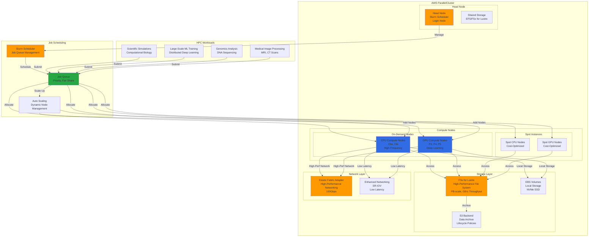
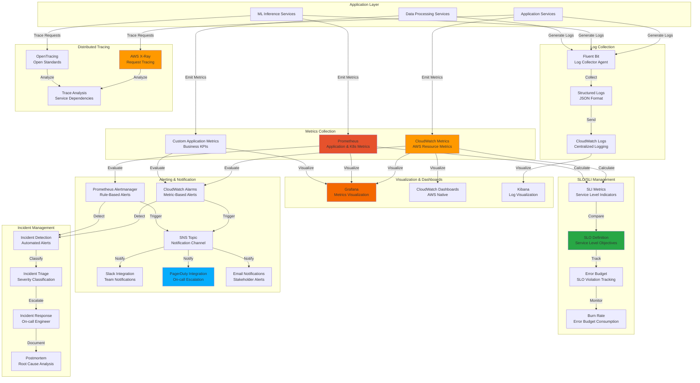

# 医療業界向けクラウドインフラ インフラ構成図

## 全体アーキテクチャ図

```mermaid
graph TB
    subgraph "Healthcare Data Sources"
        EMR[EMR/HIS Systems<br/>Electronic Medical Records]
        MedicalDevices[Medical Devices<br/>IoT Sensors, Wearables]
        ResearchData[Research Data<br/>Clinical Trials, Studies]
    end

    subgraph "Data Ingestion Layer"
        APIGateway[API Gateway<br/>REST/GraphQL APIs]
        Kinesis[Amazon Kinesis<br/>Stream Processing]
        EventBridge[Amazon EventBridge<br/>Event-Driven Architecture]
        S3Ingest[S3 Bucket<br/>Batch Data Upload]
    end

    subgraph "AWS VPC - Healthcare Environment (10.0.0.0/16)"
        subgraph "Public Subnet - 10.0.1.0/24, 10.0.2.0/24"
            ALB[Application Load Balancer<br/>ALB Ingress Controller]
            WAF[AWS WAF<br/>Web Application Firewall]
            Shield[AWS Shield<br/>DDoS Protection]
            NAT[NAT Gateway]
        end

        subgraph "Private Subnet - Application Layer (10.0.10.0/24, 10.0.11.0/24)"
            subgraph "Amazon ECS/EKS Cluster"
                subgraph "Application Services"
                    AppServices[Application Services<br/>API, Web Frontend]
                    AuthService[Authentication Service<br/>OAuth2, JWT]
                    DataService[Data Processing Service<br/>ETL, Validation]
                end
                
                subgraph "ML Inference Services"
                    MLInference[ML Inference Service<br/>Real-time Prediction]
                    FeatureService[Feature Service<br/>Feature Store Access]
                end
            end
        end

        subgraph "Private Subnet - ML Layer (10.0.15.0/24, 10.0.16.0/24)"
            subgraph "MLOps Pipeline"
                SageMaker[SageMaker Studio<br/>Model Development]
                MLTraining[Model Training Jobs<br/>Distributed Training]
                MLPipeline[ML Pipeline Orchestrator<br/>SageMaker Pipelines/Kubeflow]
                ModelRegistry[Model Registry<br/>MLflow/SageMaker Model Registry]
            end
        end

        subgraph "Private Subnet - HPC Layer (10.0.30.0/24, 10.0.31.0/24) - Optional"
            subgraph "AWS ParallelCluster"
                ParallelCluster[AWS ParallelCluster<br/>HPC Management]
                HPCNodes[Compute Nodes<br/>CPU/GPU Instances]
                Lustre[FSx for Lustre<br/>High-Performance Storage]
            end
        end

        subgraph "Private Subnet - Data Layer (10.0.20.0/24, 10.0.21.0/24)"
            RDS[(Amazon RDS/Aurora<br/>PostgreSQL/MySQL<br/>Encrypted, Multi-AZ)]
            Redshift[(Amazon Redshift<br/>Data Warehouse)]
            DynamoDB[(Amazon DynamoDB<br/>NoSQL Database)]
        end

        subgraph "Data Storage"
            S3DataLake[S3 Data Lake<br/>Encrypted, Versioned]
            S3ModelArtifacts[S3 Model Artifacts<br/>Model Storage]
            FeatureStore[Feature Store<br/>SageMaker Feature Store]
        end
    end

    subgraph "Security & Compliance"
        SecretsManager[AWS Secrets Manager<br/>Secrets Management]
        KMS[AWS KMS<br/>Encryption Keys]
        GuardDuty[AWS GuardDuty<br/>Threat Detection]
        SecurityHub[AWS Security Hub<br/>Security Posture]
        CloudTrail[AWS CloudTrail<br/>API Logging]
        Config[AWS Config<br/>Compliance Monitoring]
    end

    subgraph "Monitoring & Logging"
        CloudWatch[Amazon CloudWatch<br/>Metrics & Logs]
        Prometheus[Prometheus<br/>Application Metrics]
        Grafana[Grafana<br/>Visualization]
        XRay[AWS X-Ray<br/>Distributed Tracing]
        OpenSearch[Amazon OpenSearch Service<br/>Log Search & Analysis]
    end

    EMR -->|Secure API| APIGateway
    MedicalDevices -->|Stream Data| Kinesis
    ResearchData -->|Batch Upload| S3Ingest
    APIGateway -->|Events| EventBridge

    APIGateway -->|HTTPS| WAF
    WAF -->|Protected Traffic| ALB
    ALB -->|HTTPS| AppServices
    ALB -->|HTTPS| MLInference

    AppServices -->|Read/Write| RDS
    AppServices -->|Read/Write| DynamoDB
    AppServices -->|Read/Write| S3DataLake
    AppServices -->|Access| FeatureService

    MLInference -->|Predictions| AppServices
    MLInference -->|Read Features| FeatureStore

    MLPipeline -->|Orchestrate| MLTraining
    MLTraining -->|Train Models| S3ModelArtifacts
    MLTraining -->|Store Features| FeatureStore
    MLTraining -->|Use Data| S3DataLake
    ModelRegistry -->|Version Models| MLInference

    ParallelCluster -.->|Optional| MLTraining
    ParallelCluster -.->|Optional| HPCNodes
    HPCNodes -.->|Access| Lustre

    DataService -->|Process| Kinesis
    DataService -->|Transform| S3DataLake
    DataService -->|Load| Redshift

    AppServices -->|Logs| CloudWatch
    MLInference -->|Logs| CloudWatch
    MLPipeline -->|Logs| CloudWatch
    AppServices -->|Traces| XRay

    Prometheus -->|Metrics| Grafana
    CloudWatch -->|Metrics| Grafana
    OpenSearch -->|Logs| Grafana

    SecretsManager -->|Provide Secrets| AppServices
    SecretsManager -->|Provide Secrets| MLInference
    KMS -->|Encrypt| S3DataLake
    KMS -->|Encrypt| RDS
    GuardDuty -->|Threat Alerts| SecurityHub
    CloudTrail -->|API Logs| SecurityHub
    Config -->|Compliance Checks| SecurityHub

    style EMR fill:#DC3545
    style MedicalDevices fill:#DC3545
    style APIGateway fill:#FF9900
    style WAF fill:#FF9900
    style ALB fill:#FF9900
    style AppServices fill:#326CE5
    style MLInference fill:#FF9900
    style MLPipeline fill:#FF9900
    style SageMaker fill:#FF9900
    style RDS fill:#FF9900
    style S3DataLake fill:#FF9900
    style SecretsManager fill:#FF9900
    style GuardDuty fill:#FF9900
    style SecurityHub fill:#FF9900
```

## MLOpsパイプライン詳細構成図

```mermaid
graph TD
    subgraph "Data Sources"
        RawData[Raw Healthcare Data<br/>S3 Data Lake]
        ExternalData[External Data Sources<br/>Public Datasets]
    end

    subgraph "Data Preparation"
        DataWrangler[SageMaker Data Wrangler<br/>Data Cleaning & Prep]
        DataValidation[Data Validation<br/>Great Expectations]
        DataVersioning[Data Versioning<br/>Delta Lake, S3 Versioning]
    end

    subgraph "Feature Engineering"
        FeatureEngineering[Feature Engineering<br/>Feature Transformations]
        FeatureStore[Feature Store<br/>SageMaker Feature Store]
        OfflineStore[Offline Store<br/>S3, Redshift]
        OnlineStore[Online Store<br/>DynamoDB, ElastiCache]
    end

    subgraph "Model Development"
        SageMakerStudio[SageMaker Studio<br/>Notebook Development]
        Experiments[SageMaker Experiments<br/>Experiment Tracking]
        HyperparameterTuning[Automatic Model Tuning<br/>Hyperparameter Optimization]
    end

    subgraph "Model Training"
        TrainingJobs[Training Jobs<br/>Distributed Training]
        GPUInstances[GPU Instances<br/>P3/P4/P5]
        ModelArtifacts[Model Artifacts<br/>S3 Storage]
    end

    subgraph "Model Evaluation"
        ModelEvaluation[Model Evaluation<br/>Metrics, Confusion Matrix]
        ModelValidation[Model Validation<br/>Cross-Validation, Holdout]
        ModelApproval[Model Approval Gate<br/>Manual/Automatic]
    end

    subgraph "Model Registry"
        MLflowRegistry[MLflow Model Registry<br/>Version Control]
        SageMakerRegistry[SageMaker Model Registry<br/>Model Lineage]
        ModelVersioning[Model Versioning<br/>Semantic Versioning]
    end

    subgraph "Model Deployment"
        CanaryDeployment[Canary Deployment<br/>Gradual Rollout]
        ABTesting[A/B Testing<br/>Traffic Splitting]
        RealTimeEndpoint[Real-time Endpoint<br/>SageMaker/ECS/EKS]
        BatchEndpoint[Batch Endpoint<br/>Batch Transform]
    end

    subgraph "Model Monitoring"
        ModelMonitor[SageMaker Model Monitor<br/>Drift Detection]
        DataDrift[Data Drift Detection<br/>Input Distribution Changes]
        ModelDrift[Model Drift Detection<br/>Prediction Accuracy]
        Explainability[Model Explainability<br/>SHAP, LIME]
    end

    subgraph "Model Retraining"
        RetrainingTrigger[Retraining Trigger<br/>Scheduled/Event-Driven]
        PipelineTrigger[Pipeline Trigger<br/>ML Pipeline Orchestration]
    end

    RawData -->|Extract| DataWrangler
    ExternalData -->|Extract| DataWrangler
    DataWrangler -->|Clean Data| DataValidation
    DataValidation -->|Validated Data| DataVersioning
    DataVersioning -->|Versioned Data| FeatureEngineering

    FeatureEngineering -->|Features| FeatureStore
    FeatureStore -->|Batch Features| OfflineStore
    FeatureStore -->|Real-time Features| OnlineStore

    OfflineStore -->|Training Data| SageMakerStudio
    SageMakerStudio -->|Experiments| Experiments
    Experiments -->|Best Config| HyperparameterTuning
    HyperparameterTuning -->|Tuned Hyperparams| TrainingJobs

    TrainingJobs -->|Use GPU| GPUInstances
    TrainingJobs -->|Save Model| ModelArtifacts

    ModelArtifacts -->|Load Model| ModelEvaluation
    ModelEvaluation -->|Evaluation Results| ModelValidation
    ModelValidation -->|Pass| ModelApproval

    ModelApproval -->|Approved Model| MLflowRegistry
    ModelApproval -->|Approved Model| SageMakerRegistry
    MLflowRegistry -->|Version| ModelVersioning
    SageMakerRegistry -->|Lineage| ModelVersioning

    ModelVersioning -->|Deploy| CanaryDeployment
    CanaryDeployment -->|Test| ABTesting
    ABTesting -->|Production| RealTimeEndpoint
    ModelVersioning -->|Batch| BatchEndpoint

    RealTimeEndpoint -->|Monitor| ModelMonitor
    BatchEndpoint -->|Monitor| ModelMonitor
    ModelMonitor -->|Detect| DataDrift
    ModelMonitor -->|Detect| ModelDrift
    ModelMonitor -->|Explain| Explainability

    DataDrift -->|Trigger| RetrainingTrigger
    ModelDrift -->|Trigger| RetrainingTrigger
    RetrainingTrigger -->|Start| PipelineTrigger
    PipelineTrigger -->|Orchestrate| DataWrangler

    style SageMakerStudio fill:#FF9900
    style TrainingJobs fill:#FF9900
    style MLflowRegistry fill:#017CEE
    style RealTimeEndpoint fill:#28A745
    style ModelMonitor fill:#FFC107
```

## HPC環境構成図（オプション）

```mermaid
graph TB
    subgraph "AWS ParallelCluster"
        subgraph "Head Node"
            HeadNode[Head Node<br/>Slurm Scheduler<br/>Login Node]
            SharedStorage[Shared Storage<br/>EFS/FSx for Lustre]
        end

        subgraph "Compute Nodes"
            subgraph "On-Demand Nodes"
                CPUNodes[CPU Compute Nodes<br/>C5n, C6i<br/>High-Frequency]
                GPUNodes[GPU Compute Nodes<br/>P3, P4, P5<br/>Deep Learning]
            end

            subgraph "Spot Instances"
                SpotCPU[Spot CPU Nodes<br/>Cost-Optimized]
                SpotGPU[Spot GPU Nodes<br/>Cost-Optimized]
            end
        end

        subgraph "Storage Layer"
            LustreFS[FSx for Lustre<br/>High-Performance File System<br/>PB-scale, GB/s Throughput]
            S3Backend[S3 Backend<br/>Data Archive<br/>Lifecycle Policies]
            EBSVolumes[EBS Volumes<br/>Local Storage<br/>NVMe SSD]
        end

        subgraph "Network Layer"
            EFA[Elastic Fabric Adapter<br/>High-Performance Networking<br/>100Gbps]
            EnhancedNet[Enhanced Networking<br/>SR-IOV<br/>Low Latency]
        end
    end

    subgraph "HPC Workloads"
        ScientificSim[Scientific Simulations<br/>Computational Biology]
        MLTrainingHPC[Large-Scale ML Training<br/>Distributed Deep Learning]
        GenomicsAnalysis[Genomics Analysis<br/>DNA Sequencing]
        ImageProcessing[Medical Image Processing<br/>MRI, CT Scans]
    end

    subgraph "Job Scheduling"
        SlurmScheduler[Slurm Scheduler<br/>Job Queue Management]
        JobQueue[Job Queue<br/>Priority, Fair Share]
        AutoScaling[Auto Scaling<br/>Dynamic Node Management]
    end

    HeadNode -->|Manage| SlurmScheduler
    SlurmScheduler -->|Schedule| JobQueue
    JobQueue -->|Allocate| CPUNodes
    JobQueue -->|Allocate| GPUNodes
    JobQueue -->|Allocate| SpotCPU
    JobQueue -->|Allocate| SpotGPU

    CPUNodes -->|Access| LustreFS
    GPUNodes -->|Access| LustreFS
    SpotCPU -->|Access| LustreFS
    SpotGPU -->|Access| LustreFS

    LustreFS -->|Archive| S3Backend
    CPUNodes -->|Local Storage| EBSVolumes
    GPUNodes -->|Local Storage| EBSVolumes

    CPUNodes -->|High-Perf Network| EFA
    GPUNodes -->|High-Perf Network| EFA
    CPUNodes -->|Low Latency| EnhancedNet
    GPUNodes -->|Low Latency| EnhancedNet

    ScientificSim -->|Submit| JobQueue
    MLTrainingHPC -->|Submit| JobQueue
    GenomicsAnalysis -->|Submit| JobQueue
    ImageProcessing -->|Submit| JobQueue

    JobQueue -->|Scale Up| AutoScaling
    AutoScaling -->|Add Nodes| CPUNodes
    AutoScaling -->|Add Nodes| GPUNodes

    style HeadNode fill:#FF9900
    style SlurmScheduler fill:#FF9900
    style CPUNodes fill:#326CE5
    style GPUNodes fill:#326CE5
    style LustreFS fill:#FF9900
    style EFA fill:#FF9900
    style JobQueue fill:#28A745
```

## セキュリティ・ガバナンス構成図

```mermaid
graph TB
    subgraph "Identity & Access Management"
        IAM[IAM Roles & Policies<br/>Least Privilege Principle]
        IRSA[IAM Roles for Service Accounts<br/>EKS Integration]
        SSO[AWS Single Sign-On<br/>Centralized Authentication]
        MFA[Multi-Factor Authentication<br/>MFA Required]
        OIDC[OIDC Provider<br/>Third-Party Integration]
    end

    subgraph "Data Protection"
        EncryptionInTransit[Encryption in Transit<br/>TLS 1.3, AWS PrivateLink]
        EncryptionAtRest[Encryption at Rest<br/>S3 SSE-KMS, RDS Encryption, EBS Encryption]
        DataMasking[Data Masking<br/>Dev/Staging Environments]
        DeIdentification[De-identification<br/>HIPAA Compliance]
        AccessControl[Access Control<br/>RBAC, ABAC]
    end

    subgraph "Secrets Management"
        SecretsManager[AWS Secrets Manager<br/>Application Secrets, DB Credentials]
        ParameterStore[Systems Manager Parameter Store<br/>Configuration Parameters]
        Vault[HashiCorp Vault<br/>Optional - Advanced Secrets]
        K8sSecrets[Kubernetes Secrets<br/>Encrypted at Rest]
    end

    subgraph "Network Security"
        VPC[VPC with Private Subnets<br/>Network Isolation]
        SecurityGroups[Security Groups<br/>Instance-Level Firewall]
        NetworkACLs[Network ACLs<br/>Subnet-Level Firewall]
        NetworkPolicies[Kubernetes Network Policies<br/>Pod-to-Pod Communication]
        WAF[AWS WAF<br/>Application Layer Protection]
        Shield[AWS Shield<br/>DDoS Protection]
        PrivateLink[AWS PrivateLink<br/>Private Connectivity]
    end

    subgraph "Compliance & Governance"
        CloudTrail[AWS CloudTrail<br/>API Activity Logging]
        Config[AWS Config<br/>Configuration Compliance]
        SecurityHub[AWS Security Hub<br/>Security Posture Management]
        GuardDuty[AWS GuardDuty<br/>Threat Detection]
        Macie[Amazon Macie<br/>Data Discovery & Protection]
        Inspector[AWS Inspector<br/>Vulnerability Assessment]
    end

    subgraph "Audit & Logging"
        AuditLogs[Audit Logs<br/>CloudTrail, VPC Flow Logs]
        DBLogs[Database Audit Logs<br/>RDS Audit Logging]
        AppLogs[Application Audit Logs<br/>Structured Logging]
        LogRetention[Log Retention<br/>Compliance Requirements]
        LogAnalysis[Log Analysis<br/>OpenSearch, CloudWatch Logs Insights]
    end

    subgraph "Healthcare Compliance"
        HIPAA[HIPAA Compliance<br/>Technical Safeguards]
        PHIProtection[PHI Protection<br/>Protected Health Information]
        DataRetention[Data Retention Policies<br/>Legal Requirements]
        DataDisposal[Secure Data Disposal<br/>Permanent Deletion]
        BreachNotification[Breach Notification<br/>Incident Response]
    end

    IAM -->|Grant Access| IRSA
    SSO -->|Authenticate| IAM
    MFA -->|Enforce| SSO
    OIDC -->|Integrate| SSO

    EncryptionInTransit -->|Protect| AppServices[Application Services]
    EncryptionAtRest -->|Protect| S3Data[S3 Data]
    EncryptionAtRest -->|Protect| RDSData[RDS Data]
    DataMasking -->|Mask| DevData[Development Data]
    DeIdentification -->|Anonymize| PHIData[PHI Data]
    AccessControl -->|Control| AppServices

    SecretsManager -->|Provide Secrets| AppServices
    ParameterStore -->|Store Config| AppServices
    Vault -.->|Advanced Secrets| AppServices
    K8sSecrets -->|Mount Secrets| Pods[Kubernetes Pods]

    VPC -->|Isolate| SecurityGroups
    SecurityGroups -->|Filter| NetworkACLs
    NetworkACLs -->|Control| NetworkPolicies
    ALB[Application Load Balancer] -->|Protect| WAF
    WAF -->|Block| Shield
    AppServices -->|Private| PrivateLink

    CloudTrail -->|Log API Calls| SecurityHub
    Config -->|Track Changes| SecurityHub
    GuardDuty -->|Detect Threats| SecurityHub
    Macie -->|Discover Data| SecurityHub
    Inspector -->|Assess| SecurityHub

    AppServices -->|Generate| AuditLogs
    RDSData -->|Generate| DBLogs
    AppServices -->|Generate| AppLogs
    AuditLogs -->|Store| LogRetention
    DBLogs -->|Store| LogRetention
    AppLogs -->|Store| LogRetention
    LogRetention -->|Analyze| LogAnalysis

    HIPAA -->|Require| PHIProtection
    PHIProtection -->|Enforce| DataRetention
    DataRetention -->|Expire| DataDisposal
    PHIProtection -->|Monitor| BreachNotification

    style IAM fill:#FF9900
    style SecretsManager fill:#FF9900
    style WAF fill:#FF9900
    style SecurityHub fill:#FF9900
    style GuardDuty fill:#FF9900
    style HIPAA fill:#DC3545
    style PHIProtection fill:#DC3545
```

## SRE監視・オブザーバビリティ構成図

```mermaid
graph TB
    subgraph "Application Layer"
        AppServices[Application Services]
        MLServices[ML Inference Services]
        DataServices[Data Processing Services]
    end

    subgraph "Metrics Collection"
        CloudWatchMetrics[CloudWatch Metrics<br/>AWS Resource Metrics]
        Prometheus[Prometheus<br/>Application & K8s Metrics]
        CustomMetrics[Custom Application Metrics<br/>Business KPIs]
    end

    subgraph "Log Collection"
        CloudWatchLogs[CloudWatch Logs<br/>Centralized Logging]
        FluentBit[Fluent Bit<br/>Log Collector Agent]
        StructuredLogs[Structured Logs<br/>JSON Format]
    end

    subgraph "Distributed Tracing"
        XRay[AWS X-Ray<br/>Request Tracing]
        OpenTracing[OpenTracing<br/>Open Standards]
        TraceAnalysis[Trace Analysis<br/>Service Dependencies]
    end

    subgraph "Visualization & Dashboards"
        Grafana[Grafana<br/>Metrics Visualization]
        CloudWatchDashboards[CloudWatch Dashboards<br/>AWS Native]
        Kibana[Kibana<br/>Log Visualization]
    end

    subgraph "Alerting & Notification"
        CloudWatchAlarms[CloudWatch Alarms<br/>Metric-Based Alerts]
        PrometheusAlerts[Prometheus Alertmanager<br/>Rule-Based Alerts]
        SNSTopic[SNS Topic<br/>Notification Channel]
        Slack[Slack Integration<br/>Team Notifications]
        PagerDuty[PagerDuty Integration<br/>On-call Escalation]
        Email[Email Notifications<br/>Stakeholder Alerts]
    end

    subgraph "SLO/SLI Management"
        SLODefinition[SLO Definition<br/>Service Level Objectives]
        SLIMetrics[SLI Metrics<br/>Service Level Indicators]
        ErrorBudget[Error Budget<br/>SLO Violation Tracking]
        BurnRate[Burn Rate<br/>Error Budget Consumption]
    end

    subgraph "Incident Management"
        IncidentDetection[Incident Detection<br/>Automated Alerts]
        IncidentTriage[Incident Triage<br/>Severity Classification]
        IncidentResponse[Incident Response<br/>On-call Engineer]
        Postmortem[Postmortem<br/>Root Cause Analysis]
    end

    AppServices -->|Emit Metrics| CloudWatchMetrics
    MLServices -->|Emit Metrics| Prometheus
    DataServices -->|Emit Metrics| CustomMetrics

    AppServices -->|Generate Logs| FluentBit
    MLServices -->|Generate Logs| FluentBit
    DataServices -->|Generate Logs| FluentBit
    FluentBit -->|Collect| StructuredLogs
    StructuredLogs -->|Send| CloudWatchLogs

    AppServices -->|Trace Requests| XRay
    MLServices -->|Trace Requests| OpenTracing
    XRay -->|Analyze| TraceAnalysis
    OpenTracing -->|Analyze| TraceAnalysis

    CloudWatchMetrics -->|Visualize| Grafana
    Prometheus -->|Visualize| Grafana
    CustomMetrics -->|Visualize| Grafana
    CloudWatchMetrics -->|Visualize| CloudWatchDashboards
    CloudWatchLogs -->|Visualize| Kibana

    CloudWatchMetrics -->|Evaluate| CloudWatchAlarms
    Prometheus -->|Evaluate| PrometheusAlerts
    CustomMetrics -->|Evaluate| CloudWatchAlarms

    CloudWatchAlarms -->|Trigger| SNSTopic
    PrometheusAlerts -->|Trigger| SNSTopic
    SNSTopic -->|Notify| Slack
    SNSTopic -->|Notify| PagerDuty
    SNSTopic -->|Notify| Email

    CloudWatchMetrics -->|Calculate| SLIMetrics
    Prometheus -->|Calculate| SLIMetrics
    SLIMetrics -->|Compare| SLODefinition
    SLODefinition -->|Track| ErrorBudget
    ErrorBudget -->|Monitor| BurnRate

    CloudWatchAlarms -->|Detect| IncidentDetection
    PrometheusAlerts -->|Detect| IncidentDetection
    IncidentDetection -->|Classify| IncidentTriage
    IncidentTriage -->|Escalate| IncidentResponse
    IncidentResponse -->|Document| Postmortem

    style CloudWatchMetrics fill:#FF9900
    style Prometheus fill:#E6522C
    style XRay fill:#FF9900
    style Grafana fill:#F46800
    style PagerDuty fill:#06ADFC
    style SLODefinition fill:#28A745
```
