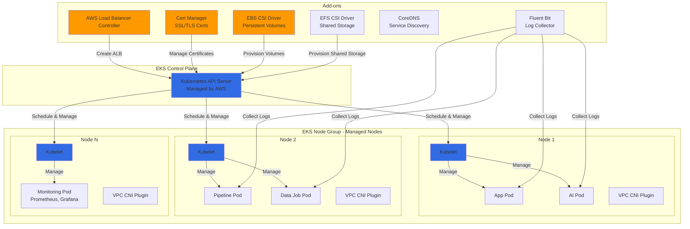
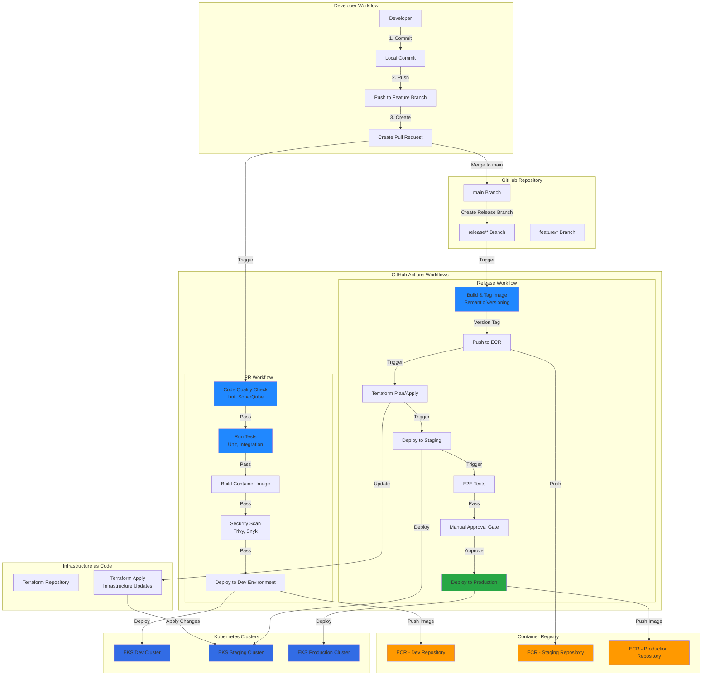

# スマートシティ向けAIアプリケーション インフラ構成図

## 全体アーキテクチャ図

```mermaid
graph TB
    subgraph "開発・CI/CD環境"
        GitHub[GitHub Repository]
        GitHubActions[GitHub Actions]
        ECR[Amazon ECR<br/>Container Registry]
    end

    subgraph "AWS VPC - 10.0.0.0/16"
        subgraph "Public Subnet - 10.0.1.0/24, 10.0.2.0/24"
            ALB[Application Load Balancer<br/>ALB Ingress Controller]
            NAT[NAT Gateway]
        end

        subgraph "Private Subnet - 10.0.10.0/24, 10.0.11.0/24"
            subgraph "Amazon EKS Cluster"
                subgraph "Namespace: production"
                    AppPods[Application Pods<br/>API Server, Web Frontend]
                    AIPods[AI Model Pods<br/>Model Serving, Inference]
                end
                
                subgraph "Namespace: data-pipeline"
                    PipelineOrchestrator[Data Pipeline Orchestrator<br/>Airflow/Step Functions/Kubeflow]
                    DataJobs[Data Processing Jobs<br/>ETL, Data Quality]
                end
                
                CoreServices[Core Services<br/>Ingress Controller, Cert Manager, Monitoring]
            end
        end

        subgraph "Data Subnet - 10.0.20.0/24, 10.0.21.0/24"
            RDS[(Amazon RDS/Aurora<br/>PostgreSQL/MySQL)]
            DynamoDB[(Amazon DynamoDB<br/>NoSQL Database)]
        end

        S3[(Amazon S3<br/>Data Lake)]
        Databricks[Databricks<br/>Optional]
    end

    subgraph "外部サービス"
        JIRA[JIRA<br/>Project Management]
        Slack[Slack<br/>Communication]
        CloudWatch[Amazon CloudWatch<br/>Logs & Metrics]
    end

    GitHub -->|Push Trigger| GitHubActions
    GitHubActions -->|Build & Push| ECR
    GitHubActions -->|Deploy| AppPods
    GitHubActions -->|Deploy| AIPods
    GitHubActions -->|Deploy| DataJobs

    ALB -->|HTTPS| AppPods
    ALB -->|HTTPS| AIPods

    AppPods -->|Read/Write| RDS
    AppPods -->|Read/Write| DynamoDB
    AppPods -->|Read/Write| S3

    AIPods -->|Model Data| S3
    AIPods -->|Feature Store| DynamoDB

    PipelineOrchestrator -->|Orchestrate| DataJobs
    DataJobs -->|Extract| S3
    DataJobs -->|Transform| S3
    DataJobs -->|Load| RDS
    DataJobs -->|Load| DynamoDB
    DataJobs -.->|Optional| Databricks

    AppPods -->|Logs| CloudWatch
    AIPods -->|Logs| CloudWatch
    DataJobs -->|Logs| CloudWatch
    CoreServices -->|Metrics| CloudWatch

    style GitHub fill:#181717
    style GitHubActions fill:#2088FF
    style ECR fill:#FF9900
    style ALB fill:#FF9900
    style AppPods fill:#326CE5
    style AIPods fill:#326CE5
    style PipelineOrchestrator fill:#326CE5
    style DataJobs fill:#326CE5
    style RDS fill:#FF9900
    style DynamoDB fill:#FF9900
    style S3 fill:#FF9900
    style CloudWatch fill:#FF9900
```

## Kubernetesクラスター詳細構成図

```mermaid
graph TB
    subgraph "EKS Control Plane"
        APIServer[Kubernetes API Server<br/>Managed by AWS]
    end

    subgraph "EKS Node Group - Managed Nodes"
        subgraph "Node 1"
            Kubelet1[Kubelet]
            Pod1[App Pod]
            Pod2[AI Pod]
            CNI1[VPC CNI Plugin]
        end

        subgraph "Node 2"
            Kubelet2[Kubelet]
            Pod3[Pipeline Pod]
            Pod4[Data Job Pod]
            CNI2[VPC CNI Plugin]
        end

        subgraph "Node N"
            KubeletN[Kubelet]
            PodN[Monitoring Pod<br/>Prometheus, Grafana]
            CNIN[VPC CNI Plugin]
        end
    end

    subgraph "Add-ons"
        IngressController[AWS Load Balancer Controller]
        CertManager[Cert Manager<br/>SSL/TLS Certs]
        EBSDriver[EBS CSI Driver<br/>Persistent Volumes]
        EFSDriver[EFS CSI Driver<br/>Shared Storage]
        CoreDNS[CoreDNS<br/>Service Discovery]
        FluentBit[Fluent Bit<br/>Log Collector]
    end

    APIServer -->|Schedule & Manage| Kubelet1
    APIServer -->|Schedule & Manage| Kubelet2
    APIServer -->|Schedule & Manage| KubeletN

    Kubelet1 -->|Manage| Pod1
    Kubelet1 -->|Manage| Pod2
    Kubelet2 -->|Manage| Pod3
    Kubelet2 -->|Manage| Pod4
    KubeletN -->|Manage| PodN

    IngressController -->|Create ALB| APIServer
    CertManager -->|Manage Certificates| APIServer
    EBSDriver -->|Provision Volumes| APIServer
    EFSDriver -->|Provision Shared Storage| APIServer

    FluentBit -->|Collect Logs| Pod1
    FluentBit -->|Collect Logs| Pod2
    FluentBit -->|Collect Logs| Pod3
    FluentBit -->|Collect Logs| Pod4

    style APIServer fill:#326CE5
    style Kubelet1 fill:#326CE5
    style Kubelet2 fill:#326CE5
    style KubeletN fill:#326CE5
    style IngressController fill:#FF9900
    style CertManager fill:#FF9900
    style EBSDriver fill:#FF9900
```

## データ処理パイプライン構成図

```mermaid
graph LR
    subgraph "Data Sources"
        IoTDevices[IoT Devices<br/>Smart City Sensors]
        ExternalAPIs[External APIs<br/>Public Data]
        UserData[User Generated Data<br/>Applications]
    end

    subgraph "Data Ingestion Layer"
        Kinesis[Amazon Kinesis<br/>Stream Processing]
        S3Ingest[S3 Bucket<br/>Raw Data]
    end

    subgraph "Data Processing Layer - Kubernetes"
        Airflow[Airflow DAG Scheduler<br/>Orchestration]
        
        subgraph "ETL Jobs"
            ExtractJob[Extract Job<br/>Data Collection]
            TransformJob[Transform Job<br/>Data Cleaning, Validation]
            LoadJob[Load Job<br/>Data Enrichment]
        end
        
        QualityCheck[Data Quality Checks<br/>Validation Rules]
        FeatureEngineering[Feature Engineering<br/>ML Features]
    end

    subgraph "Data Storage Layer"
        S3DataLake[S3 Data Lake<br/>Processed Data]
        FeatureStore[Feature Store<br/>DynamoDB/S3]
        DataWarehouse[(Data Warehouse<br/>Redshift/Databricks)]
    end

    subgraph "AI/ML Layer"
        TrainingPipeline[Model Training Pipeline<br/>Kubeflow Pipelines]
        ModelRegistry[Model Registry<br/>S3/MLflow]
        InferenceService[Model Inference Service<br/>Kubernetes Deployment]
    end

    IoTDevices -->|Stream| Kinesis
    ExternalAPIs -->|Batch| S3Ingest
    UserData -->|Batch| S3Ingest

    Kinesis -->|Trigger| Airflow
    S3Ingest -->|Trigger| Airflow

    Airflow -->|Orchestrate| ExtractJob
    ExtractJob -->|Raw Data| TransformJob
    TransformJob -->|Clean Data| QualityCheck
    QualityCheck -->|Validated Data| LoadJob
    LoadJob -->|Enriched Data| FeatureEngineering

    FeatureEngineering -->|Features| FeatureStore
    FeatureEngineering -->|Processed Data| S3DataLake
    FeatureEngineering -->|Aggregated Data| DataWarehouse

    S3DataLake -->|Training Data| TrainingPipeline
    FeatureStore -->|Features| TrainingPipeline
    TrainingPipeline -->|Trained Model| ModelRegistry
    ModelRegistry -->|Model Artifacts| InferenceService

    FeatureStore -->|Real-time Features| InferenceService
    InferenceService -->|Predictions| AppPods[Application Pods]

    style Airflow fill:#017CEE
    style TrainingPipeline fill:#FF9900
    style InferenceService fill:#326CE5
    style S3DataLake fill:#569A31
    style DataWarehouse fill:#FF9900
```

## CI/CDパイプライン詳細図

```mermaid
graph TD
    subgraph "Developer Workflow"
        Dev[Developer]
        LocalCommit[Local Commit]
        PushPR[Push to Feature Branch]
        CreatePR[Create Pull Request]
    end

    subgraph "GitHub Repository"
        MainBranch[main Branch]
        ReleaseBranch[release/* Branch]
        FeatureBranch[feature/* Branch]
    end

    subgraph "GitHub Actions Workflows"
        subgraph "PR Workflow"
            PRCheck[Code Quality Check<br/>Lint, SonarQube]
            PRTest[Run Tests<br/>Unit, Integration]
            PRBuild[Build Container Image]
            PRScan[Security Scan<br/>Trivy, Snyk]
            PRDeployDev[Deploy to Dev Environment]
        end

        subgraph "Release Workflow"
            ReleaseBuild[Build & Tag Image<br/>Semantic Versioning]
            ReleasePushECR[Push to ECR]
            ReleaseTerraform[Terraform Plan/Apply]
            ReleaseDeployStg[Deploy to Staging]
            ReleaseE2E[E2E Tests]
            ManualApproval[Manual Approval Gate]
            ReleaseDeployProd[Deploy to Production]
        end
    end

    subgraph "Container Registry"
        ECRDev[ECR - Dev Repository]
        ECRStg[ECR - Staging Repository]
        ECRProd[ECR - Production Repository]
    end

    subgraph "Infrastructure as Code"
        TerraformRepo[Terraform Repository]
        TerraformApply[Terraform Apply<br/>Infrastructure Updates]
    end

    subgraph "Kubernetes Clusters"
        EKSDev[EKS Dev Cluster]
        EKSStg[EKS Staging Cluster]
        EKSProd[EKS Production Cluster]
    end

    Dev -->|1. Commit| LocalCommit
    LocalCommit -->|2. Push| PushPR
    PushPR -->|3. Create| CreatePR
    CreatePR -->|Trigger| PRCheck

    PRCheck -->|Pass| PRTest
    PRTest -->|Pass| PRBuild
    PRBuild -->|Pass| PRScan
    PRScan -->|Pass| PRDeployDev

    PRDeployDev -->|Deploy| EKSDev
    PRDeployDev -->|Push Image| ECRDev

    CreatePR -->|Merge to main| MainBranch
    MainBranch -->|Create Release Branch| ReleaseBranch

    ReleaseBranch -->|Trigger| ReleaseBuild
    ReleaseBuild -->|Version Tag| ReleasePushECR
    ReleasePushECR -->|Push| ECRStg
    ReleasePushECR -->|Trigger| ReleaseTerraform
    ReleaseTerraform -->|Update| TerraformApply
    TerraformApply -->|Apply Changes| EKSStg
    ReleaseTerraform -->|Trigger| ReleaseDeployStg
    ReleaseDeployStg -->|Deploy| EKSStg
    ReleaseDeployStg -->|Trigger| ReleaseE2E
    ReleaseE2E -->|Pass| ManualApproval
    ManualApproval -->|Approve| ReleaseDeployProd
    ReleaseDeployProd -->|Push Image| ECRProd
    ReleaseDeployProd -->|Deploy| EKSProd

    style PRCheck fill:#2088FF
    style PRTest fill:#2088FF
    style ReleaseBuild fill:#2088FF
    style ReleaseDeployProd fill:#28A745
    style EKSDev fill:#326CE5
    style EKSStg fill:#326CE5
    style EKSProd fill:#326CE5
    style ECRDev fill:#FF9900
    style ECRStg fill:#FF9900
    style ECRProd fill:#FF9900
```

## セキュリティ構成図

```mermaid
graph TB
    subgraph "Identity & Access Management"
        IAM[IAM Roles & Policies]
        IRSA[IAM Roles for Service Accounts<br/>IRSA]
        OIDC[OIDC Provider<br/>EKS Integration]
    end

    subgraph "Network Security"
        VPC[VPC with Public/Private Subnets]
        SecurityGroups[Security Groups<br/>Network ACLs]
        NetworkPolicies[Kubernetes Network Policies<br/>Pod-to-Pod Communication]
        WAF[AWS WAF<br/>Application Protection]
    end

    subgraph "Secrets Management"
        SecretsManager[AWS Secrets Manager<br/>Application Secrets]
        K8sSecrets[Kubernetes Secrets<br/>Pod Configuration]
        ParameterStore[Systems Manager Parameter Store<br/>Configuration]
    end

    subgraph "Encryption"
        TLS[TLS 1.3<br/>In-Transit Encryption]
        S3Encryption[S3 Server-Side Encryption<br/>SSE-S3/SSE-KMS]
        RDSEncryption[RDS Encryption at Rest<br/>AES-256]
        EBSEncryption[EBS Encryption<br/>Volume Encryption]
    end

    subgraph "Container Security"
        ImageScanning[Container Image Scanning<br/>ECR, Trivy]
        PodSecurity[Pod Security Standards<br/>PSA Labels]
        RBAC[Kubernetes RBAC<br/>Role-Based Access Control]
    end

    subgraph "Monitoring & Compliance"
        CloudTrail[AWS CloudTrail<br/>API Logging]
        GuardDuty[AWS GuardDuty<br/>Threat Detection]
        Config[AWS Config<br/>Compliance Monitoring]
        VPCFlowLogs[VPC Flow Logs<br/>Network Traffic]
    end

    IAM -->|Assume Role| IRSA
    OIDC -->|Authenticate| IRSA
    IRSA -->|Grant Access| AppPods[Application Pods]

    VPC -->|Isolate| SecurityGroups
    SecurityGroups -->|Filter| NetworkPolicies
    ALB[Application Load Balancer] -->|Protect| WAF

    SecretsManager -->|Provide Secrets| AppPods
    K8sSecrets -->|Mount Secrets| AppPods
    ParameterStore -->|Store Config| AppPods

    ALB -->|Terminate| TLS
    AppPods -->|Encrypt| S3Encryption
    AppPods -->|Encrypt| RDSEncryption
    AppPods -->|Use| EBSEncryption

    ECR[ECR Registry] -->|Scan| ImageScanning
    ImageScanning -->|Block Vulnerable| AppPods
    AppPods -->|Apply| PodSecurity
    APIServer[K8s API Server] -->|Enforce| RBAC

    APIServer -->|Log API Calls| CloudTrail
    VPC -->|Monitor Traffic| GuardDuty
    VPC -->|Track Changes| Config
    VPC -->|Log Traffic| VPCFlowLogs

    style IAM fill:#FF9900
    style SecretsManager fill:#FF9900
    style TLS fill:#28A745
    style ImageScanning fill:#DC3545
    style GuardDuty fill:#FF9900
```
